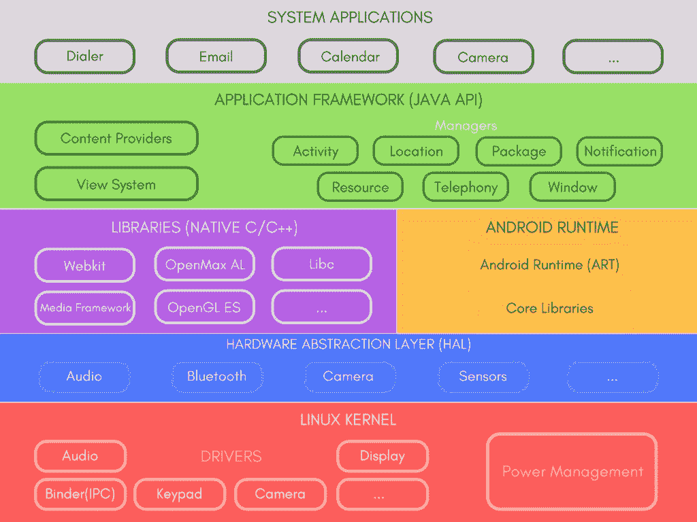

# 安卓架构——安卓的软件栈

> 原文：<https://www.studytonight.com/android/android-architecture>

在[之前的教程](introduction-to-android)中，你学习了什么是 Android，Android 的不同版本以及它支持哪些功能。既然你已经对安卓有了基本的了解和认识，在本教程中，我们将学习安卓软件堆栈(见下图)，这将有助于你理解安卓在设备内部是如何工作的。

安卓操作系统遵循分层架构方法。所有这些层负责我们在下面讨论的不同角色和功能。

* * *

## Linux 内核

这一层是安卓平台的基础。

*   包含各种硬件组件支持的所有低级驱动程序。
*   安卓运行时依赖于 Linux 内核来提供核心系统服务，
    *   内存、进程管理、线程等。
    *   网络堆栈
    *   驾驶员模型
    *   安全等等。

* * *

## 硬件抽象层

*   在硬件和软件栈的其余部分之间提供抽象。

* * *

## 安卓运行时

*   旨在在电池、处理和内存等方面肌肉力量有限的受限环境中运行应用。
*   自安卓 5.0 以来，每个应用都在自己的 ART 虚拟机实例中运行自己的进程，这使得进程管理变得更加关键。
*   ART 使用`DEX`文件，这是一种字节码，专门为 Android 设计，有助于 ART 更高效地管理内存。
*   包含一组核心库，使开发人员能够使用 Java 编程编写安卓应用。
*   在安卓 5.0 之前，Dalvik 被用作安卓运行时。
*   ART 既能**提前** (AOT)又能**及时** (JIT)编译。
*   它还具有非常高效的垃圾收集功能。

* * *

## 图书馆

*   通过安卓应用框架向开发者公开。
*   包含安卓系统组件使用的 [C](/c/overview-of-c.php) / [C++](introduction-to-cpp.php) 库。
*   少数特征包括，
    *   SQLite 库用于数据存储，在移动内存占用和任务执行方面很轻。
    *   网络工具包库主要提供网络浏览引擎和更多相关功能。
    *   surface manager 库负责在屏幕上渲染窗口和绘制各种应用的表面。
    *   媒体框架库为音频和视频提供媒体编解码器。
    *   OpenGl(开放图形库)和 SGL(可缩放图形库)分别是用于 3D 和 2D 渲染的图形库。
    *   自由类型库用于呈现字体。

* * *

## 应用框架

*   它是用 Java 编写的 API 的集合，让开发人员可以访问 Android OS 的完整功能集。
*   开发人员可以完全访问核心应用使用的相同框架 API，这样他们就可以增强应用的功能。
*   支持并简化核心组件和服务的重用，例如:
    *   **活动管理器**:管理应用的生命周期&提供常用的导航回栈。
    *   **窗口管理器**:管理窗口和绘制曲面，是曲面管理器库的抽象。
    *   **内容提供商**:使应用能够从其他应用访问数据或共享自己的数据，即它提供了在应用之间交换数据的机制。
    *   **查看系统**:包含用于构建应用 UI 的用户界面构建块，包括列表、网格、文本、框、按钮等。并且还执行 UI 元素的事件管理(在后面的教程中解释)。
    *   **包管理器**:管理与设备上当前安装的应用包相关的各种信息。
    *   **电话管理器**:使 app 能够使用设备的电话功能。
    *   **资源管理器**:提供对非代码资源(本地化字符串、位图、图形和布局)的访问。
    *   **位置管理器**:处理位置感知能力。
    *   **通知管理器**:让应用在状态栏显示自定义提醒。

* * *

## 应用

*   安卓应用堆栈的顶端是系统应用和用户可以从安卓官方游戏商店(也称为谷歌 Play 商店)下载的成吨的其他应用。
*   一组核心应用预装在手机中，如电子邮件客户端、短信程序、日历、地图、浏览器、联系人等。
*   该层使用其下的所有层来保证这些移动应用的正常运行。

因此，正如我们可以看到和理解的那样，安卓将分层或者我们可以说分组功能作为软件堆栈，使安卓在任何设备上都可以非常流畅地工作。

* * *

## 市面上的安卓设备

运行安卓操作系统的设备有各种形状和大小。运行安卓操作系统和应用的各种设备如下:

*   智能手机
*   智能手表
*   药片
*   电子阅读器设备
*   上网本
*   MP4 播放器
*   网络电视等等。

* * *

### 安卓市场

2008 年 8 月，在收购安卓大约一年后，谷歌宣布了安卓应用市场——安卓设备的在线应用商店。这家在线商店后来被命名为 **Play Store** ，并于 2008 年 10 月向用户开放，允许用户直接将任何第三方应用下载到他们的设备中。付费和免费应用都可以在游戏商店上获得。

* * *

* * *