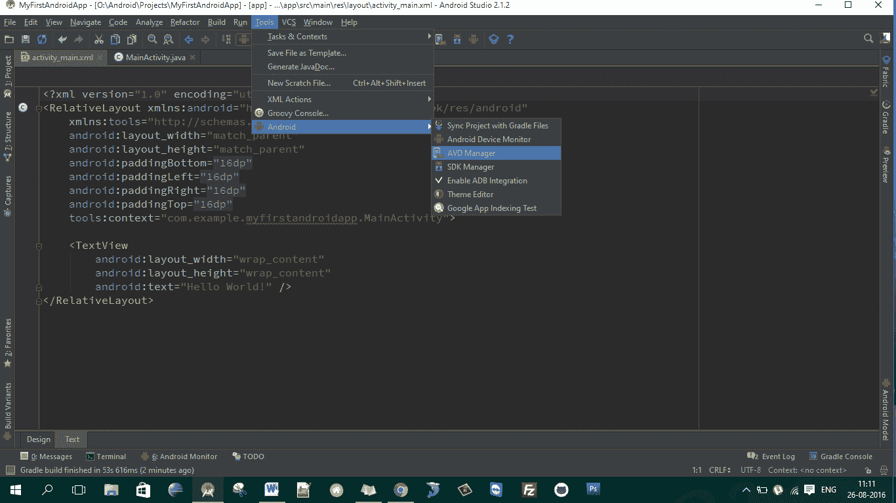
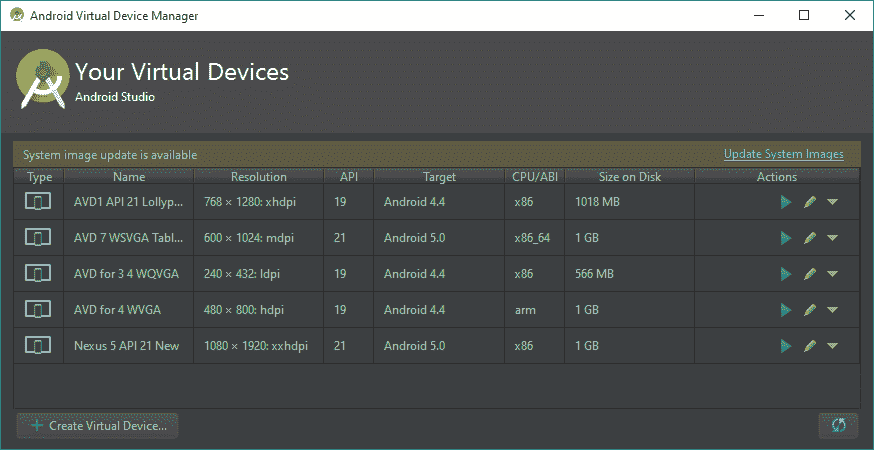
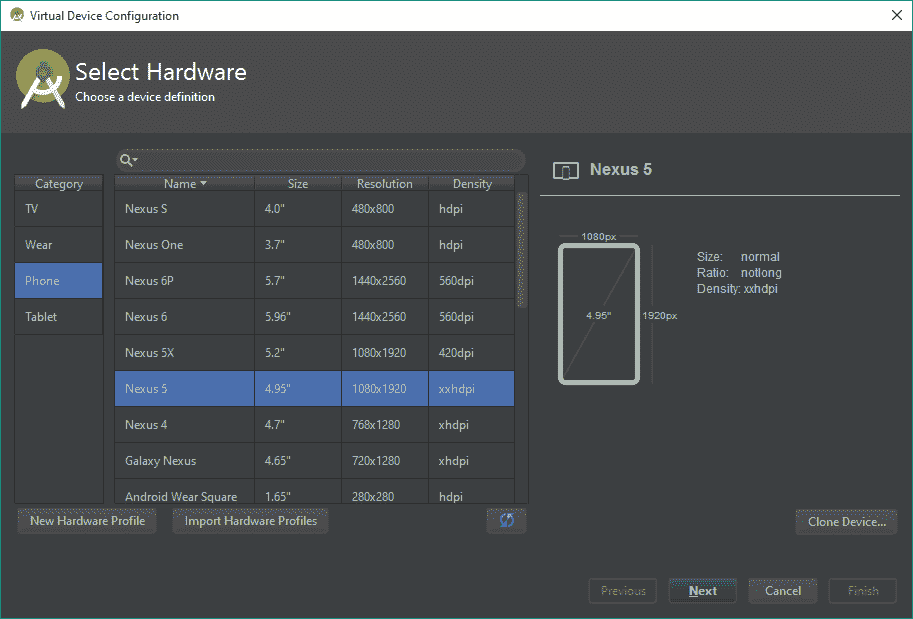
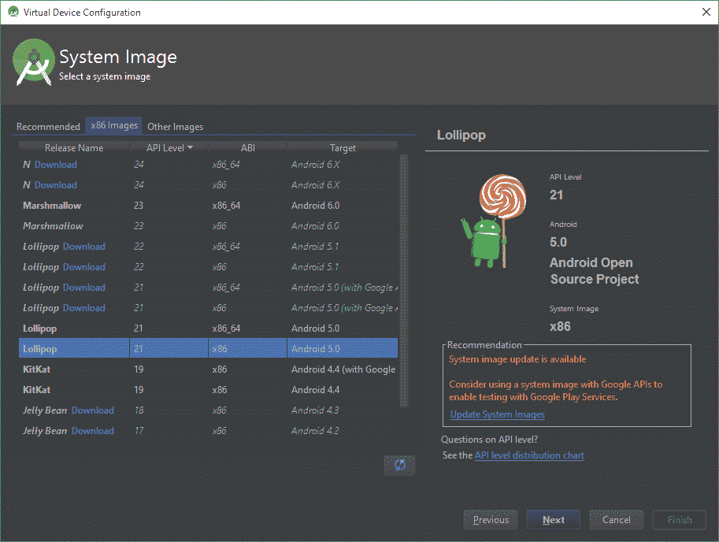
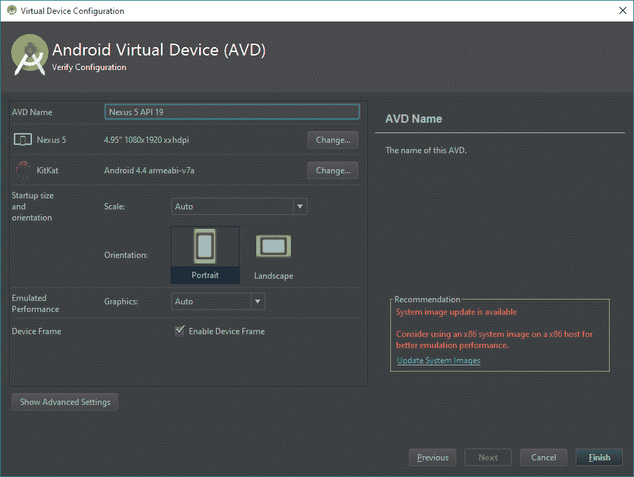
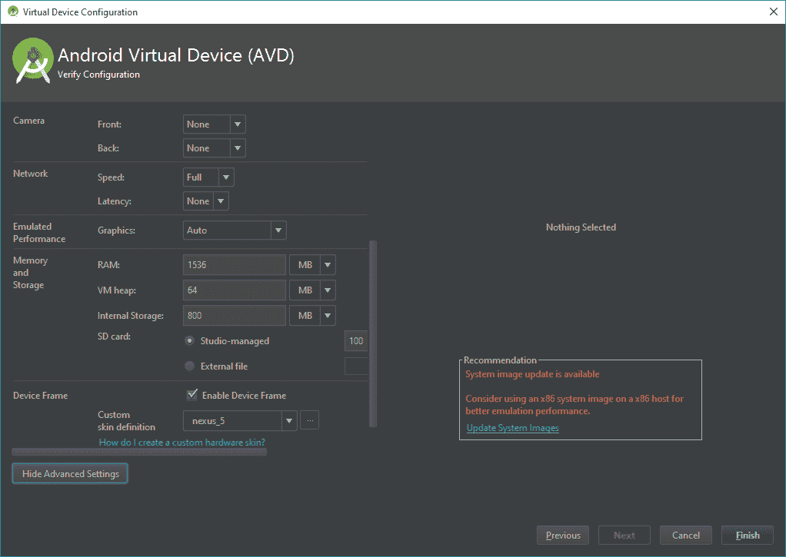
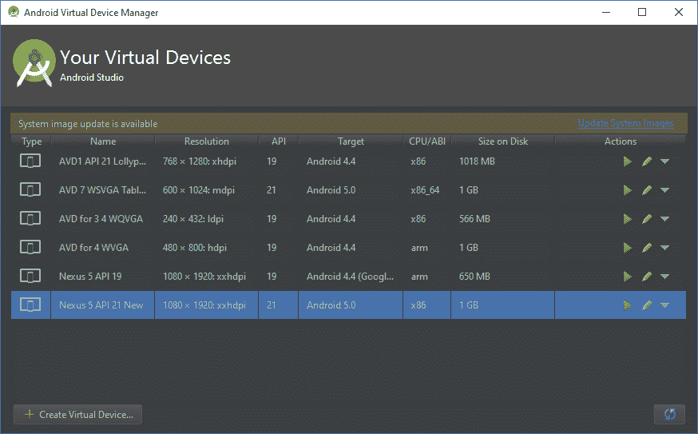
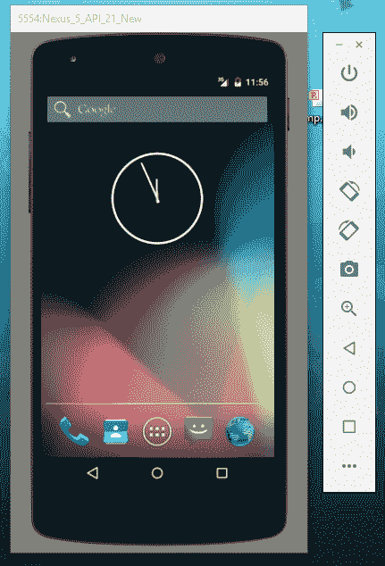

# 使用 AVD 管理器创建安卓虚拟设备

> 原文：<https://www.studytonight.com/android/android-virtual-device>

在本教程中，我们将学习什么是 **AVD 管理器**，以及如何创建 AVD(安卓虚拟设备)来测试您的第一个[安卓应用](first-android-application)。

一个**安卓虚拟设备** (AVD)是一个运行在安卓模拟器上的设备配置。它提供了特定于虚拟设备的[安卓环境](setup-android-dev-env)，我们可以在其中安装&来测试我们的安卓应用。AVD 管理器是 [SDK 管理器](adding-tools-packages-android-studio)的一部分，用于创建和管理创建的虚拟设备。

打开 AVD 管理器，进入**工具→安卓→ AVD 管理器**，如下图所示。

它将打开 AVD 管理器，并显示创建的虚拟设备列表，如下图所示。它现在对您来说可能是空的，因为您还没有创建任何设备。要创建新设备，点击左下角的**创建虚拟设备**按钮。

它将打开一个窗口，为您的虚拟设备选择硬件类型。这个列表包含了几乎所有安卓设备及其各自的设置。根据您需要的配置(如屏幕尺寸、分辨率和密度)从列出的所有设备中选择任意一个，然后点击**下一步**。

接下来，您将被要求为您新创建的虚拟设备选择运行中的**安卓版**系统映像。您可以选择任何已经在您的[AndroidStudio](android-studio-for-android)中可用的安卓系统图像，或者通过点击名称可用的**下载**选项下载您想要的图像。**推荐**部分将根据可用的最新更新列出可用的最佳选择。 **x86 图像**包含最常用的图像，**其他图像**部分包含带有 Google Play Services 的系统图像。根据您需要的配置进行选择(我们选择了 API 级别 21)。完成后点击**下一步**。

Next window will list down all the configured settings for final verification. Here, you can give your AVD a name for identification, can change device type and API configuration and can also setup size, orientation as well as Graphics for your AVD.

点击**显示高级设置**，您将看到虚拟设备的更多高级设置，如下图所示。这里有相机、网络、内存(内存&堆)和存储(内部&外部)和虚拟设备框架的设置。

您可以根据自己的要求配置设备，点击**完成**。AndroidStudio 将立即开始用选定的配置构建 AVD&可能需要一些时间。完成后，AVD 管理器将在可用设备列表中列出您的虚拟设备，如下图所示。

从**动作**栏(表格最后一栏)，可以执行**启动 AVD** 和**编辑 AVD** 配置等多个动作。通过单击开始图标(绿色播放图标)启动您的第一个 AVD。它将启动一个虚拟设备，就像安卓设备一样，如下图所示。侧工具栏包含按钮，用于执行诸如上下音量、改变方向、返回、回家或最近的&等操作。您也可以使用电源按钮关闭虚拟设备的电源，并选择关闭按钮关闭虚拟设备。

现在，您的系统上运行了自己的安卓虚拟设备，您可以在其中测试各种安卓应用项目。根据您的项目要求，您的 AVD 管理器中可以有多个虚拟设备。同样，您也可以为安卓电视和安卓穿戴等设备创建 AVD 进行测试。

* * *

* * *