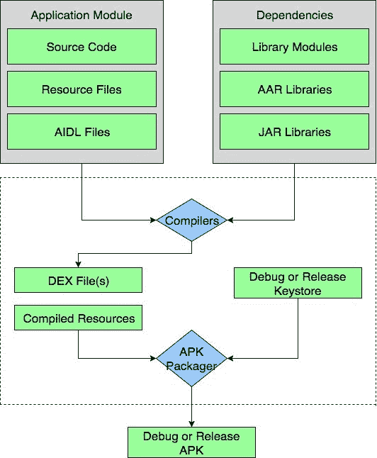
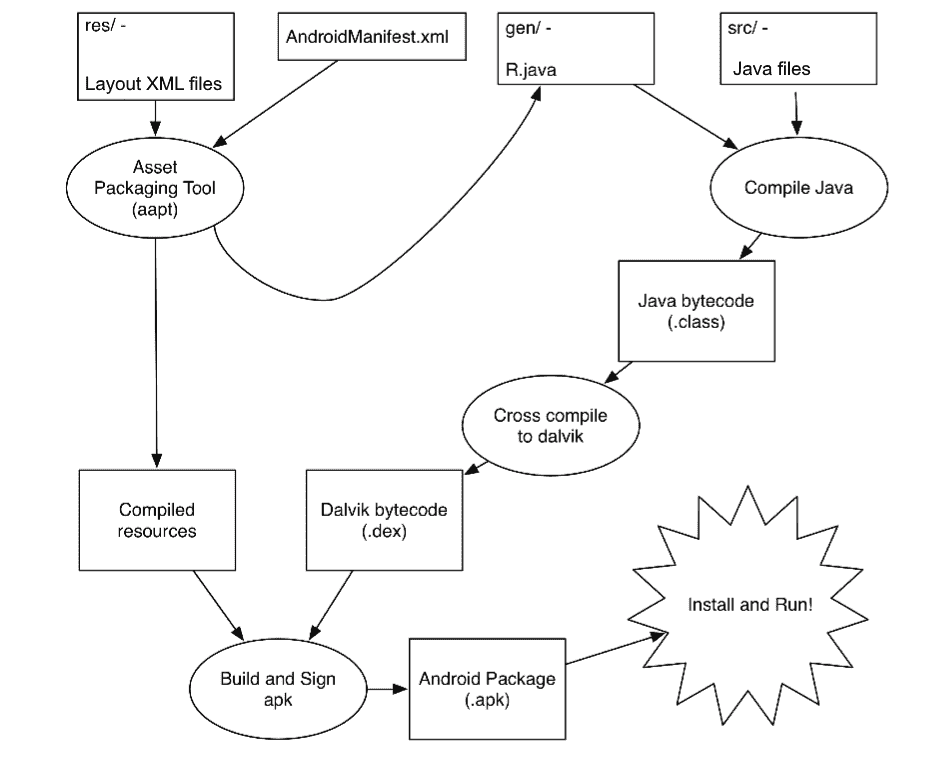

# AndroidStudio Gradle 简介

> 原文：<https://www.studytonight.com/android/introduction-to-gradle>

在[AndroidStudio](android-studio-for-android)中，Gradle 用于构建我们的安卓应用项目，因此扮演了构建系统的角色。在AndroidStudio之前，在 [Eclipse](using-eclipse-for-android) 中，我们使用命令行工具编译和构建应用，该工具很快被基于GUI的步骤所取代，以使用 ANT 在 Eclipse 中构建和运行安卓应用。每个 android 应用开发工具都必须编译资源、java 源代码、外部库，并将它们组合成最终的 APK。

**Gradle** 是一个构建系统，负责代码编译、测试、部署以及将代码转换成`.dex`文件，从而在设备上运行应用。

由于AndroidStudio自带预装的 Gradle 系统，所以不需要安装额外的运行时软件来构建我们的项目。每当你点击 android studio 中的 **Run** 按钮时，一个 grade le 任务会自动触发并开始构建项目，在 grade le 完成任务后，app 开始在 AVD 或连接的设备中运行。

像 Gradle 这样的构建系统不是编译器、链接器等，但它控制和监督编译、文件链接、运行测试用例的操作，并最终为你的 Android 应用将代码捆绑到一个`apk`文件中。

每个AndroidStudio项目都有两个`build.gradle`文件，一个是**应用**文件，另一个是**项目级(模块级)构建文件**文件。

构建过程如下图所示。

在构建过程中，编译器获取源代码、资源、外部库 JAR 文件和`AndroidManifest.xml`(包含关于应用的元数据)并将其转换为`.dex` (Dalvik 可执行文件)文件，其中包括字节码。所有安卓设备都支持字节码来运行你的应用。然后 **APK 管理器**将`.dex`文件和所有其他资源合并成单个 **apk** 文件。 **APK 打包程序**使用各自的调试或发布密钥库签署调试或发布 APK。

**Debug apk** 一般用于测试目的或者我们可以说只是在开发阶段使用。当您的应用具有所需的功能并且您准备发布您的应用供外部使用时，您需要使用发布密钥库签署的**发布 apk** 。

现在让我们来看看这些文件。

#### setting.gradle

**设置.梯度**(梯度设置)文件用于**指定您的应用**中使用的所有模块。

#### build.gradle(项目级)

*顶层*(模块) **build.gradle** 文件是项目级构建文件，定义项目级的构建配置。该文件将配置应用于 android 应用项目中的所有模块。

#### build.gradle(应用级)

*应用级* **build.gradle** 文件位于安卓项目的每个模块中。该文件包括您的软件包名称`applicationID`、版本名称(apk 版本)、版本代码、特定应用模块的最低和目标 sdk。当您包含外部库(而不是 jar 文件)时，您需要在应用级别的 gradle 文件中提到它，以便将它们作为应用的依赖项包含在项目中。

> **注意:**如果某个应用是针对智能手机、平板电脑或电视等单个模块开发的变体，则必须为所有模块创建单独的梯度文件。

你甚至可以通过**命令行工具**启动你的梯度系统。它使用以下命令:

*   `./gradlew build` -(建设项目)
*   `./gradlew clean build` -(构建项目完成从头开始)
*   `./gradlew clean build` -(运行测试)
*   `./gradlew wrapper` -(查看所有可用任务)

* * *

## 艺术-安卓运行时

**达尔维克虚拟机死了**。是的，谷歌在 2014 年就停止使用了，虽然你会在网上找到大部分的安卓教程，仍然没有更新，但是请注意 Dalvik Virtual Machine 已经不在安卓使用了。

新的运行时被称为 ART 或 Android Runtime，它与它的前身 Dalvik 非常兼容，但确实有很多新功能，比如:

*   **提前编译**
*   **改良垃圾收集**
*   改进的调试和诊断。

* * *

* * *