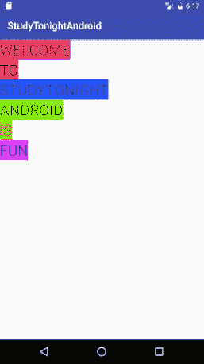
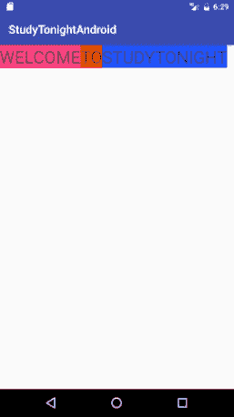
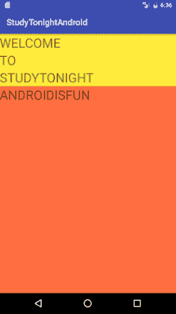

# 安卓系统中的线性布局

> 原文：<https://www.studytonight.com/android/linear-layout-in-android>

`LinearLayout`是一个[视图组](introduction-to-layouts)，负责在其中保存视图。它是一种布局，将子视图(即各种视图和布局)线性(一个接一个)排列在一列(垂直)或一行(水平)中。

所有的孩子是水平排列还是垂直排列取决于属性`android:orientation`的值。默认情况下，方向为**水平**。

* * *

## 垂直线性布局

在垂直线性布局中，顾名思义，线性布局中定义的视图是一个接一个真实排列的，就像在一列中一样。为此，我们需要在 LinearLayout 标签中提到值为**垂直**的`android:orientation`属性。

为了更清楚地理解，让我们检查下面的代码及其显示的输出。

```
<?xml version="1.0" encoding="utf-8"?>
<LinearLayout xmlns:android="http://schemas.android.com/apk/res/android"
    xmlns:app="http://schemas.android.com/apk/res-auto"
    xmlns:tools="http://schemas.android.com/tools"
    android:layout_width="match_parent"
    android:layout_height="match_parent"
    android:orientation="vertical"
    tools:context="com.example.android.studytonightandroid.MainActivity">

    <TextView
        android:layout_width="wrap_content"
        android:layout_height="wrap_content"
        android:textSize="30sp"
        android:text="Welcome"
        android:background="@color/colorAccent"
        android:textAllCaps="true"/>

    <TextView
        android:layout_width="wrap_content"
        android:layout_height="wrap_content"
        android:textSize="30sp"
        android:text="to"
        android:background="#E65100"
        android:textAllCaps="true"/>

    <TextView
        android:layout_width="wrap_content"
        android:layout_height="wrap_content"
        android:textSize="30sp"
        android:background="#25f"
        android:text="Studytonight"
        android:textAllCaps="true"/>

    <TextView
        android:layout_width="wrap_content"
        android:layout_height="wrap_content"
        android:textSize="30sp"
        android:text="android"
        android:background="#76FF03"
        android:textAllCaps="true"/>

    <TextView
        android:layout_width="wrap_content"
        android:layout_height="wrap_content"
        android:textSize="30sp"
        android:text="is"
        android:background="#FDD835"
        android:textAllCaps="true"/>

    <TextView
        android:layout_width="wrap_content"
        android:layout_height="wrap_content"
        android:textSize="30sp"
        android:text="fun"
        android:background="#E040FB"
        android:textAllCaps="true"/>

</LinearLayout;>
```



正如我们所看到的，线性布局里面有 6 个孩子，都是 [TextView](android-textview) 。此外，由于方向属性设置为垂直，所有 6 个子对象将一个接一个地垂直显示。

* * *

## 水平线形布局

在水平线性布局中，顾名思义，线性布局中定义的视图将一个接一个地水平排列，就像一行一样。默认情况下，方向设置为水平。但是通过在 linear layout 标签中将属性`android:orientation`设置为值**水平**，来明确指定线性布局的方向是一个很好的做法。

为了更清楚地理解这一点，让我们检查下面的代码及其显示的输出。

```
<?xml version="1.0" encoding="utf-8"?>
<LinearLayout xmlns:android="http://schemas.android.com/apk/res/android"
    xmlns:app="http://schemas.android.com/apk/res-auto"
    xmlns:tools="http://schemas.android.com/tools"
    android:layout_width="match_parent"
    android:layout_height="match_parent"
    android:orientation="horizontal"
    tools:context="com.example.android.studytonightandroid.MainActivity">

    <TextView
    android:layout_width="wrap_content"
    android:layout_height="wrap_content"
    android:textSize="30sp"
    android:text="Welcome"
    android:background="@color/colorAccent"
    android:textAllCaps="true"/>

    <TextView
    android:layout_width="wrap_content"
    android:layout_height="wrap_content"
    android:textSize="30sp"
    android:text="to"
    android:background="#E65100"
    android:textAllCaps="true"/>

    <TextView
    android:layout_width="wrap_content"
    android:layout_height="wrap_content"
    android:textSize="30sp"
    android:background="#25f"
    android:text="Studytonight"
    android:textAllCaps="true"/>

</LinearLayout>
```



如我们所见，线性布局中有 3 个子元素。此外，由于方向属性设置为水平，所有 3 个子视图(即文本视图)将一个接一个地水平显示。

* * *

## 线性布局中的线性布局

线形布局是一个视图组，也可以包含其他布局。让我们试试下面的代码，其中我们在另一个线性布局中添加了一个线性布局，以及一些视图。

```
<?xml version="1.0" encoding="utf-8"?>
<LinearLayout xmlns:android="http://schemas.android.com/apk/res/android"
    xmlns:app="http://schemas.android.com/apk/res-auto"
    xmlns:tools="http://schemas.android.com/tools"
    android:layout_width="match_parent"
    android:layout_height="match_parent"
    android:orientation="vertical"
    android:background="#FFEB3B"
    tools:context="com.example.android.studytonightandroid.MainActivity">

    <TextView
        android:layout_width="wrap_content"
        android:layout_height="wrap_content"
        android:textSize="30sp"
        android:text="Welcome"
        android:textAllCaps="true"/>

    <TextView
        android:layout_width="wrap_content"
        android:layout_height="wrap_content"
        android:textSize="30sp"
        android:text="to"
        android:textAllCaps="true"/>

    <TextView
        android:layout_width="wrap_content"
        android:layout_height="wrap_content"
        android:textSize="30sp"
        android:text="Studytonight"
        android:textAllCaps="true"/>

    <LinearLayout
        android:layout_height="match_parent"
        android:layout_width="match_parent"
        android:orientation="horizontal"
        android:background="#FF6E40">

        <TextView
            android:layout_width="wrap_content"
            android:layout_height="wrap_content"
            android:textSize="30sp"
            android:text="android"
            android:textAllCaps="true"/>

        <TextView
            android:layout_width="wrap_content"
            android:layout_height="wrap_content"
            android:textSize="30sp"
            android:text="is"
            android:textAllCaps="true"/>

        <TextView
            android:layout_width="wrap_content"
            android:layout_height="wrap_content"
            android:textSize="30sp"
            android:text="fun"
            android:textAllCaps="true"/>
    </LinearLayout>

</LinearLayout>
```



第一个线性布局(黄色)有 3 个文本视图和 1 个线性布局作为其子元素。由于它被设置为**垂直**方向，它的所有子对象将垂直出现。

第二个线性布局(橙色)有 3 个文本视图作为其子视图。由于它被设置为**水平**方向，它的所有子对象将在这个线性布局中水平显示。

* * *

* * *