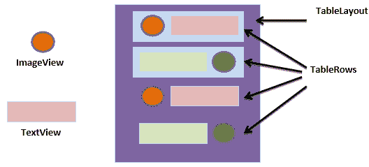
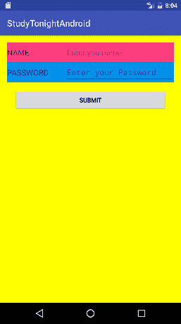

# 安卓表格布局

> 原文：<https://www.studytonight.com/android/table-layout-in-android>

一个`TableLayout`是一个[视图组](introduction-to-layouts)，它以表格的形式排列其子视图和其他布局，表格中有行和列。要定义一行，可以在该布局中使用`<TableRow>`标记。

没有必要提及 TableLayout 中的列数，因为 Android 会根据表行中添加的视图和其他布局的数量自动添加列。



* * *

## 表格布局:需要记住的要点

1.  TableRow 不需要提供`layout_width`和`layout_height`，因为默认情况下，它的宽度是`match_parent`，高度是`wrap_content`。
2.  一个表行，其中有最多的视图，创建了许多列。
3.  列的宽度会根据具有最大宽度的列的大小自动调整。

现在让我们看看`TableLayout`中使用的一些常见属性。

| 属性 | 使用它的地方 | 为什么使用它 |
| `android:stretchColumns` | 表格布局 | 当列宽较小时，需要扩展(或拉伸)它时，可以使用该属性。 |
| `android:shrinkColumns` | 表格布局 | 当您不需要列中的额外空间时，可以使用此属性来收缩和移除空间。 |
| `android:collapseColumns` | 表格布局 | 它在 TableLayout 中隐藏给定索引的列。 |
| `android:layout_span` | 表格行中的任何视图 | 如果视图只占用一个列宽，但希望视图占用多个列空间，则可以使用此属性。 |
| `android:layout_column` | TableRow 中的任何视图 | 当您希望第一个表行中的视图显示在另一个表行的视图下方时，可以使用该属性。 |

* * *

## 在布局 XML 中定义表格布局

现在，让我们理解如何在尤拉 XML 及其输出中定义一个表布局。

```
<?xml version="1.0" encoding="utf-8"?>
<TableLayout xmlns:android="http://schemas.android.com/apk/res/android"
    android:layout_width="match_parent"
    android:layout_height="match_parent"
    android:padding="16dp"
    android:background="#FFFF00"
    android:stretchColumns="*"
    android:shrinkColumns="*">

    <!-- first row -->
    <TableRow
        android:layout_width="match_parent"
        android:layout_height="match_parent"
        android:gravity="center"
        android:background="@color/colorAccent">

        <TextView
            android:id="@+id/textView"
            android:layout_width="wrap_content"
            android:layout_height="wrap_content"
            android:text="NAME"
            android:textAppearance="?android:attr/textAppearanceMedium"/>

        <EditText
            android:id="@+id/edtName"
            android:layout_width="wrap_content"
            android:layout_height="wrap_content"
            android:ems="10"
            android:hint="Enter you name"
            android:inputType="textPersonName"/>

    </TableRow>

    <!-- second row -->
    <TableRow
        android:layout_width="match_parent"
        android:layout_height="match_parent"
        android:gravity="center"
        android:background="#0091EA">

        <TextView
            android:id="@+id/textView2"
            android:layout_width="wrap_content"
            android:layout_height="wrap_content"
            android:text="Password"
            android:textAllCaps="true"
            android:textAppearance="?android:attr/textAppearanceMedium"/>

        <EditText
            android:id="@+id/edtPwd"
            android:layout_width="wrap_content"
            android:layout_height="wrap_content"
            android:ems="10"
            android:hint="Enter your Password"
            android:inputType="textPassword"/>

    </TableRow>

    <!-- third row -->
    <TableRow
        android:layout_width="match_parent"
        android:layout_height="match_parent"
        android:gravity="center"
        android:padding="16dp">

        <Button
            android:id="@+id/btnSubmit"
            android:layout_width="wrap_content"
            android:layout_height="wrap_content"
            android:text="SUBMIT"/>

    </TableRow>

</TableLayout>
```

### 输出屏幕:



正如您在 XML 文件中看到的，根元素是`TableLayout`，因此您的布局将有一个以行和列的形式呈现的元素表。

表格布局中的行是用标记 TableRow 定义的。您必须使用属性`layout_width`和`layout_height`指定行的**宽度**以及**高度**。

接下来，如果您想要在 TableLayout 中添加一个新行，您可以添加新的 TableRow 标记，并在其中定义您想要的组件/视图。表格行的工作方式与线性水平布局相同，其中组件并排放置。

我们为 TableLayout 设置了三个属性，即:

1.  `collapseColumns`

    此属性定义要折叠的列，即隐藏指定索引的列。

2.  `shrinkColumns`

    此属性用于通过为列提供 indes 值来收缩一列或多列。

3.  `stretchColumns`

    此属性用于拉伸列。

索引值从`0`开始，即第一列将有索引`0`，然后是`1`等等。

对于所有这三个属性，列索引可以显示为单个值，或者如果要将此属性应用于多个列，可以在索引之间使用逗号(，)来实现。1，2，5。您也可以使用值`*`拉伸所有列，而不用提及列的索引。

可以看到，在布局 e 中，第一行添加了两个组件——一个是 **[AndroidStudio](android-studio-for-android)** (显示名称作为标签)，另一个是**`EditText`**(从用户那里获取名称)。我们已经将该行的`gravity`设置为**中心**，这样元素就被放置在显示屏的中心。

同样，我们添加了第二行`TextView`(将密码显示为标签)和`EditText`(从用户那里获取密码)。

第三行只包含一个提交按钮。

* * *

* * *