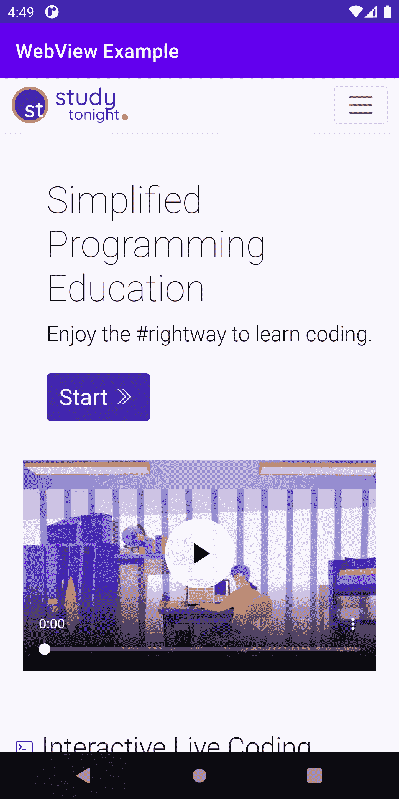
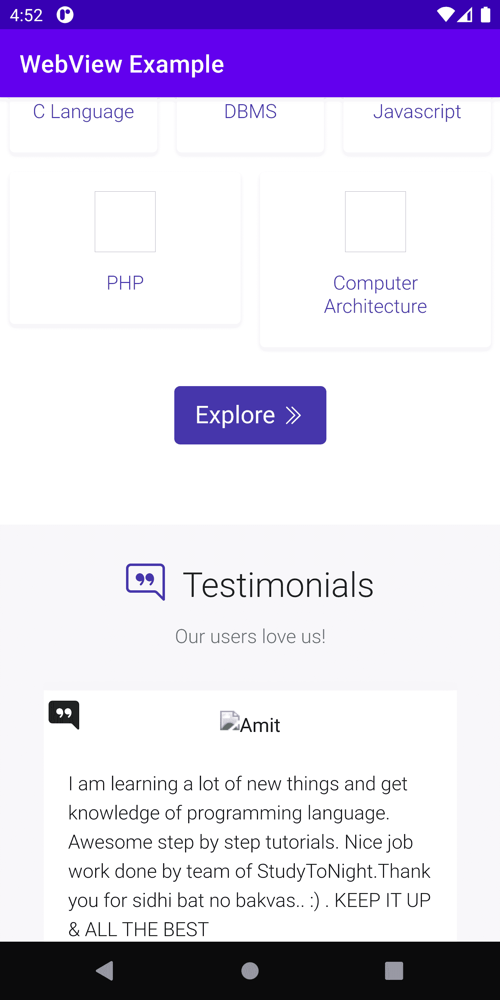

> 原文：<https://www.studytonight.com/android/android-webview>

[← Prev](/android/hierarchical-arrangement-in-android "Hierarchical Layout Arrangements")[Next →](/android/introduction-to-views "Introduction to Views and ViewGroups")

# 安卓网页视图

**安卓 WebView** 用于在安卓中加载和显示网页。

当我们需要增加对应用中用户界面和高级配置选项的控制时，网络视图非常有用。

在这里，我们将学习在我们的安卓应用中添加一个**安卓网络视图**。那么，让我们开始吧。

## 步骤 1:创建新项目

1.  打开你的AndroidStudio点击“**开始一个新的AndroidStudio项目**”(学习[如何设置AndroidStudio](https://www.studytonight.com/android/setup-android-dev-env)[创建你的第一个安卓项目](https://www.studytonight.com/android/first-android-application))

2.  从项目模板窗口中选择**空活动**，点击**下一步**。

3.  输入 **App 名称**、**包名**、**保存位置**、**语言**([**Java**](https://www.studytonight.com/java/)/[**Kotlin**](https://www.studytonight.com/kotlin)，本教程我们将使用 **Java** )以及**最小 SDK** (我们使用的是 API 19: Android 4.4 (KitKat))

4.  填写以上详细信息后，点击**完成**按钮。

5.  现在，等待项目完成建设。

## 步骤 2:添加互联网权限

现在转到**app->mainfestics->androidmanifest . XML**并添加互联网权限，现在我们的 **AndroidManifest.xml** 文件将如下所示:

```
<?xml version="1.0" encoding="utf-8"?>
<manifest xmlns:android="http://schemas.android.com/apk/res/android"
    package="com.studytonight.project">
    <uses-permission android:name="android.permission.INTERNET"/>
    <application
        android:allowBackup="true"
        android:icon="@mipmap/ic_launcher"
        android:label="@string/app_name"
        android:roundIcon="@mipmap/ic_launcher_round"
        android:supportsRtl="true"
        android:theme="@style/Theme.StudyTonight">
        <activity android:name=".MainActivity">
            <intent-filter>
                <action android:name="android.intent.action.MAIN" />
                <category android:name="android.intent.category.LAUNCHER" />
            </intent-filter>
        </activity>
    </application>
</manifest>
```

## 第三步:将**网络视图**添加到安卓活动中

现在转到 **app - > res - >布局- > activity_main.xml** 并添加 **Webview** ，现在我们的 **activity_main.xml** 文件将如下所示:

```
<?xml version = "1.0" encoding = "utf-8"?>
<RelativeLayout xmlns:android = "http://schemas.android.com/apk/res/android"
    xmlns:app = "http://schemas.android.com/apk/res-auto"
    xmlns:tools = "http://schemas.android.com/tools"
    android:layout_width = "match_parent"
    android:layout_height = "match_parent"
    tools:context = ".MainActivity">

    <!-- webview -->
    <WebView
        android:id="@+id/oklWebView"
        android:layout_width="match_parent"
        android:layout_height="match_parent"
     />
</RelativeLayout>
```

在上面的代码中，我们已经在我们的安卓活动中添加了默认的网络视图。

## 第四步:修改活动

这是我们 app 中添加 webview 的主要部分，首先我们打开**MainActivity.java**文件，导入一些基础类，如下图

```
import androidx.appcompat.app.AppCompatActivity;
import android.os.Bundle;
import android.webkit.WebView;
```

接下来，我们在 MainActivity 类中创建 **WebView 类**的对象，如下所示:

```
//creating object of WebView
WebView oklWebView;
```

现在，在 **`onCreate`** 方法内部，我们初始化 **WebView** 如下图所示。

```
//initializing the WebView objects
oklWebView=(WebView)findViewById(R.id.oklWebView);
```

初始化网络视图后，我们只需加载网址**。**

```
 //load the url
oklWebView.loadUrl("https://www.studytonight.com/");
```

**MainActivity.java**的完整代码如下:

```
package com.studytonight.project;

import androidx.appcompat.app.AppCompatActivity;
import android.os.Bundle;
import android.webkit.WebView;

public class MainActivity extends AppCompatActivity {

    //creating object of WebView
    WebView oklWebView;
    @Override
    protected void onCreate(Bundle savedInstanceState) {
        super.onCreate(savedInstanceState);
        setContentView(R.layout.activity_main);

        //initializing the WebView objects
        oklWebView=(WebView)findViewById(R.id.oklWebView);

        //load the url
        oklWebView.loadUrl("https://www.studytonight.com/");
    }
}
```

现在，我们的应用已经准备好了，运行该应用并查看输出。

### 输出:

在下面的快照中，您可以看到 **Webview** 在安卓应用中的外观。

当第一次打开应用时:我们可以看到 https://www.studytonight.com/在我们的应用中打开

[ ](https://s3.ap-south-1.amazonaws.com/s3.studytonight.com/tutorials/uploads/pictures/1626434450-76979.png) [ ](https://s3.ap-south-1.amazonaws.com/s3.studytonight.com/tutorials/uploads/pictures/1626434450-76979.png)

当滚动网页视图时，它会转到页面底部。

[ ](https://s3.ap-south-1.amazonaws.com/s3.studytonight.com/tutorials/uploads/pictures/1626434763-76979.png)

* * *

* * *