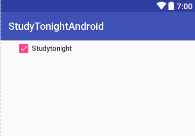
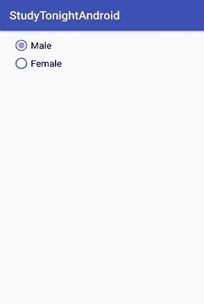

# 安卓系统中的`RadioButton`视图和`Checkbox`视图

> 原文：<https://www.studytonight.com/android/android-radiobutton-and-checkbox>

当你在安卓应用中创建一个接受用户输入的表单，并且你必须列出几个选项供用户选择时，`CheckBox`和单选框就派上了用场。

因此，单选框和`CheckBox`之间的功能区别在于，当用户在多个选项中只能选择一个选项时，我们使用单选框，如果允许多选，则应使用`CheckBox`。

* * *

## 安卓系统中的`Checkbox`视图

当您必须向用户显示多个选项，并且用户可以通过点击选择任意多个选项时，使用`Checkbox`。您可以将其默认检查状态设置为**真**或**假**，其他属性与[`TextView`](android-textview)相同。

```java
<CheckBox
    android:id="@+id/myCheckbox"
    android:layout_width="wrap_content"
    android:layout_height="wrap_content"
    android:text="Studytonight"
    android:checked="true"
    android:textColor="@android:color/black"
    android:layout_marginLeft="30dp"/>
```

*   `android:checked="true"`

    该属性检查，即默认情况下在`CheckBox`中放置勾号。

这涵盖了我们如何在应用屏幕上显示 CheckBox 视图。它是如何工作的，我们很快就会知道。

* * *

### 输出屏



* * *

## 安卓系统中的`RadioButton`视图

当您必须允许在多个选项列表中只选择一个选项时，使用`RadioButton`。它在其父视图–`RadioGroup`下使用，因此我们可以从所有列出的`RadioButton`中选择一个值。

```java
<RadioGroup
    android:id="@+id/rg_gender"
    android:layout_width="match_parent"
    android:layout_height="wrap_content"
    android:layout_marginTop="10dp"
    android:layout_marginLeft="20dp">

    <RadioButton
        android:id="@+id/rb_male"
        android:layout_width="wrap_content"
        android:layout_height="wrap_content"
        android:text="Male"
        android:textColor="@android:color/black"/>

    <RadioButton
        android:id="@+id/rb_female"
        android:layout_width="wrap_content"
        android:layout_height="wrap_content"
        android:textColor="@android:color/black"
        android:text="Female"/>

</RadioGroup>
```

我们也可以使用[微调视图](spinner-in-android)来显示选项列表，其中只能选择一个。但是在 Spinner 中，并不是所有的选项都同时显示给用户，它更像是一个下拉菜单。

还有`RadioGroup`是`LinearLayout`的子类，垂直排列`RadioButton`，因为默认是垂直方向。但是您可以通过在布局 XML 文件中将属性`android:orientation="horizontal"`添加到您的`RadioGroup`中来更改它。

* * *

### 输出屏



* * *

## 检查`RadioButton`或`Checkbox`视图的当前状态

为了检查`RadioButton`或`CheckBox`是否被选中，我们可以在 Java 代码文件中编写一个简单的代码。

```java
// initiate the radio button
RadioButton maleRadioButton = (RadioButton) findViewById(R.id.rb_male); 
// check current state of the radio button (true or false)
Boolean RadioButtonState = maleRadioButton.isChecked();
```

代码的第一行使用布局 XML 中为`RadioButton`视图指定的`id`来创建该视图的实例。这段代码对于所有类型的视图都是一样的。

同样，我们也可以选中相同的`CheckBox`，

```java
// initiate the check box
CheckBox myCheckbox = (CheckBox) findViewById(R.id.myCheckbox); 
// check current state of the check box (true or false)
Boolean CheckBoxState = myCheckbox.isChecked();
```

* * *

### 常用属性

这里我们有一些常用的属性，你可以用它们来设计你的`RadioButton`和`Checkbox`视图。

*   `android:textColor`:改变文字的颜色。
*   `android:textSize`:调整文字大小。
*   `android:textStyle`:文本样式，可能的值有`Bold`或`Italic`等。
*   `android:background`:给`RadioButton`一个背景色。
*   我们也可以在`RadioButton`的文本旁边使用图像。要添加图像，我们可以使用`android:drawableTop`、`android:drawableBottom`、`android:drawableRight`和`android:drawableLeft`，分别在文本的顶部、底部、右侧或左侧设置图像。

    ```java
    android:drawableRight="@drawable/any_picture"
    ```

* * *

* * *