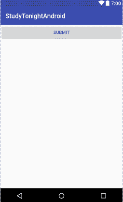

# 安卓系统中的`Button`视图

> 原文：<https://www.studytonight.com/android/android-button-view>

`Button`，顾名思义，是用户可以按下或点击来执行动作的组件。它具有与`TextView`相同的属性，只有几个按钮特定的属性。

下面我们已经指定了如何使用布局 XML 在您的 android 应用中定义`Button`视图:

```java
<Button
    android:id="@+id/btn_submit"
    android:layout_width="match_parent"
    android:layout_height="wrap_content"
    android:text="Submit"
    android:textColor="@android:color/holo_blue_dark"
    />
```

`Button`视图的主要用途是，每当我们单击一个按钮时，我们可以设置一个方法来处理该特定的按钮请求并执行必要的操作。这可以在 [`Activity`](activity-in-android) 类内完成，如下所示:

> **注意:**如果你现在还不知道`Activity`班的情况，不用担心。我们很快会解释的。

```java
public class MainActivity extends Activity {
	@Override
    protected void onCreate(Bundle savedInstanceState) {
        super.onCreate(savedInstanceState);

        setContentView(R.layout.activity_main);
        // creating instance of button
        Button b = (Button) findViewById(R.id.btn_submit);
        // setting on click event listener
        b.setOnClickListener(new View.OnClickListener() {
            public void onClick(View v) {

                // Perform action on click

            }
        });
    }
}
```

因此，每当我们按下带有`id` **btn_submit** 的按钮时，就会调用上面的方法，执行其中的代码。

* * *

### 使用`android:onClick`为按钮添加行为

我们还可以在布局 XML 中直接分配一个方法，同时使用`android:onClick`属性定义按钮，如下所示。

```java
<Button
    android:id="@+id/btn_submit"
    android:layout_width="match_parent"
    android:layout_height="wrap_content"
    android:text="Submit"
    android:textColor="@android:color/holo_blue_dark"
    android:onClick="study"
    />
```

当用户点击上述布局 xml 文件中定义的按钮时，安卓系统将调用`MainActivity.java`文件中定义的`study(View)`方法。为了实现这一点，方法必须是`public`并接受一个`View`类型作为其唯一参数。

```java
public void study(View view) {

    //Perform action on click

}
```

类似地，`android:onClick`属性可以用于所有可用的视图子类，如[`TextView`](android-textview)、`EditText`、`RadioButton`、`CheckBox`等。

* * *

### 输出屏



* * *

## 按钮的常用属性

以下是一些常用的`Button`视图样式属性

*   `android:gravity`:可以用来设置 app 屏幕上任意 View 的位置。可用值有**右**、**左**、**中心**、**中心 _ 垂直**等。您也可以使用`|`符号一起使用到值。
*   `android:textSize`:设置按钮内部文字大小。
*   `android:background`:设置按钮的背景颜色。
*   可以分别使用`android:drawableRight`、`android:drawableLeft`、`android:drawableTop`和`android:drawableBottom`将图片添加到按钮上，与文本并排。：

* * *

* * *