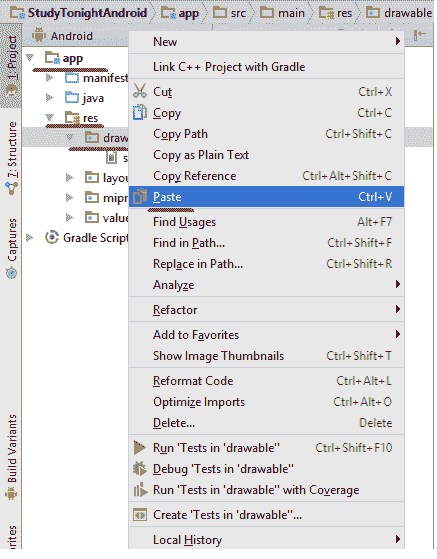
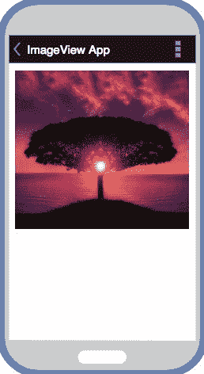

# 安卓系统中的`ImageView`和`ImageButton`

> 原文：<https://www.studytonight.com/android/android-imageview>

`ImageView`和`ImageButton`在安卓应用中用于在视图中放置图像。ImageButton 用于将图像用作 android 应用中的按钮。

* * *

## 安卓系统中的 ImageView

`ImageView`用于在用户界面上显示任何图片。

以下是一些最常用的主要属性:

| 属性 | 描述 |
| `android:maxHeight` | 用于指定此视图的最大高度。 |
| `android:maxWidth` | 用于指定此视图的最大宽度。 |
| `android:src` | 将可绘制的设置为此`ImageView`的内容。 |
| `android:scaleType` | 控制如何调整图像的大小或移动图像以匹配`ImageView`的大小。 |
| `android:tint` | 在`ImageView`中淡入图像的颜色。 |

因此，我们想要在应用中显示的任何图像都应该放在可绘制文件夹下。这个文件夹可以在 **app → res →可绘制**下找到。要插入图像，只需复制图像，然后右键单击**可绘制→粘贴**。



下面是我们需要添加到布局 XML 文件中的代码，以便将 ImageView 添加到我们的应用屏幕中。

```
<ImageView
    android:id="@+id/img"   
    android:layout_width="match_parent"
    android:layout_height="wrap_content"
    android:scaleType="fitCenter"
    android:src="@drawable/img_nature"/>
```



* * *

### ImageView 中还有一些常用的属性

以下是一些常用的属性:

*   `android:background`:这个属性给你的 ImageView 一个背景色。当您的图像不能完全填充`ImageView`时，背景色用于填充图像未覆盖的区域。
*   `android:padding`:在 ImageView 内部为图像提供填充或额外空间。

* * *

### ImageView 中的所有`scaleType`

这里我们已经为属性`scaleType`指定了所有可能的值，这些值可以在您的 ImageView 应用中使用:

*   **居中**:将图像放在中央，但不缩放。
*   **CENTER_CROP** :均匀缩放图像。
*   **CENTER_INSIDE** :这样会把图像放在容器里面，图像的边缘不会和容器的边缘重叠，图像会在里面。
*   **FIT_CENTER** :从中心开始缩放图像。
*   **FIT_END** :从容器的末端，也就是右手边开始缩放图像。
*   **FIT_START** :从容器开始，即从左手边开始缩放图像。
*   **FIT_XY** :这将使用图像填充整个容器。这通常会以不成比例的比例拉伸/扭曲图像。
*   **矩阵**:用于绘图时使用图像矩阵缩放图像。

* * *

### 将图像用作按钮

`ImageButton` has the same property as `ImageView`. Only one feature is extra, which is, images set through ImageButton are clickable, and actions can be attached with them upon clicking.

以下是如何在布局 XML 文件中定义`ImageButton`:

```
<ImageButton
    android:id="@+id/imgButton"
    android:layout_width="match_parent"
    android:layout_height="wrap_content"
    android:scaleType="fitCenter"
    android:src="@drawable/img_nature"/>
```

就像按钮一样，`setOnClickListener()`可以用来设置点击事件的事件监听器。

```
imageButton = (ImageButton)findViewById(R.id.imgButton);
imageButton.setOnClickListener(new View.OnClickListener() {
    @Override
    public void onClick(View v) {

        // do anything here

    }
});
```

* * *

* * *