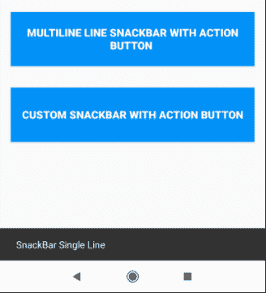
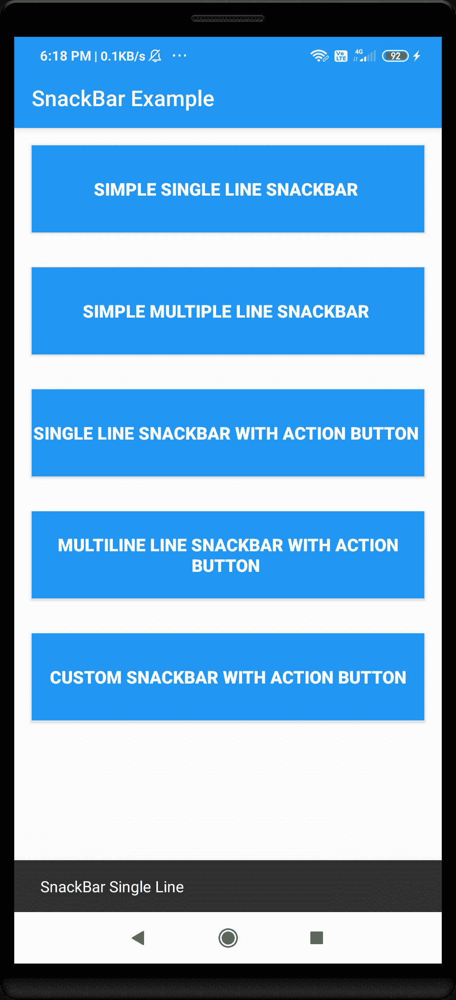
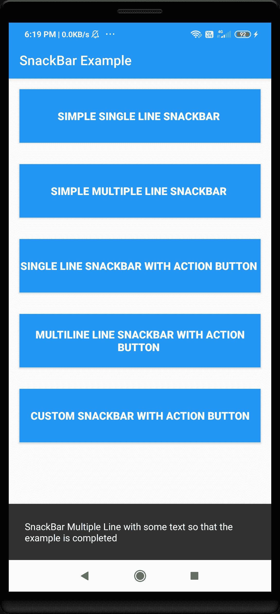
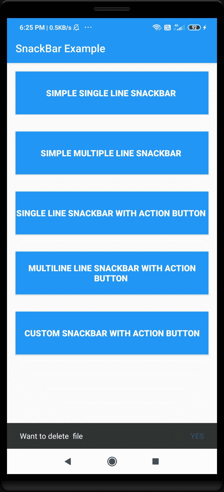
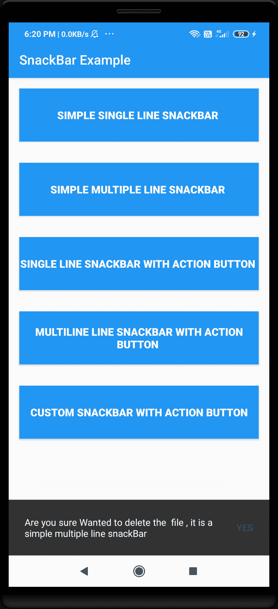
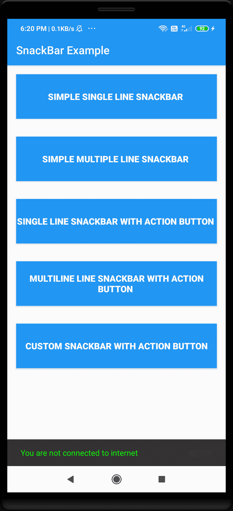

# 在安卓应用中创建自定义 Snackbar

> 原文：<https://www.studytonight.com/android/create-custom-snackbar-in-android-app>

为了给用户展示一些反馈，我们可以在安卓中使用不同的方法，比如在安卓中展示一个[吐司，一个小吃店，或者一个对话框等。因此在本教程中，我们将使用 **Snackbar** 向用户显示一些消息。](https://www.studytonight.com/android/toast-in-android)

Snackbar 在很多应用中都有使用，比如 YouTube(当没有互联网连接时，YouTube 会向我们显示一条消息，让我们查看下载的内容)、google photos(当我们将任何图像上传到 Google photos 时)、Google drive(当我们想要删除一些文件时)等。这里有一个例子:



## 什么是小吃店？

Snackbar 是一个轻量级的小部件，我们可以用它来替代 **Toast** (在某些情况下，Toast 比 snackbar 更有用，但这取决于不同的项目)。Snackbar 用于在应用屏幕底部向用户显示消息。Snackbar 还包含一个**可选操作按钮**。

为了在我们的安卓应用中实现 Snackbar，我们将使用**素材库**。

Snackbar 主要有 3 个部分，如下所示:

1.  **文字标签**:包含手机和平板的单行文字或多行文字(最多 2 行)。

2.  **容器**:snackbar 显示在**矩形容器**中，默认为灰色背景。容器应该是完全**不透明的**，这样用户就可以看到文本标签。

3.  **动作按钮**:这个是可选的，我们也可以用它来隐藏或者解除 snackbar。如果文本标签较长，第三行将显示**动作按钮**。我们必须为动作按钮和文本标签使用不同的颜色，以便用户可以区分两者。

## 吐司和小吃的区别

以下是吐司和小吃之间的一些主要区别:

| **吐司** | **Snackbar** |
| --- | --- |
| 吐司显示在屏幕的底部中央。 | 屏幕底部还会显示 Snackbar。 |
| 吐司可以定制为在屏幕的任何地方显示。 | Snackbar 不能自定义为显示在屏幕的任何地方，它只显示在屏幕的底部 |
| Toast 消息没有任何用于记录用户反馈的操作按钮 | Snackbar 有一个可选的操作按钮，但只支持一个操作按钮。 |
| 将显示一条吐司消息，直到其时间结束(吐司的持续时间变量为:`Length.Long`和`Length.Short`) | 用户可以通过轻扫、操作按钮或使用 Java 代码来提前取消 Snackbar。 |

### 如何设置 Snackbar 的持续时间？

以下是可用于设置 Snackbar 持续时间的常数:

*   **LENGTH _ unlimited**:无限长时间显示 Snackbar，直到被用户取消或添加另一个 Snackbar。

*   **LENGTH_LONG** :长时间(10 秒)显示 Snackbar。

*   **LENGTH_SHORT** :短时间(4 秒)显示 Snackbar。

## Snackbar 的一些重要方法:

以下是一些有用的 Snackbar 方法:

| **方法** | **描述** |
| --- | --- |
| `void dismiss()` | 它会取消 Snackbar，并且不返回任何内容。 |
| `int getDuration()` | 它返回 Snackbar 的持续时间。 |
| `boolean isShown()` | 用于检查是否显示 Snackbar。如果 snackbar 显示给用户，它将返回**真**，否则返回**假**。 |
| `make()` | 它用于制作 Snackbar，有 3 个参数:

*   视角

*   字符序列或 resId

*   持续时间

**语法:**

```
make (View view, CharSequence text, int duration);
```

**示例:**

```
make(constraintLayout, " some text ", Snackbar.LENGTH_SHORT);
```

 |
| `setAction()` | 它用于设置 snackbar 中的操作按钮，它需要 2 个参数:

*   字符序列或`resId`

*   `View.OnClickListener`

**语法:**

```
setAction(CharSequence text, View.OnClickListener listener);
```

**示例:**

```
setAction("Yes", new View.OnClickListener() {
    @Override
    public void onClick(View view) {
        // define what to do on click
    }
});
```

 |
| `setActionTextColor()` | 用于**设置动作**的文字颜色，只需 1 个参数:

*   颜色列表或`int`

**语法:**

```
setActionTextColor(int color);
// or 
setActionTextColor(ColorStateList colors);
```

**示例:**

```
setActionTextColor(Color.GREEN);
```

 |
| `setBackgroundTint()` | 它用于设置 Snackbar 背景的色调，它还采用 1 个参数:

*   `int`或颜色列表

**语法**T2:

```
setBackgroundTint(int color); 
// or 
setBackgroundTint(ColorStateList colors);
```

**示例:**

```
setBackgroundTint(Color.RED);
```

 |
| `setText()` | 它用于设置 Snackbar 的文本，它也只接受一个参数:

*   字符序列或`resId`

**语法:**

```
setText(CharSequence text);
// or
setText(int resId);
```

**示例:**

```
setText("hello world it is a simple snackbar");
```

 |
| `setTextColor()` | 它用于设置 snackbar 的文本颜色，它也只接受一个参数:

*   颜色状态列表或`int`

**语法:**

```
setTextColor(int color); 
// or 
setTextColor(ColorStateList colors);
```

**示例:**

```
setTextColor(Color.BLUE);
```

 |
| `void show()` | 它用于显示 Snackbar。它不返回任何内容，也没有参数。 |

因此，我们已经了解了 Snackbar 的一些基本知识，现在是时候在我们的安卓应用中添加这个惊人的功能了。我们必须遵循一些基本步骤，在我们的应用中添加 snackbar，如下所示。

## 步骤 1:创建新项目

1.  打开你的AndroidStudio点击“**开始一个新的AndroidStudio项目**”(学习[如何设置AndroidStudio](https://www.studytonight.com/android/setup-android-dev-env)[创建你的第一个安卓项目](https://www.studytonight.com/android/first-android-application))

2.  从项目模板窗口中选择**空活动**，点击**下一步**。

3.  输入 **App 名称**、**包名**、**保存位置**、**语言**([**Java**](https://www.studytonight.com/java/)/[**Kotlin**](https://www.studytonight.com/kotlin)，本教程我们将使用 **Java** )以及**最小 SDK** (我们使用的是 API 19: Android 4.4 (KitKat))

4.  填写以上详细信息后，点击**完成**按钮。

5.  现在，等待项目完成建设。

## 步骤 2:添加物料依赖关系

要在我们的应用中显示**工具栏**，我们必须在我们的应用中**实现****素材 l** 库，为此，请遵循以下步骤。

转到**梯度脚本- >构建.梯度(模块:应用)**部分，导入下面的依赖项，点击顶部显示的“**立即同步**:

```
dependencies {
    // Adding the material  library to add snackBar in our app
    implementation 'com.google.android.material:material:1.0.0'
}
```

## 第三步:修改活动

现在转到**app->RES->layout->activity _ main . XML**并添加一个 **[LinearLayout](https://www.studytonight.com/android/linear-layout-in-android)** 方向垂直，内部 **LinearLayout** 我们为不同类型的 snackbar 添加了不同的按钮。现在我们的 **activity_main.xml** 文件将如下所示

```
<?xml version = "1.0" encoding =  "utf-8" ?>
<androidx.constraintlayout.widget.ConstraintLayout
    android:id = "@+id/constraintLayout"
    xmlns:android = "http://schemas.android.com/apk/res/android"
    xmlns:app = "http://schemas.android.com/apk/res-auto"
    xmlns:tools = "http://schemas.android.com/tools"
    android:layout_width = "match_parent"
    android:layout_height = "match_parent"
    tools:context = ".MainActivity">

    <!-- simple linear layout containing different button -->
    <LinearLayout
        android:orientation = "vertical"
        android:layout_width = "match_parent"
        android:layout_height = "wrap_content">

        <!-- button with single line snackbar -->
        <Button
        android:id = "@+id/snackBar1"
        android:textAllCaps = "true"
        android:textStyle = "bold"
        android:textSize = "16dp"
        android:background = "@color/colorPrimary"
        android:textColor = "#ffffff"
        android:text = "Simple Single Line Snackbar "
        android:layout_margin = "16dp"
        android:layout_width = "match_parent"
        android:layout_height = "80dp"/>

        <!-- button with multi line snackbar -->
        <Button
        android:id = "@+id/snackBar2"
        android:textAllCaps = "true"
        android:textStyle = "bold"
        android:textSize = "16dp"
        android:background = "@color/colorPrimary"
        android:textColor = "#ffffff"
        android:text = "Simple Multiple Line Snackbar "
        android:layout_margin = "16dp"
        android:layout_width = "match_parent"
        android:layout_height = "80dp"/>

        <!-- button with single line snackbar with action button -->
        <Button
        android:id = "@+id/snackBar3"
        android:textAllCaps = "true"
        android:textStyle = "bold"
        android:textSize = "16dp"
        android:background = "@color/colorPrimary"
        android:textColor = "#ffffff"
        android:text = "Single line Snackbar With Action Button "
        android:layout_margin = "16dp"
        android:layout_width = "match_parent"
        android:layout_height = "80dp"/>

        <!-- button with multiline snackbar with action button -->
        <Button
        android:id = "@+id/snackBar4"
        android:textAllCaps = "true"
        android:textStyle = "bold"
        android:textSize = "16dp"
        android:background = "@color/colorPrimary"
        android:textColor = "#ffffff"
        android:text = "MultiLine line Snackbar With Action Button "
        android:layout_margin = "16dp"
        android:layout_width = "match_parent"
        android:layout_height = "80dp"/>

        <!-- button with custom snackbar with action button -->
        <Button
        android:id = "@+id/snackBar5"
        android:textAllCaps = "true"
        android:textStyle = "bold"
        android:textSize = "16dp"
        android:background = "@color/colorPrimary"
        android:textColor = "#ffffff"
        android:text = "Custom Snackbar With Action Button"
        android:layout_margin = "16dp"
        android:layout_width = "match_parent"
        android:layout_height = "80dp"/>

    </LinearLayout>

</androidx.constraintlayout.widget.ConstraintLayout>
```

现在，我们的应用界面将如下所示:


## 第四步:MainActivity.java 文件

这是我们 app 中添加 snackbar 的主要部分，首先我们打开**MainActivity.java**文件，导入一些基础类，如下图:

```
//import the basic library
import com.google.android.material.snackbar.Snackbar;
import android.graphics.Color;
import android.os.Bundle ;
import android.view.View;
import android.widget.Button;
import android.widget.TextView;
import android.widget.Toast;
```

接下来，我们在 MainActivity 类中创建 [Android](https://www.studytonight.com/android/margin-vs-padding) **[按钮](https://www.studytonight.com/android/margin-vs-padding)** 的对象，如下所示:

```
//creating 5 different object of Button class 
    private Button b1, b2, b3, b4, b5;
```

现在我们创建不同的方法来显示不同类型和风格的 **Snackbar** ，如下图:

```
private void showSnackBarSingleLine() {
	ConstraintLayout constraintLayout = (ConstraintLayout) findViewById(R.id.constraintLayout);
	Snackbar snackbar = Snackbar.make(constraintLayout, "SnackBar Single Line", Snackbar.LENGTH_SHORT);
	snackbar.show();
}

private void showSnackBarMultipleLine() {
	ConstraintLayout constraintLayout = (ConstraintLayout) findViewById(R.id.constraintLayout);
	Snackbar snackbar = Snackbar.make(constraintLayout, "SnackBar Multiple Line with some text so that the example is completed ", Snackbar.LENGTH_SHORT);
	snackbar.show();
}

private void showSnackBarSingleLineWithActionButton() {
	ConstraintLayout constraintLayout = (ConstraintLayout) findViewById(R.id.constraintLayout);
	Snackbar snackbar = Snackbar.make(constraintLayout, "Want to delete  file", Snackbar.LENGTH_SHORT);

	snackbar.setAction("Yes", new View.OnClickListener() {@Override
		public void onClick(View view) {
			Toast.makeText(MainActivity.this, "Your file is deleted  ", Toast.LENGTH_SHORT).show();
		}
	});
	snackbar.show();
}

private void showSnackBarMultipleLineWithActionButton() {
	ConstraintLayout constraintLayout = (ConstraintLayout) findViewById(R.id.constraintLayout);
	Snackbar snackbar = Snackbar.make(constraintLayout, "Are you sure Wanted to delete the  file , it is a simple multiple line snackBar ", Snackbar.LENGTH_SHORT);

	snackbar.setAction("Yes", new View.OnClickListener() {@Override
		public void onClick(View view) {
			Toast.makeText(MainActivity.this, "Your file is deleted  ", Toast.LENGTH_SHORT).show();
		}
	});
	snackbar.show();
}

private void showCustomSnackBar() {
	ConstraintLayout constraintLayout = (ConstraintLayout) findViewById(R.id.constraintLayout);

	Snackbar snackbar = Snackbar.make(constraintLayout, "You are not connected to internet ", Snackbar.LENGTH_LONG).setAction("RETRY", new View.OnClickListener() {@Override
		public void onClick(View view) {
			Toast.makeText(MainActivity.this, "Waiting for connection ", Toast.LENGTH_SHORT).show();

		}
	});
	//setting action text color o red 
	snackbar.setActionTextColor(Color.RED);
	View sbView = snackbar.getView();
	//getting the textview of the snackbar 
	TextView textView = (TextView) sbView.findViewById(com.google.android.material.R.id.snackbar_text);
	//setting snackbar text color to green
	textView.setTextColor(Color.GREEN);
	snackbar.show();

}
```

现在在`onCreate()` 方法中，我们初始化**按钮**并添加 OnClick Listener 并调用`onClick()`中相应的方法:

```
b1 = (Button) findViewById(R.id.snackBar1);
b2 = (Button) findViewById(R.id.snackBar2);
b3 = (Button) findViewById(R.id.snackBar3);
b4 = (Button) findViewById(R.id.snackBar4);
b5 = (Button) findViewById(R.id.snackBar5);

b1.setOnClickListener(new View.OnClickListener() {@Override
	public void onClick(View view) {
		showSnackBarSingleLine();
	}
});

b2.setOnClickListener(new View.OnClickListener() {@Override
	public void onClick(View view) {
		showSnackBarMultipleLine();
	}
});

b3.setOnClickListener(new View.OnClickListener() {@Override
	public void onClick(View view) {
		showSnackBarSingleLineWithActionButton();
	}
});

b4.setOnClickListener(new View.OnClickListener() {@Override
	public void onClick(View view) {
		showSnackBarMultipleLineWithActionButton();
	}
});

b5.setOnClickListener(new View.OnClickListener() {@Override
	public void onClick(View view) {
		showCustomSnackBar();
	}
});
```

一旦您在您的主活动中添加了所有上述代码，我们就可以运行我们的应用了。

## Snackbar 的输出屏幕:

在下面的快照中，您可以看到 **SnackBar** 在安卓应用中的外观。

**简单单线蛇形线:**



**简单多线 Snackbar:**



**带动作按钮的简单单线 Snackbar:**



**带动作按钮的简单多线 Snackbar:**



**带操作按钮的自定义 Snackbar:**



在本教程中，我们学习了如何使用素材库向我们的安卓应用添加 Snackbar。我们学习了如何编写代码在安卓应用中显示 Snackbar，以及如何在其中添加各种功能。

* * *

* * *