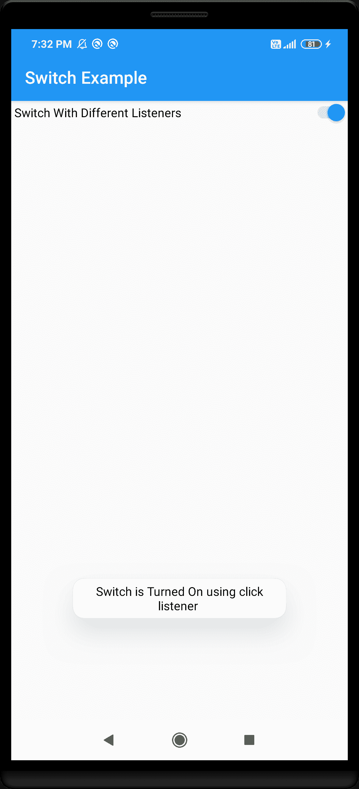
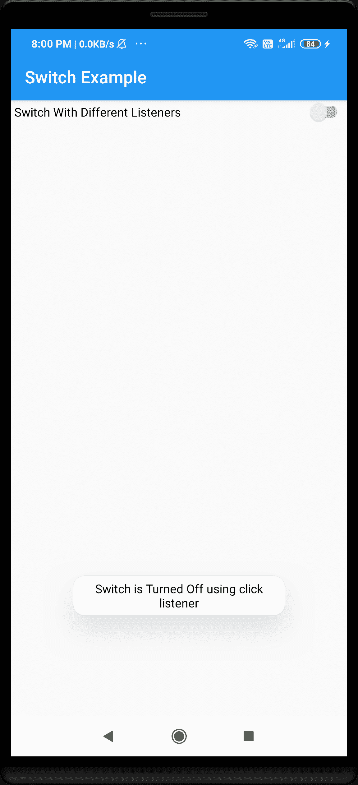
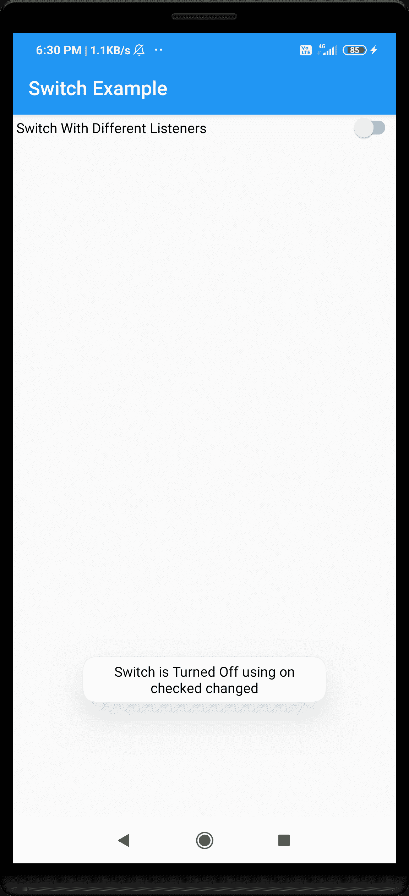
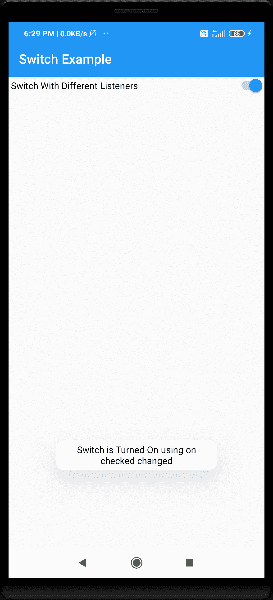

# 安卓切换开关按钮

> 原文：<https://www.studytonight.com/android/android-toggle-switch-button>

在各种安卓应用中，我们看到了不同类型的开关，比如 YouTube(切换到自动播放下一个视频)、Truecaller(切换到启用暗主题、阻止通话、通话录音开关等。)，在脸书设置，Gmail，WhatsApp(为安全启用指纹锁定)和许多其他应用。

## 什么是开关？

在 AndroidStudio**开关**是一个双态**切换开关小部件**，可以用来在两个选项之间进行选择。它主要用于显示选项的开和关状态，对于用户来说，它看起来像一个简单的滑块控件。用户可以前后拖动“拇指”来选择所选选项，或者我们可以简单地点击来切换开关的状态。

常用于选择开/关热点、手电筒、WiFi 等。是`android.widget.CompoundButton`类的子类。

**开关**在功能上类似于一个**切换按钮**，但两者都有一些区别，比如**开关有一个蜘蛛来控制开关的状态**，开关和切换按钮的用户界面都不一样。

现在我们已经对 switch 有了足够的了解，让我们在安卓应用中添加一个 switch。

## 步骤 1:创建新项目

1.  打开你的 AndroidStudio 点击“**开始一个新的 AndroidStudio 项目**”(学习[如何设置 AndroidStudio](https://www.studytonight.com/android/setup-android-dev-env)[创建你的第一个安卓项目](https://www.studytonight.com/android/first-android-application))

2.  从项目模板窗口中选择**空活动**，点击**下一步**。

3.  输入 **App 名称**、**包名**、**保存位置**、**语言**([**Java**](https://www.studytonight.com/java/)/[**Kotlin**](https://www.studytonight.com/kotlin)，本教程我们将使用 **Java** )以及**最小 SDK** (我们使用的是 API 19: Android 4.4 (KitKat))

4.  填写以上详细信息后，点击**完成**按钮。

5.  现在，等待项目完成建设。

## 第二步:添加切换到安卓活动

现在转到 **app - > res - >布局- > activity_main.xml** 并添加 **Switch** ，现在我们的 **activity_main.xml** 文件将如下所示:

```java
<?xml version = "1.0" encoding =  "utf-8" ?>
<RelativeLayout
    android:id = "@+id/constraintLayout"
    xmlns:android = "http://schemas.android.com/apk/res/android"
    xmlns:app = "http://schemas.android.com/apk/res-auto"
    xmlns:tools = "http://schemas.android.com/tools"
    android:layout_width = "match_parent"
    android:layout_height = "match_parent"
    tools:context = ".MainActivity">

        <Switch
            android:layout_width = "wrap_content"
            android:layout_height = "wrap_content"/>

</RelativeLayout>
```

在上面的代码中，我们在我们的安卓活动中添加了默认的切换开关。

## 交换机的属性示例:

让我们更多地了解 switch 的属性，以及如何在安卓应用中使用它们来定制 Switch。

### 1.属性标识:

它用于为交换机设置一个**唯一 id** ，通过它我们可以识别一个特定的交换机，这意味着不同的交换机有不同的 id。

```java
<Switch
    android:id = "@+id/mySwitchId"
    android:layout_width = "wrap_content"
    android:layout_height = "wrap_content"/>
```

### 2.选中的属性:

该属性用于设置**开关**的当前状态。该值可以是**真**或**假**，勾选属性的默认值为**假**。当我们设置`checked="true"`时，开关默认为选中，当我们设置**为假**时，开关变为未选中。

```java
<Switch
    android:checked = "true"
    android:id = "@+id/mySwitchId"
    android:layout_width = "wrap_content"
    android:layout_height = "wrap_content"/>
```

我们也可以使用`setChecked(Boolean b)`功能在 Java 代码中更改开关的选中状态，其中`b`可以是**真**也可以是**假**，如下图所示:

```java
Switch sw = (Switch) findViewById(R.id.mySwitchId);
sw.setChecked(true);
sw.setChecked(false); 
```


### 3.文本属性:

它用于设置开关的文本。我们可以直接设置文本，如下所示:

```java
<Switch
    android:text = "Dark Mode"
    android:id = "@+id/mySwitchDarkMode"
    android:layout_width = "wrap_content"
    android:layout_height = "wrap_content"/>
```

或者我们也可以使用如下所示的`setText(CharcaterSwequence cs)`函数在 Java 代码中动态更改文本:

```java
Switch swdark = ( Switch ) findViewById( R.id.mySwitchDarkMode );
swdark.setText( "Dark Mode" ); 
```


### 4.重力属性:

它用于在**开关**中设置文本的重力。默认值为**左侧**。重力的数值有很多，如**右**、**左**、**中心**、**中心 _ 水平**、**顶部**、**底部**、**中心 _ 垂直**、**夹 _ 水平**、**夹 _ 垂直**、**末端**、**填充**、**等要查看重力的影响，我们必须设置`android:layout_width = "match_parent"`**

```java
<Switch
    android:gravity = "right"
    android:text = "Gravity Right"
    android:id = "@+id/mySwitchGravity"
    android:layout_width = "match_parent"
    android:layout_height = "wrap_content"/>
```

我们也可以使用如下所示的`setGravity(int gravity)`函数在运行时改变 Java 代码中的文本重力:

```java
Switch swgravity = ( Switch ) findViewById( R.id.mySwitchGravity );
swgravity.setGravity( Gravity.RIGHT ); 
```


### 5.文本开和文本关属性:

**文本开**属性用于设置开关处于选中状态时我们想要显示的文本(表示处于打开状态)**文本关**属性用于设置开关处于未选中状态时我们想要显示的文本(表示处于关闭状态)，如下图所示。为了显示**文本关闭**和**文本打开**文本，我们设置了`showText = "true"`

```java
<Switch
    android:textOff = "Disable"
    android:textOn = "Enable"
    android:text = "System  Sound"
    android:id = "@+id/mySwitchTextOnOff"
    android:layout_width = "match_parent"
    android:layout_height = "wrap_content"
    android:showText = "true"/>
```

我们还可以使用如下所示的`setTextOn(CharSeqence texton)`和`setTextOff(CharSeqence textoff)`函数来更改 Java 代码中的**文本开**和**文本关**值:

```java
Switch swOnOff = ( Switch ) findViewById( R.id.mySwitchTextOnOff );
swOnOff.setTextOn( "Enabled" );
swOnOff.setTextOff( "Disabled" );
```

<u>**输出为**</u>


<u>**输出为**</u>


### 6.文本颜色属性:

它用于设置开关的文本颜色。颜色值可以是任何一种形式的" #argb "、" #rgb "、" #rrggbb "或" # aarrggbb "。

```java
<Switch
    android:textColor = "#FF0000"
    android:text = "Color text Switch"
    android:id = "@+id/mySwitchTextColor"
    android:layout_width = "match_parent"
    android:layout_height = "wrap_content"/>
```

我们也可以在 Java 代码中使用如下所示的`void setTextColor(int color)`或`void setTextColor(ColorStateList colors)`函数做同样的事情:

```java
Switch swtxtColor = ( Switch ) findViewById( R.id.mySwitchTextColor );
swtxtColor.setTextColor(Color.RED);
```


### 7.文本大小属性:

该属性用于设置**开关**文本的大小。我们可以在 **dp** 、**中**、 **mm** 、 **pt** 、 **px** 、 **sp** 中用 XML 设置尺寸。在下面的示例中，我们将文本大小设置为 **32 dp** :

```java
<Switch
    android:textSize = "32dp"
    android:text = " Text Size Switch"
    android:id = "@+id/mySwitchTextSize"
    android:layout_width = "match_parent"
    android:layout_height = "wrap_content"/>
```

我们可以使用`void setTextSize(float size)`和`void setTextSize(int unit, float size)`函数从 Java 代码中更改文本大小:

```java
Switch swtxtSize = ( Switch ) findViewById( R.id.mySwitchTextSize );
swtxtSize.setTextSize( 32 );
```


### 8.文本样式属性:

它用于设置开关文本的文本样式。安卓系统提供的 3 种文本样式分别是**粗体**、**普通**和**斜体**。默认的文本样式是**普通的**，如果我们想要使用多个文本样式，那么我们可以在不同的样式之间使用`**|**`(管道)操作符，例如**粗体|斜体**。

```java
<Switch
    android:textStyle = "bold"
    android:text = " Text Style Switch"
    android:id = "@+id/mySwitchTextStyle"
    android:layout_width = "match_parent"
    android:layout_height = "wrap_content"/>
```

我们也可以使用如下所示的`void setTypeface( Typeface tf)` 和`void setTypeface( Typeface typeface, int style )`函数来改变 Java 代码的文本样式:

```java
Switch swtxtStyle = ( Switch ) findViewById( R.id.mySwitchTextStyle );
swtxtStyle.setTypeface( Typeface.DEFAULT_BOLD );
```


### 9.背景属性:

用于设置开关的背景。它可以是**颜色**或**可绘制**(图像)或任何**自定义 xml 文件**。在本教程中，我们将添加一个简单的红色背景:

```java
<Switch
    android:background = "#FF0000"
    android:text = " Switch With Background"
    android:id = "@+id/mySwitchBackground"
    android:layout_width = "match_parent"
    android:layout_height = "wrap_content"/>
```

我们也可以使用`void setBackgroundColor( int color)`函数从 Java 代码中设置背景:

```java
Switch swBackground = ( Switch ) findViewById( R.id.mySwitchBackground );
swBackground.setBackgroundColor( Color.RED);
```


### 10.填充属性:

它用于设置开关的填充。我们可以使用`padding`属性一次性设置上、下、左、右填充，也可以使用`paddingLeft`、`paddingRight`、`paddingTop`和`paddingBottom`属性为上、下、左、右添加不同的填充。

```java
<Switch
    android:paddingLeft = "12dp"
    android:paddingBottom = "10dp"
    android:paddingTop = "14dp"
    android:paddingRight = "6dp"
    android:padding = "16dp"
    android:text = " Switch With Padding"
    android:layout_width = "match_parent"
    android:layout_height = "wrap_content"/>
```

我们也可以使用如下所示的`void setPadding( int left, int top, int right, int bottom )` 函数从 Java 代码中添加填充:

```java
Switch swPadding = ( Switch ) findViewById( R.id.mySwitchPadding );
swPadding.setPadding(12,14,6,10 );
```


## 交换机中的不同监听器:

现在让我们介绍一下事件或点击监听器功能，这些功能可用于捕捉用户点击切换开关并执行一些操作。

### 1.使用 setOnClickListener(OnClickListener l)侦听器:

当我们想要检查开关是否被点击并根据点击做出决定时，我们可以使用这个监听器。在`public void onClick(View view)`功能中，会检查开关是否勾选使用`boolean isChecked()`功能，并根据开关状态向用户显示吐司，如下图:

```java
final Switch aSwitch = (Switch) findViewById(R.id.mySwitchListener);

aSwitch.setOnClickListener(new View.OnClickListener() 
{
    @Override
	public void onClick(View view) {
		if (aSwitch.isChecked()) //checking if  switch is checked
		{
			Toast.makeText(MainActivity.this, "Switch is Turned On using click listener ", Toast.LENGTH_SHORT).show();
		} else {
			Toast.makeText(MainActivity.this, "Switch is Turned Off using click listener", Toast.LENGTH_SHORT).show();
		}
	}
});
```

以下是输出屏幕:

 

### 2.使用 setnchckedchangelistener(onchecedchangelistener l)监听器:

当开关状态改变时，该监听器被调用，这意味着当我们**将开关从关闭状态切换到开启状态**时，反之亦然。与 **onClickListener** 的主要区别在于，这仅在状态改变时调用，但是 **onClickListener** 在我们每次点击**开关**时都会被调用。

在 **onCheckedChangeListener** 中，我们有一个`onCheckedChanged(CompoundButton compoundButton, boolean b)`，我们可以使用布尔值来检查开关的状态，并根据布尔值执行功能:

```java
aSwitch.setOnCheckedChangeListener(new CompoundButton.OnCheckedChangeListener() {@Override
	public void onCheckedChanged(CompoundButton compoundButton, boolean b) {
		if (b) //checking if the user turned on the switch
		{
			Toast.makeText(MainActivity.this, "Switch is Turned On using on checked changed", Toast.LENGTH_SHORT).show();

		} else {
			Toast.makeText(MainActivity.this, "Switch is Turned Off using on checked changed", Toast.LENGTH_SHORT).show();
		}
	}
});
```

以下是输出屏幕:

 

根据我们的需要，还有许多其他的听众可以使用。这 2 个监听器是最基本的，任何项目都可以用这些监听器完成，没有任何问题。

* * *

* * *