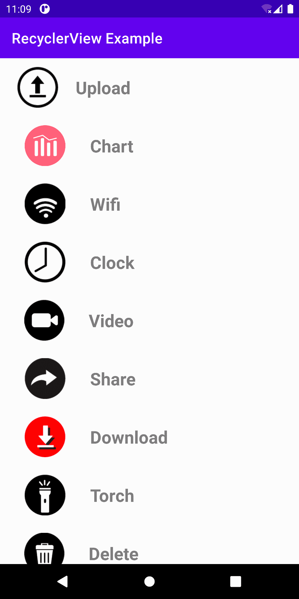
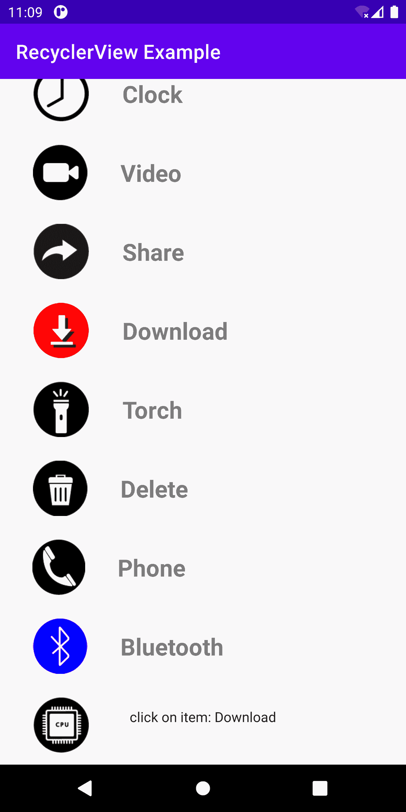

# 安卓`RecyclerView`

> 原文：<https://www.studytonight.com/android/android-recycler-view>

在本文中，我们将把 **Recycler View** 添加到我们的安卓应用中。为此，我们使用**回收商视图**。**回收机视图**是 AndroidStudio 的一个**视图**，和 Listview 类似，但是控件和功能更多。那么，让我们创建一个项目。

## 步骤 1:创建新项目

1.  打开你的 AndroidStudio 点击“**”开始新的 AndroidStudio 项目**”(学习[如何设置 AndroidStudio](https://www.studytonight.com/android/setup-android-dev-env)、[创建你的第一个安卓项目](https://www.studytonight.com/android/first-android-application))。

2.  从项目模板窗口中选择“**空活动**，点击**下一步。**

3.  输入 **App 名称**、**包名**、**保存位置**、**语言**(**Java**/**Kotlin**，本教程我们使用 **Java** )和**最小 SDK** (我们使用的是 API 19: Android 4.4 (KitKat))。

4.  填写完所有细节后，点击**完成**按钮，

5.  现在，等待项目完成建设。

## 步骤 2:添加依赖项

转到**梯度脚本- >构建.梯度(模块:应用)**部分，导入下面的依赖项，点击顶部显示的“**立即同步**:

```
dependencies
{
//Adding Recycler view 
 implementation 'androidx.recyclerview:recyclerview:1.2.1'
}
```

## 第三步:用户界面部分

在对 **activity_main.xml** 文件进行任何更改之前，我们需要一个将在**`RecyclerView`**中显示的图像和文本，您可以[下载](https://elasq.com/)任何图像，并将该图像放入**app->RES->drawing able，**中，并给它一个合适的名称。

现在，转到 **app - > res - >布局- > activity_main.xml** 并添加**recycle view**，如下所示。

```
<?xml version = "1.0" encoding = "utf-8"?>
<RelativeLayout
    xmlns:android = "http://schemas.android.com/apk/res/android"
    xmlns:tools = "http://schemas.android.com/tools"
    android:layout_width = "match_parent"
    android:layout_height = "match_parent"
    tools:context = ".MainActivity">

    <!-- Recycler view -->
    <androidx.recyclerview.widget.RecyclerView
        android:id = "@+id/recycleView"
        android:layout_width = "match_parent"
        android:layout_height = "match_parent"/>
</RelativeLayout>
```

接下来，我们在其中创建一个新的布局资源文件(**recycle view _ row . XML**)，我们添加一个简单的 **ImageView** 和 **TextView** 集合。**recycle view _ row . XML**的完整代码如下

```
<?xml version="1.0" encoding="utf-8"?>
<RelativeLayout
  xmlns:android="http://schemas.android.com/apk/res/android"
    android:layout_width="match_parent"
    android:layout_height="?android:attr/listPreferredItemHeightLarge"
    android:id="@+id/relativeLayout">
    <ImageView
        android:padding="4dp"
        android:layout_centerVertical="true"
        android:layout_alignParentStart="true"
        android:layout_alignParentLeft="true"
        android:id="@+id/imageView"
        android:layout_width="wrap_content"
        android:layout_height="wrap_content"
       android:layout_margin="8dp"
        android:contentDescription="Icon" />
    <TextView
        android:textStyle="bold"
        android:layout_width="wrap_content"
        android:layout_height="match_parent"
        android:id="@+id/textView"
        android:layout_toEndOf="@id/imageView"
        android:gravity="center_vertical"
        android:textSize="24sp"/>
</RelativeLayout>
```

## 第 4 步:编码部分

首先，我们创建一个**MyData.java**类，并添加如下所示的代码。

```
package com.studytonight.project;

public class MyData {

    private String desc;
    private int imgId;
    public MyData(String desc, int imgId) {
        this.desc = desc;
        this.imgId = imgId;
    }
    public String getDescription() {
        return desc;
    }
    public int getImgId() {
        return imgId;
    }
} 
```

然后，我们创建一个新的**RecyclerViewAdapter.java**类，**将其扩展到**回收视图。适配器<再循环适配器。viewpholder>**并实现了它的一些方法，如下所示。**

```
package com.studytonight.project;

import android.view.LayoutInflater;
import android.view.View;
import android.view.ViewGroup;
import android.widget.ImageView;
import android.widget.RelativeLayout;
import android.widget.TextView;
import android.widget.Toast;
import androidx.recyclerview.widget.RecyclerView;
public class RecyclerViewAdapter extends RecyclerView.Adapter < RecyclerViewAdapter.ViewHolder > {
    private MyData[] mydata;
    // RecyclerView recyclerView;  
    public RecyclerViewAdapter(MyData[] mydata) {
        this.mydata = mydata;
    }
    @Override
    public ViewHolder onCreateViewHolder(ViewGroup parent, int viewType) {
        LayoutInflater layoutInflater = LayoutInflater.from(parent.getContext());
        View listItem = layoutInflater.inflate(R.layout.recyclerview_row, parent, false);
        ViewHolder viewHolder = new ViewHolder(listItem);
        return viewHolder;
    }
    @Override
    public void onBindViewHolder(ViewHolder holder, int position) {
        final MyData MyData = mydata[position];
        holder.textView.setText(mydata[position].getDescription());
        holder.imageView.setImageResource(mydata[position].getImgId());
        holder.relativeLayout.setOnClickListener(new View.OnClickListener() {
            @Override
            public void onClick(View view) {
                Toast.makeText(view.getContext(), "click on item: " + MyData.getDescription(), Toast.LENGTH_LONG).show();
            }
        });
    }
    @Override
    public int getItemCount() {
        return mydata.length;
    }
    public static class ViewHolder extends RecyclerView.ViewHolder {
        public ImageView imageView;
        public TextView textView;
        public RelativeLayout relativeLayout;
        public ViewHolder(View itemView) {
            super(itemView);
            this.imageView = (ImageView) itemView.findViewById(R.id.imageView);
            this.textView = (TextView) itemView.findViewById(R.id.textView);
            relativeLayout = (RelativeLayout) itemView.findViewById(R.id.relativeLayout);
        }
    }
}
```

最后，我们将数据添加到`RecyclerView`中，并显示给用户。**MainActivity.java**的完整代码如下:

```
package com.studytonight.project;

import androidx.appcompat.app.AppCompatActivity;
import androidx.recyclerview.widget.LinearLayoutManager;
import androidx.recyclerview.widget.RecyclerView;
import android.os.Bundle;
public class MainActivity extends AppCompatActivity {

    @Override
    protected void onCreate(Bundle savedInstanceState) {
        super.onCreate(savedInstanceState);
        setContentView(R.layout.activity_main);        
        MyData[] myListData = new MyData[]{
                new MyData("Upload", R.drawable.u1),
                new MyData("Chart", R.drawable.u2),
                new MyData("Wifi", R.drawable.u3),
                new MyData("Clock", R.drawable.u4),
                new MyData("Video", R.drawable.u5),
                new MyData("Share", R.drawable.u6),
                new MyData("Download", R.drawable.u7),
                new MyData("Torch", R.drawable.u8),
                new MyData("Delete", R.drawable.u9),
                new MyData("Phone", R.drawable.u10),
                new MyData("Bluetooth", R.drawable.u11),
                new MyData("Processor", R.drawable.u12),
        };
        RecyclerView recyclerViewOKL = (RecyclerView) findViewById(R.id.recycleView);
        RecyclerViewAdapter adapter = new RecyclerViewAdapter(myListData);
        recyclerViewOKL.setHasFixedSize(true);
        recyclerViewOKL.setLayoutManager(new LinearLayoutManager(MainActivity.this));
        recyclerViewOKL.setAdapter(adapter);
    }
}
```

### 输出:

在下面的快照中，您可以看到 **Recycler View** 在安卓应用中的外观。

首次打开应用时:



当我们向下滚动时


当我们点击项目时



* * *

* * *