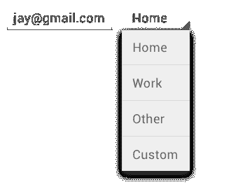

# 安卓系统中的旋转器

> 原文：<https://www.studytonight.com/android/spinner-in-android>

在本教程中，我们将学习和探索安卓系统中的 Spinner。让我们从理解什么是旋转器开始。

**微调器**是一种视图类型，以下拉菜单的形式保存项目，供用户选择。它创建了一个带有多个选项的菜单，用户可以在其中选择任何一个选项。下面是一个微调器的示例。



我们可以通过向布局 XML 文件添加以下代码来创建一个 Spinner:

```
<Spinner
    android:id="@+id/days_spinner"
    android:layout_width="fill_parent"
    android:layout_height="wrap_content" />
```

* * *

### Spinner 和 ListView 有什么区别？

[列表视图](android-listview)和微调器看起来非常相似。但是它们彼此不同。

**微调器**提供了从给定的一组值中选择一个值的快速方法，在默认状态下，微调器仅显示当前选定的值。当您触摸(点击)微调器时，它会显示一个包含所有其他可用值(选项)的下拉菜单，用户可以从中选择一个新值。

**ListView** 则是一个显示可滚动项目列表的视图组。使用[适配器](adapter-and-adapter-view)将列表项自动插入到列表中，该适配器从数据源(如数组或数据库表)提取内容，并将每个数据项转换为放置在列表中的视图。

因此，Spinner 和 ListView 在显示方式和用法上也有所不同。如果您想从一组选项中只选择一个值，那么您应该使用微调器。如果要显示数据列表，请使用列表视图。

* * *

### 旋转器是如何工作的？

1.  **Define the data source**

    应该有一个用于在微调器中显示数据的数据源。

    ```
    String days[] = {"Monday", "Tuesday", "Wednesday", "Thursday", "Friday", "Saturday", "Sunday"};
    ```

    数据源可以是列表、数组、JSON 数据或来自数据库的数据。

3.  **Define the Adapter**

    将有一个[适配器](adapter-and-adapter-view) (ArrayAdapter 等)从数据源获取数据，创建一个视图，然后将其传递给适配器视图，即**微调器**。因此，您需要告诉适配器如何通过为下拉列表指定布局来显示数据。

    ```
    ArrayAdapter<String> adapter =  new ArrayAdapter<>(this, android.R.layout.simple_spinner_item, days);
    ```

    有 3 个参数用于实例化 ArrayAdapter(我们在示例中使用了 ArrayAdapter):

    *   **上下文 c** :指当前正在实例化 ArrayAdapter 的类对象。
    *   **布局**:这是一个布局文件，定义了单个项目在微调器中的显示方式。安卓 SDK 默认提供`simple_spinner_item`、`simple_spinner_dropdown_item`这样的布局，如果你没有什么特殊的设计要求，我们建议你只用这些。
    *   **数据源**:是将数据转换为视图的数据源。

5.  **Define any actions for Spinner**

    要为选项选择添加事件处理程序，您可以实现[OnemSelected Listener](https://developer.android.com/reference/android/widget/AdapterView.OnItemSelectedListener.html)界面，以确定当用户从菜单中选择任何选项时会发生什么。为此，您需要实现上述接口并重写两个方法:

    #### 未选中()

    该方法有 4 个参数:

    *   **AdapterView av** :您使用的是 Spinner 视图。
    *   **视图 v** :它定义了被点击的微调器内部的文本视图。
    *   **int 位置**:告知在微调器中点击的项目的位置。索引或位置从 0 开始。
    *   **长 id** :给出在微调器中点击的项目的行 id。该参数主要用于安卓系统中处理数据库时。

    #### onNothingSelected()

    此方法只有一个参数:

    **AdapterView av** :您使用的是 Spinner 视图。只要当前选定的项目从微调器的可用项目列表中移除，就会调用此方法。如果适配器被修改，使得当前选定的项不再可用，则将调用此方法。可以使用此方法，以便您可以设置在前一个项目不再可用时将选择哪个项目。这将阻止微调器自动选择列表中的下一项。

    如果`mySpinner`是一个 Spinner 视图的实例，那么下面是我们如何实现上面的监听器:

    ```
    mySpinner.setOnItemSelectedListener(new AdapterView.OnItemSelectedListener() {

        @Override
        public void onItemSelected(AdapterView<?> parent, View view, int position, long id) 
        { 
            // An item was selected. You can retrieve the selected item using
            // parent.getItemAtPosition(pos)
        }

        @Override
        public void onNothingSelected(AdapterView<?> parent) 
        { 
            // If an option is removed then what to do
            // or anything else
        }

    });
    ```

我们希望您已经了解了什么是 Spinners 以及如何实现它们。在下一个教程中，我们将看到如何在我们的安卓应用中创建一个微调器。

* * *

* * *