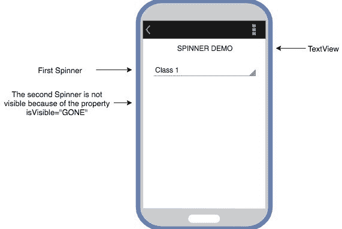
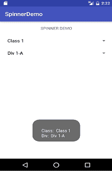
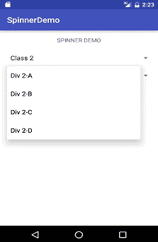
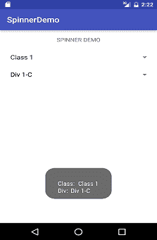

# 在安卓系统中使用`Spinner`

> 原文：<https://www.studytonight.com/android/spinner-example-in-android>

你已经学习了什么是[`Spinner`](spinner-in-android)以及它们是如何工作的。因此，让我们检查一个例子，并了解如何在我们的安卓应用中实现它。

在本教程中，我们将创建一个应用，它与两个依赖于 inder 的 Spinners 一起工作。应用的主布局将包含我们的**一个[`TextView`](android-textview)** 和**两个[`Spinner`](spinner-in-android)** 作为其子组件视图。因此，我们需要定制布局(如下图所示)，其中一个`Spinner`位于`TextView`下方，另一个`Spinner`位于第一个`Spinner`下方。

由于第二个`Spinner`中的选项将取决于我们在第一个`Spinner`中选择的内容，因此最初第二个`Spinner`将被隐藏，并且只有当用户从第一个`Spinner`中选择了一个选项时才会出现。

第二个`Spinner`的属性`isVisible`等于**go**，这意味着它存在于布局中，但不可见(或隐藏)。

因此，在下图中，它看起来好像不存在。但是你可以试着把 isVisible 的值改成`VISIBLE`看看有没有。但之后暂时改回`GONE`。



第一个`Spinner`(`classSpinner`)包含用户要选择的课程列表(在学校中)，基于该选择，我们将值分配给第二个`Spinner`(`divSpinner`)。当用户也从第二个`Spinner`中选择一个选项时，我们将创建一个吐司并在屏幕上显示所选的值。

让我们开始吧，这里有布局 XML 文件。如果需要，复制并粘贴下面的 XML，以便在您的本地计算机上开始这个示例。

**main_activity.xml**

```kt
<?xml version="1.0" encoding="utf-8"?>
<RelativeLayout xmlns:android="http://schemas.android.com/apk/res/android"
    xmlns:tools="http://schemas.android.com/tools"
    android:layout_width="match_parent"
    android:layout_height="match_parent"
    tools:context="com.example.akshay.studytonightandroid.MainActivity">

    <TextView
        android:id="@+id/tvDemo"
        android:layout_width="match_parent"
        android:layout_height="wrap_content"
        android:layout_alignParentStart="true"
        android:layout_alignParentTop="true"
        android:gravity="center"
        android:text="SPINNER DEMO"
        android:layout_alignParentLeft="true" />

    <Spinner
        android:id="@+id/classSpinner"
        android:layout_width="match_parent"
        android:layout_height="wrap_content"
        android:layout_below="@+id/tvDemo"
        android:layout_marginTop="25dp"
        android:entries="@array/items_class"/>

    <Spinner
        android:id="@+id/divSpinner"
        android:visibility="gone"
        android:layout_width="match_parent"
        android:layout_height="wrap_content"
        android:layout_below="@id/classSpinner"
        android:layout_toLeftOf="@id/classSpinner"
        android:layout_marginTop="10dp"
        />

</RelativeLayout>
```

> **注意:**如果您在这方面出现错误，那是因为您还没有创建下面的数据 XML 文件。一旦您创建了它，这个文件中的错误就会被解决。

如您所见，我们在 xml 文件中有一个 TextView 和两个 Spinner 视图，并指定了一些属性。

要将项目添加到`Spinner`，有两种可能的方法为其提供一组选项。一种是声明一个数组并定义其中的项。但是对于这个例子，我们将尝试另一种方法，即使用一个 XML。

我们可以用 XML 定义一个字符串数组，就像下面在 **strings.xml** 文件中显示的那样。在安卓系统中，我们必须将数据 XML 文件像我们的 **strings.xml** 文件一样放在**应用→ res → values → strings.xml** 中。

**strings.xml**

```kt
<resources>

    <string name="app_name">StudytonightAndroid</string>

    <string-array name="items_class">
        <**item**>Class 1</**item**>
        <**item**>Class 2</**item**>
        <**item**>Class 3</**item**>
        <**item**>Class 4</**item**>
    </string-array>

    <string-array name="items_div_class_1">
        <**item**>Div 1-A</**item**>
        <**item**>Div 1-B</**item**>
        <**item**>Div 1-C</**item**>
        <**item**>Div 1-D</**item**>
    </string-array>

    <string-array name="items_div_class_2">
        <**item**>Div 2-A</**item**>
        <**item**>Div 2-B</**item**>
        <**item**>Div 2-C</**item**>
        <**item**>Div 2-D</**item**>
    </string-array>

    <string-array name="items_div_class_3">
        <**item**>Div 3-A</**item**>
        <**item**>Div 3-B</**item**>
        <**item**>Div 3-C</**item**>
        <**item**>Div 3-D</**item**>
    </string-array>

    <string-array name="items_div_class_4">
        <**item**>Div 4-A</**item**>
        <**item**>Div 4-B</**item**>
        <**item**>Div 4-C</**item**>
        <**item**>Div 4-D</**item**>
    </string-array>

</resources>
```

到目前为止，我们已经完成了以下工作:

1.  我们已经理解了我们在安卓应用中创建的设计，它将有 1 个`TextView`和 2 个`Spinner`。
2.  我们已经为用户界面定义了布局 XML。
3.  我们还为 Spinners 定义了数据集。

在我们的数据集中，名为**项目类**的`string-array`将被分配给`classSpinner`以在下拉列表中显示类项目。

要将这些条目添加到`Spinner`中，我们所要做的就是在主活动布局 XML 文件中添加一个属性`android:entries="@array/items_class"`。这样做将把`items_class`数组中的值分配给类`Spinner`。

根据用户从第一个`Spinner`中选择的选项，我们的第二个`Spinner`将与基于第一个`Spinner`选择的选项一起出现。我们将通过 Java 代码实现这一点，因为用户将在运行时从第一个下拉列表中进行选择，即动态选择。

为了处理 GUI 事件，我们需要在**MainActivity.java**文件中实现代码。我们将从创建两个`Spinner`的实例开始，然后在两个`Spinner`上分配`setOnItemSelectedListener()`。

**MainActivity.java**

```kt
public class MainActivity extends AppCompatActivity 
{
    // these are the global variables
    Spinner classSpinner, divSpinner;

    @Override
    protected void onCreate(Bundle savedInstanceState) {
        super.onCreate(savedInstanceState);
        setContentView(R.layout.activity_main);

        classSpinner = (Spinner) findViewById(R.id.classSpinner);
        divSpinner = (Spinner) findViewById(R.id.divSpinner);

        // Class Spinner implementing onItemSelectedListener
        classSpinner.setOnItemSelectedListener(new AdapterView.OnItemSelectedListener() 
        {
            @Override
            public void onItemSelected(AdapterView<?> parent, View view, int position, long id) 
            {
                // do something upon option selection
            }

            @Override
            public void onNothingSelected(AdapterView<?> parent) 
            {
                // can leave this empty
            }
        });

        // Div Spinner implementing onItemSelectedListener
        divSpinner.setOnItemSelectedListener(new AdapterView.OnItemSelectedListener() 
        {
            @Override
            public void onItemSelected(AdapterView<?> parent, View view, int position, long id)
            {
                // do something upon option selection
            }

            @Override
            public void onNothingSelected(AdapterView<?> parent)
            {
                // can leave this empty
            }

        });
    }
}
```

#### 基于第一个`Spinner`值更改第二个`Spinner`的值

在`classSpinner`的`onItemSelected()`方法中，您必须从下拉列表中获取所选项目，并基于该值，您必须从字符串数组资源中为`divSpinner`分配条目，即选项。所以在 classSpinner 的`onItemSelected()`方法中添加以下代码。

```kt
 classSpinner.setOnItemSelectedListener(new AdapterView.OnItemSelectedListener() 
{
    @Override
    public void onItemSelected(AdapterView<?> parent, View view, int position, long id) 
    {
        // Get Selected Class name from the list
        String selectedClass = parent.getItemAtPosition(position).toString();
        switch (selectedClass) 
        {
            case "Class 1":
                // assigning div item list defined in XML to the div Spinner
                divSpinner.setAdapter(new ArrayAdapter<String>(MainActivity.this, 
                                android.R.layout.simple_spinner_dropdown_item, 
                                getResources().getStringArray(R.array.items_div_class_1)));
                break;

            case "Class 2":
                divSpinner.setAdapter(new ArrayAdapter<String>(MainActivity.this, 
                                android.R.layout.simple_spinner_dropdown_item, 
                                getResources().getStringArray(R.array.items_div_class_2)));
                break;

            case "Class 3":
                divSpinner.setAdapter(new ArrayAdapter<String>(MainActivity.this, 
                                android.R.layout.simple_spinner_dropdown_item, 
                                getResources().getStringArray(R.array.items_div_class_3)));
                break;

            case "Class 4":
                divSpinner.setAdapter(new ArrayAdapter<String>(MainActivity.this, 
                                android.R.layout.simple_spinner_dropdown_item, 
                                getResources().getStringArray(R.array.items_div_class_4)));
                break;
        }

        //set divSpinner Visibility to Visible
        divSpinner.setVisibility(View.VISIBLE);
    }

    @Override
    public void onNothingSelected(AdapterView<?> parent) 
    {
        // can leave this empty
    }
});
```

我们可以从 ClassSpinner 中获取所选类名的值。为此，我们使用了`parent.getItemAtPosition(position).toString()`方法。这里，`parent`是 classSpinner 视图，`position`是所选选项的位置。

因此在`parent.getItemAtPosition(position).toString()`中，我们正在获取存储在参数`position`中的位置处的类别`Spinner`下拉列表的项目(选项)。

一旦我们在第一个下拉列表中选择了类的名称，我们就可以使用一个简单的`switch`案例来用适当的值集初始化第二个下拉列表。

我们将用相应的字符串数组初始化`ArrayAdapter`，并将[适配器](adapter-and-adapter-view)放置到第二个`Spinner``divSpinner`上。

要从 XML 中的字符串资源访问字符串数组，我们必须使用方法`getResources().getStringArray(ID_OF_ARRAY)`

最后，我们将第二个`Spinner`的可见性设置为 **VISIBLE** 。

#### 创建一个吐司来显示选定的值

接下来，当用户从第二个`Spinner`中选择一个选项时，我们将创建一个吐司并在屏幕上显示所选的值。

```kt
// getting selected value from second spinner
selectedDiv = parent.getItemAtPosition(position).toString();
// creating Toast
Toast.makeText(MainActivity.this, "\n Class: \t " + selectedClass + "\n Div: \t" + selectedDiv, Toast.LENGTH_LONG).show();
```

* * *

### MainActivity.java 的完整代码

以下是`MainActivity.java`的完整代码

```kt
package com.example.android.studytonight;
import android.os.Bundle;
import android.support.v7.app.AppCompatActivity;
import android.view.View;
import android.widget.AdapterView;
import android.widget.ArrayAdapter;
import android.widget.Spinner;
import android.widget.Toast;

public class MainActivity extends AppCompatActivity 
{
    // these are the global variables
    Spinner classSpinner, divSpinner;
    // string variable to store selected values
    String selectedClass, selectedDiv;

    @Override
    protected void onCreate(Bundle savedInstanceState) {
        super.onCreate(savedInstanceState);
        setContentView(R.layout.activity_main);

        classSpinner = (Spinner) findViewById(R.id.classSpinner);
        divSpinner = (Spinner) findViewById(R.id.divSpinner);

        // Class Spinner implementing onItemSelectedListener
        classSpinner.setOnItemSelectedListener(new AdapterView.OnItemSelectedListener() 
        {
            @Override
            public void onItemSelected(AdapterView<?> parent, View view, int position, long id) 
            {
                String selectedClass = parent.getItemAtPosition(position).toString();
                switch (selectedClass) 
                {
                    case "Class 1":
                        // assigning div item list defined in XML to the div Spinner
                        divSpinner.setAdapter(new ArrayAdapter<String>(MainActivity.this, 
                                        android.R.layout.simple_spinner_dropdown_item, 
                                        getResources().getStringArray(R.array.items_div_class_1)));
                        break;

                    case "Class 2":
                        divSpinner.setAdapter(new ArrayAdapter<String>(MainActivity.this, 
                                        android.R.layout.simple_spinner_dropdown_item, 
                                        getResources().getStringArray(R.array.items_div_class_2)));
                        break;

                    case "Class 3":
                        divSpinner.setAdapter(new ArrayAdapter<String>(MainActivity.this, 
                                        android.R.layout.simple_spinner_dropdown_item, 
                                        getResources().getStringArray(R.array.items_div_class_3)));
                        break;

                    case "Class 4":
                        divSpinner.setAdapter(new ArrayAdapter<String>(MainActivity.this, 
                                        android.R.layout.simple_spinner_dropdown_item, 
                                        getResources().getStringArray(R.array.items_div_class_4)));
                        break;
                }

                //set divSpinner Visibility to Visible
                divSpinner.setVisibility(View.VISIBLE);
            }

            @Override
            public void onNothingSelected(AdapterView<?> parent) 
            {
                // can leave this empty
            }
        });

        // Div Spinner implementing onItemSelectedListener
        divSpinner.setOnItemSelectedListener(new AdapterView.OnItemSelectedListener() 
        {
            @Override
            public void onItemSelected(AdapterView<?> parent, View view, int position, long id)
            {
                selectedDiv = parent.getItemAtPosition(position).toString();
                /*
                    Now that we have both values, lets create a Toast to
                    show the values on screen
                */
                Toast.makeText(MainActivity.this, "\n Class: \t " + selectedClass +
                                    "\n Div: \t" + selectedDiv, Toast.LENGTH_LONG).show();
            }

            @Override
            public void onNothingSelected(AdapterView<?> parent)
            {
                // can leave this empty
            }

        });
    }
}
```

当你运行你的安卓应用时，默认情况下你会得到第一条吐司消息，因为第一个项目已经分配给了`Spinner`。别担心。只要去尝试改变类和部门下拉微调选择，你应该会看到如下图的结果。

当您选择类选项时，根据类选择，您的应用将在 DivSpinner 中加载其他项目，然后您可以从第二个 Spinner 中选择项目。当您从第二个`Spinner`中选择一个项目时，您的应用将在设备屏幕上显示所选项目。



 

* * *

* * *