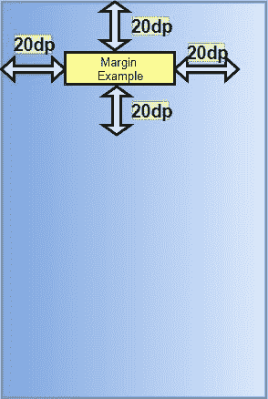
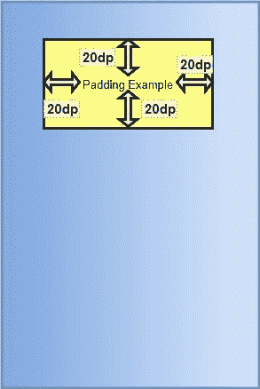
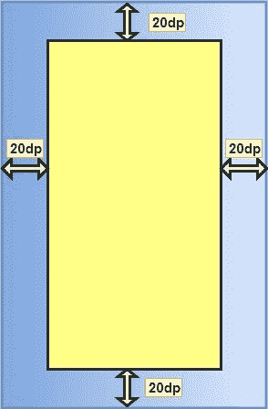
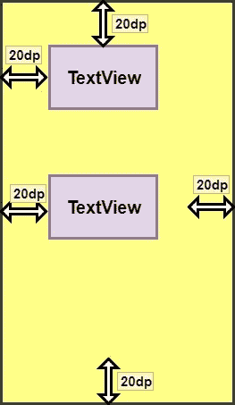

# 边距与填充属性

> 原文：<https://www.studytonight.com/android/margin-vs-padding>

刚开始设计用户界面时，**填充**和**边距**属性之间总是有混淆。无论是网络开发还是安卓开发，边距和填充都是定位和设计用户界面元素的标准参数。

两者都在容器内部或外部提供了额外的空间/间隙。那到底有什么区别呢？让我们把它清理干净。简单来说，边距就是往外推，填充就是往里推。

现在，让我们理解当我们在安卓中使用这些属性来查看**视图**时会发生什么。

* * *

### 视图的边距和填充

让我们看看如何在安卓系统中使用视图的这些属性，以及它如何影响视图的位置和样式。

#### 边距→安卓:布局 _ 边距

当我们说“向外推”时，视图(即矩形)会按 margin 属性中指定的尺寸从自身推出其周围的内容。这里，周围的内容可以是其他视图。下图会更清楚。



下面是我们如何证明这是我们的布局 XML:

```
android:layout_margin="20dp"
```

因此，其他[视图](introduction-to-views)将与该视图分开至少 20dp。

我们还可以为所有边设置不同的边距值，例如:

```
android:layout_marginRight="20dp"
android:layout_marginLeft="20dp"
android:layout_marginTop="20dp"
android:layout_marginBottom="20dp"
```

* * *

#### 填充→安卓:填充

当我们说“向内推”时，视图(即矩形)通过填充属性中指定的维度将其内容从自身推向其中心。填充可被视为边距，但在视图内部。下图会更清楚。



下面是我们如何证明这是我们的布局 XML:

```
android:padding="20dp"
```

因此，它的内容(这里是文本)将被推入矩形内部 20dp。

我们还可以为所有边设置不同的填充值，例如:

```
android:paddingRight="20dp"
android:paddingLeft="20dp"
android:paddingTop="20dp"
android:paddingBottom="20dp"
```

* * *

### 带有布局的边距和填充

现在，让我们理解当我们为<bold>布局编写这些属性时会发生什么。</bold>

#### 边缘

当我们说“向外推”时，根[布局](introduction-to-layouts)即矩形按照边距属性中指定的尺寸从自身推出其周围的内容。在这里，周围的内容将是手机的屏幕。因此，布局(矩形)将自己从手机屏幕上推出。下图会更清楚。



将边距应用于布局的语法类似于视图的语法。

* * *

#### 填料

当我们说向内推送时，根布局(即矩形)通过填充属性中指定的维度从自身推送其内容。在这里，它的内容将是它持有的不同观点，如[文本视图](android-textview)、[图像视图](android-imageview)等。下图会更清楚。



> **注意**:在安卓系统中，应用于父级(根布局)的**填充**属性看起来与应用于子级(布局内部的视图)的**边距**属性相同。

* * *

* * *