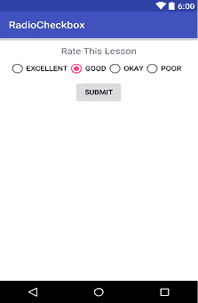
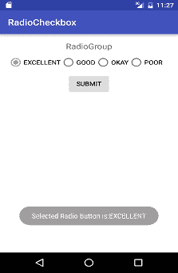
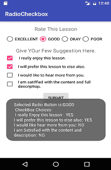
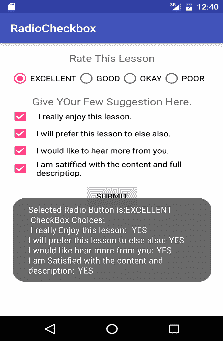

# 在安卓系统中使用单选按钮和复选框

> 原文：<https://www.studytonight.com/android/radiogroup-radiobutton-checkbox>

到目前为止，您一定非常熟悉编辑文本和文本视图以及各种布局。让我们继续，了解更多关于其他视图的信息，如`RadioButton`和`CheckBox`。

在本教程中，我们将设计一个表单，用户必须使用单选按钮选择其中一个选项。用户将不得不使用复选框选择更多的建议和选项。然后我们将在显示屏上显示用户使用[吐司](toast-in-android)选择的所有选项。

* * *

### 让我们从收音机按钮和收音机组开始

让我们开始吧。创建一个新的安卓应用项目，并复制 XML 布局文件的以下内容。

```
<?xml version="1.0" encoding="utf-8"?>
<RelativeLayout xmlns:android="http://schemas.android.com/apk/res/android"
    xmlns:tools="http://schemas.android.com/tools"
    android:layout_width="match_parent"
    android:layout_height="match_parent"
    tools:context="com.example.studytonightandroid.MainActivity" >

    <TextView
        android:id="@+id/tvRg"
        android:layout_width="match_parent"
        android:layout_height="wrap_content"
        android:layout_alignParentTop="true"
        android:layout_centerHorizontal="true"
        android:gravity="center"
        android:text="Rate This Lesson"
        android:textAppearance="?android:attr/textAppearanceMedium" />

    <RadioGroup
        android:layout_width="match_parent"
        android:layout_height="wrap_content"
        android:layout_below="@+id/tvRg"
        android:layout_centerHorizontal="true"
        android:orientation="horizontal"
        android:showDividers="beginning|middle|end"
        android:layout_marginTop="10dp"
        android:id="@+id/radioGroup" >

        <RadioButton
            android:id="@+id/rb1"
            android:layout_width="wrap_content"
            android:layout_height="wrap_content"
            android:text="EXCELLENT"
            android:checked="false" />

        <RadioButton
            android:id="@+id/rb2"
            android:layout_width="wrap_content"
            android:layout_height="wrap_content"
            android:text="GOOD"
            android:checked="true" />

        <RadioButton
            android:id="@+id/rb3"
            android:layout_width="wrap_content"
            android:layout_height="wrap_content"
            android:text="OKAY"
            android:checked="false" />

        <RadioButton
            android:id="@+id/rb4"
            android:layout_width="wrap_content"
            android:layout_height="wrap_content"
            android:text="POOR"
            android:checked="false" />

    </RadioGroup>

    <Button
        android:layout_width="wrap_content"
        android:layout_height="wrap_content"
        android:text="SUBMIT"
        android:id="@+id/btnSubmit"
        android:layout_below="@+id/radioGroup"
        android:layout_centerHorizontal="true"
        android:layout_marginTop="10dp"/>

</RelativeLayout>
```

您将看到以下输出:



布局完成后，我们现在将处理用户界面的后台逻辑(后端)，它将获取用户选择并使用 toast 在屏幕上显示。

因此，我们需要用户将与之交互的视图，以便我们能够获得必要的信息。然后我们需要实现**点击提交按钮上的监听器**。

在`onClickListener()`中，首先我们必须从收音机组中获取选定的单选按钮`id`。一旦我们有了所选单选按钮[的`id`按钮](android-button-view)，我们就可以很容易地获取所选单选按钮的**文本值**并将其显示在屏幕上。让我们实现它。下面我们有**MainActivity.java**文件的所有代码。

```
package com.example.akshay.studytonightandroid;

import android.os.Bundle;
import android.support.v7.app.AppCompatActivity;
import android.view.View;
import android.widget.Button;
import android.widget.RadioButton;
import android.widget.RadioGroup;
import android.widget.Toast;

public class MainActivity extends AppCompatActivity {

    // These are the global variables
    RadioGroup radioGroup;
    RadioButton selectedRadioButton;
    Button buttonSubmit;

    @Override
    protected void onCreate(Bundle savedInstanceState) {
        super.onCreate(savedInstanceState);
        setContentView(R.layout.activity_main);

        // layout instances
        buttonSubmit = (Button) findViewById(R.id.buttonSubmit);
        radioGroup = (RadioGroup) findViewById(R.id.radioGroup);

        /*
            Submit Button
        */
        buttonSubmit.setOnClickListener(new View.OnClickListener() {

            @Override
            public void onClick(View v) {
                // get the selected RadioButton of the group
                selectedRadioButton  = (RadioButton)findViewById(radioGroup.getCheckedRadioButtonId());
                //get RadioButton text
                String yourVote = selectedRadioButton.getText().toString();
                // display it as Toast to the user
                Toast.makeText(MainActivity.this, "Selected Radio Button is:" + yourVote , Toast.LENGTH_LONG).show();
            }
        });
    }
}
```

为了得到选中的单选按钮，我们使用了`radioGroup.getCheckedRadioButtonId()`方法，返回选中单选按钮的`id`。

然后为了获得所选单选按钮的文本，我们在该所选单选按钮上使用了`getText()`方法。我们从该方法接收的文本使用`toString()`方法转换为`String`类型。最后，我们使用一个 Toast 向用户显示了所选的选项值。

将以上代码添加到**MainActivity.java**文件中，然后运行你的安卓应用项目。结果将类似于下图所示。每当用户选择任何选项时，它都会以吐司的形式显示给用户。



* * *

### 是复选框的时候了

现在，是时候玩一些复选框了。通过在布局 XML 文件中的按钮视图后复制粘贴以下代码来扩展用户界面设计(将`id`作为**b 提交**)。

```
<TextView
    android:id="@+id/tvCb"
    android:layout_width="match_parent"
    android:layout_height="wrap_content"
    android:layout_below="@+id/radioGroup"
    android:gravity="center"
    android:text="Give Your Suggestions Here."
    android:layout_marginTop="65dp"
    android:textAppearance="?android:attr/textAppearanceMedium"/>

<CheckBox
    android:layout_width="match_parent"
    android:layout_height="wrap_content"
    android:text=" I really enjoy this lesson."
    android:id="@+id/cb1"
    android:layout_below="@+id/tvCb"
    android:layout_centerHorizontal="true"
    android:checked="false"/>

<CheckBox
    android:layout_width="match_parent"
    android:layout_height="wrap_content"
    android:text="I will prefer this lesson over any other."
    android:id="@+id/cb2"
    android:layout_below="@+id/cb1"
    android:layout_centerHorizontal="true"
    android:checked="false"/>

<CheckBox
    android:layout_width="match_parent"
    android:layout_height="wrap_content"
    android:text="I would like to hear more from you."
    android:id="@+id/cb3"
    android:layout_below="@+id/cb2"
    android:layout_centerHorizontal="true"
    android:checked="false"/>

<CheckBox
    android:layout_width="match_parent"
    android:layout_height="wrap_content"
    android:text="I am satisfied with the content and full description."
    android:id="@+id/cb4"
    android:layout_below="@+id/cb3"
    android:layout_centerHorizontal="true"
    android:checked="false"/>
```

> **重要提示:** *对于提交按钮，我们必须设置这个属性:`android:layout_below="@+id/cb4"`，使其出现在最后，因为我们现在已经在现有表单中添加了复选框。*

复选框用于向用户显示多个选项，并且允许用户从这些选项中选择一个或多个。所有复选框最初都将`checked`属性设置为 **false** 。

要在用户点击提交按钮时从用户界面获取用户选择的复选框值，我们将使用`isChecked()`检查复选框是否被选中。

因此，我们将不得不对我们的**MainActivity.java**类文件进行一些更改。首先，我们必须使用`findViewById()`方法为复选框创建实例。为此，我们还必须声明 CheckBox 类型的全局变量。

要声明全局变量，

```
CheckBox cb1, cb2, cb3, cb4;
```

然后，在`onCreate()`方法内部，使用`findViewById()`方法将来自 XML 的 CheckBox 视图存储到 Java 中。

```
cb1 = (CheckBox) findViewById(R.id.cb1);
cb2 = (CheckBox) findViewById(R.id.cb2);
cb3 = (CheckBox) findViewById(R.id.cb3);
cb4 = (CheckBox) findViewById(R.id.cb4);
```

一旦我们准备好了所有的实例，我们所要做的就是当用户点击提交按钮时，检查用户选择了哪些复选框。正如我们已经提到的，这是通过使用 CheckBox 视图的`isChecked()`方法来完成的。

`isChecked()`如果复选框被选中，方法返回**真**，否则返回**假**。使用`getText()`和`toString()`方法检索选定的复选框值并将其添加到一个字符串(`checkBoxChoices`)中。最后，一个吐司被用来显示所有选择的选项。

因此，用以下代码更新 SUBMIT 按钮的`OnClick()`方法中的现有代码:

```
/*
    Submit Button
*/
buttonSubmit.setOnClickListener(new View.OnClickListener() {

    @Override
    public void onClick(View v) {
        //Get the selected RadioButton
        selectedRadioButton  = (RadioButton) findViewById(radioGroup.getCheckedRadioButtonId());
        // get RadioButton text
        String yourVote = selectedRadioButton.getText().toString();

        String checkBoxChoices = "";

        if (cb1.isChecked()) {
            checkBoxChoices += cb1.getText().toString() + "\tYES";
        }
        else{
            checkBoxChoices += cb1.getText().toString() + "\tNO";
        }

        if (cb2.isChecked()) {
            checkBoxChoices += cb2.getText().toString() + "\tYES";
        }
        else{
            checkBoxChoices += cb2.getText().toString() + "\tNO";
        }

        if (cb3.isChecked()) {
            checkBoxChoices += cb3.getText().toString() + "\tYES";
        }
        else{
            checkBoxChoices += cb3.getText().toString() + "\tNO";
        }

        if (cb4.isChecked()) {
            checkBoxChoices += cb4.getText().toString() + "\tYES";
        }
        else{
            checkBoxChoices += cb4.getText().toString() + "\tNO";
        }

        // display it as Toast to the user

        Toast.makeText(MainActivity.this, "Selected Radio Button is:" + yourVote + "\n CheckBox Choices: \n "+ checkBoxChoices , Toast.LENGTH_LONG).show();

    }
});
```

 

当您运行该应用时，您将看到在所有单选按钮中，您只能选择一个单选按钮，而在复选框的情况下，您可以选择任意数量的单选按钮。这就是单选按钮和复选框的工作方式。这就是安卓应用开发中单选按钮和复选框的实现。

* * *

* * *