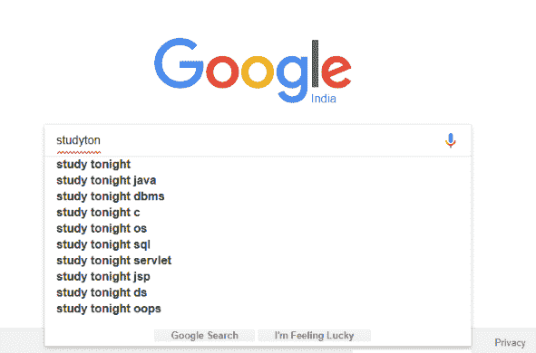
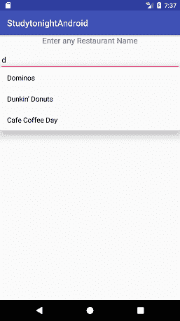
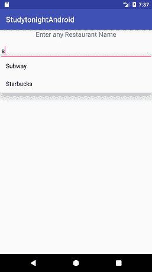
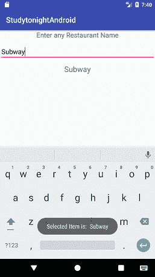

# Android 中的`AutoCompleteTextView`

> 原文：<https://www.studytonight.com/android/autocomplete-textview>

在本教程中，我们将了解可以在安卓应用开发中使用的`AutoCompleteTextView`小部件。

但是它有什么用呢？你一定注意到谷歌搜索栏在你输入搜索查询时提供建议。



在`AutoCompleteTextView`的帮助下，类似的功能可以在安卓应用中实现。

自动完成[`TextView`](android-textview)是一个可编辑的`TextView`，用户可以在其中键入任何值，甚至可以从建议的项目列表中选择输入。当用户点击一个项目时，将从列表中选择建议的项目。此外，编辑框的内容将被所选的建议项目替换。以下是`AutoCompleteTextView`的示例:



通过点击**后退**键或点击项目下拉列表外的任意位置，可以随时取消建议列表。建议列表使用**数组编辑器**生成，该编辑器保存当用户键入字符时出现在下拉列表中的项目数据集，并且仅在键入了由阈值定义的给定数量的字符后才出现。

* * *

### 自动完成 xtView 示例

在本教程中，我们将创建一个安卓应用，用户将获得一个[`EditText`](android-texteditview)视图，选择输入他们最喜欢的餐厅的名称。由于用户将输入名称，我们将为用户提供建议，用户可以从中选择任何项目。由于用户可以通过点击列表项来选择任何名称，一个带有餐厅名称的[吐司](toast-in-android)将显示在屏幕上，该名称也将添加到`TextView`中。

以下是项目的 XML 代码:

```
<?xml version="1.0" encoding="utf-8"?>

<RelativeLayout xmlns:android="http://schemas.android.com/apk/res/android"
    xmlns:tools="http://schemas.android.com/tools"
    android:layout_width="match_parent"
    android:layout_height="match_parent"
    tools:context="com.example.android.studytonightandroid.MainActivity">

    <TextView
        android:id="@+id/tvRestaurant"
        android:layout_width="wrap_content"
        android:layout_height="wrap_content"
        android:layout_alignParentTop="true"
        android:layout_centerHorizontal="true"
        android:text="Enter Your Country Below"
        android:textAppearance="?android:attr/textAppearanceMedium"/>

    <AutoCompleteTextView
        android:id="@+id/actv"
        android:layout_width="match_parent"
        android:layout_height="wrap_content"
        android:layout_below="@+id/tvRestaurant"
        android:layout_marginTop="10dp"
        android:completionThreshold="1"/>

    <TextView
        android:id="@+id/tvDisplay"
        android:layout_width="match_parent"
        android:layout_height="wrap_content"
        android:layout_below="@+id/actv"
        android:layout_marginTop="10dp"
        android:gravity="center"
        android:text="selected country will appear here"
        android:textSize="20sp"/>

</RelativeLayout>
```

在这个布局中，我们有一个`TextView`在屏幕上显示标题**“输入任何餐厅名称”**。然后在它下面，我们有一个`AutoCompleteTextView`，它将从用户那里获取餐厅名称，并提供建议。之后我们还有一个`TextView`，它将显示从建议列表中选择的项目。

如您所见，在`AutoCompleteTextView`中，我们设置了一个名为`android:completionThreshold`的属性。此属性指示要输入的字符数，之后，建议列表将显示给用户。这意味着，如果您为其分配一个等于`2`的值，那么，该视图将需要至少 2 个字符来向用户显示建议列表。

在**MainActivity.java**文件中，首先我们将创建`AutoCompleteTextView`和`TextView`的实例。然后，我们将使用 [`ArrayAdapter`](adapter-and-adapter-view) 在`AutoCompleteTextView`中显示建议项目。为此，我们首先需要创建一个名为`restaurants`的数组，并添加各种餐厅的名称以显示它们作为建议。

然后我们将实现`AdapterView.OnItemClickListener`并在`AutoCompleteTextView`上设置`onItemClickListener()`，以从列表中获取用户选择的项目值。

以下是上述逻辑的代码:

**MainActivity.java**

```
package com.example.android.studytonight;

import android.os.Bundle;
import android.support.v7.app.AppCompatActivity;
import android.view.View;
import android.widget.AdapterView;
import android.widget.ArrayAdapter;
import android.widget.AutoCompleteTextView;
import android.widget.TextView;

public class MainActivity extends AppCompatActivity implements AdapterView.OnItemClickListener {
    // get instances of AutoCompleteTextView and TextView
    AutoCompleteTextView autoCompleteTextView;
    TextView tvDisplay;

    String restaurants[] = {
                                "KFC",
                                "Dominos",
                                "Pizza Hut",
                                "Burger King",
                                "Subway",
                                "Dunkin' Donuts",
                                "Starbucks",
                                "Cafe Coffee Day"
                            };

    @Override
    protected void onCreate(Bundle savedInstanceState) 
    {
        super.onCreate(savedInstanceState);
        setContentView(R.layout.activity_main);

        autoCompleteTextView = (AutoCompleteTextView) findViewById(R.id.actv);
        tvDisplay = (TextView) findViewById(R.id.tvDisplay);

        ArrayAdapter<String> adapter = new ArrayAdapter<String>(this,android.R.layout.simple_list_item_1, restaurants);

        autoCompleteTextView.setAdapter(adapter);
        autoCompleteTextView.setOnItemClickListener(this);
    }

    @Override
    public void onItemClick(AdapterView<?> parent, View view, int position, long id) 
    {
        // we will show a Toast with selected value
    }
}
```

请注意，在使用`ArrayAdapter`时，我们提供了一个布局对象作为参数`android.R.layout.simple_list_item_1`，而我们没有创建任何布局 xml 文件，因为这是指安卓操作系统提供的默认布局 XML。

您可以使用`getItemAtPosition()`方法获得用户选择的值。然后，要在屏幕上显示所选项目，您需要使用`Toast`类。最后，我们将使用第二个`TextView`的`setText()`方法为`TextView`添加值。我们需要将所有这些代码放入`onItemClick()`方法中，如下所示:

```
@Override
public void onItemClick(AdapterView<?> parent, View view, int position, long id) 
{
    // fetch the user selected value
    String item = parent.getItemAtPosition(position).toString();

    // create Toast with user selected value
    Toast.makeText(MainActivity.this, "Selected Item is: \t" + item, Toast.LENGTH_LONG).show();

    // set user selected value to the TextView
    tvDisplay.setText(item);

}
```

### MainActivity.java 完全法典

这里是整个**MainActivity.java**的文件代码:

```
package com.example.android.studytonight;

import android.os.Bundle;
import android.support.v7.app.AppCompatActivity;
import android.view.View;
import android.widget.AdapterView;
import android.widget.ArrayAdapter;
import android.widget.AutoCompleteTextView;
import android.widget.TextView;
import android.widget.Toast;

public class MainActivity extends AppCompatActivity implements AdapterView.OnItemClickListener 
{
    // get instances of AutoCompleteTextView and TextView
    AutoCompleteTextView autoCompleteTextView;
    TextView tvDisplay;

    String restaurants[] = {
                                "KFC",
                                "Dominos",
                                "Pizza Hut",
                                "Burger King",
                                "Subway",
                                "Dunkin' Donuts",
                                "Starbucks",
                                "Cafe Coffee Day"
                            };

    @Override
    protected void onCreate(Bundle savedInstanceState) 
    {
        super.onCreate(savedInstanceState);
        setContentView(R.layout.activity_main);

        autoCompleteTextView = (AutoCompleteTextView) findViewById(R.id.actv);
        tvDisplay = (TextView) findViewById(R.id.tvDisplay);

        ArrayAdapter<String> adapter = new ArrayAdapter<String>(this,android.R.layout.simple_list_item_1,restaurants);

        autoCompleteTextView.setAdapter(adapter);
        autoCompleteTextView.setOnItemClickListener(this);
    }

    @Override
    public void onItemClick(AdapterView<?> parent, View view, int position, long id) 
    {
        // fetch the user selected value
        String item = parent.getItemAtPosition(position).toString();

        // create Toast with user selected value
        Toast.makeText(MainActivity.this, "Selected Item is: \t" + item, Toast.LENGTH_LONG).show();

        // set user selected value to the TextView
        tvDisplay.setText(item);

    }
}
```

* * *

#### 输出屏幕:

 

* * *

* * *