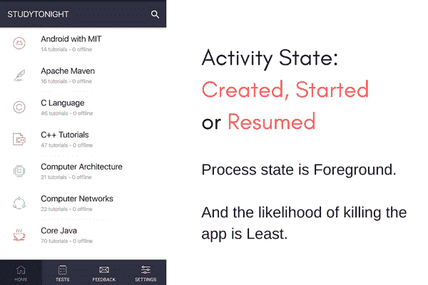
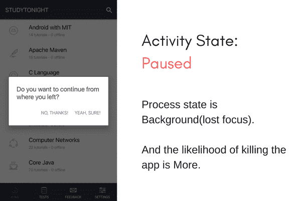
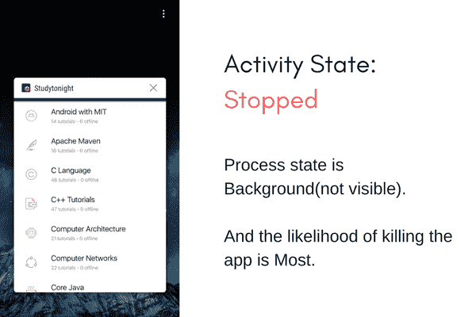
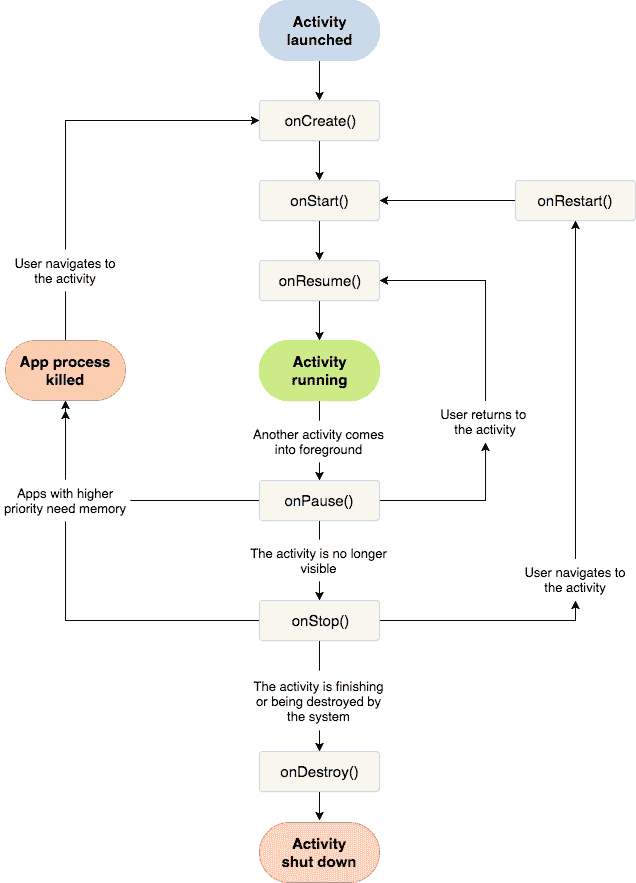

# 安卓系统中的活动

> 原文：<https://www.studytonight.com/android/activity-in-android>

在本教程中，我们将学习与安卓开发相关的最重要的概念之一，即**活动**。

### 什么是安卓系统中的活动？

人类的思想或意识对我们的感觉负责，当我们受到伤害(身体上或情感上)时，我们的想法会让我们感到痛苦，这通常会导致一些眼泪，看到或听到有趣的事情时会笑，等等。现实世界中发生在我们身体上的事情(受伤、视觉、听觉等)是由我们的头脑(意识或灵魂)来感应的，我们按照它来思考或操作。

所以在某种程度上，我们可以说我们的身体只是一个物理物体，而在每种情况下控制我们的是我们的思想(灵魂或意识)。

如果是安卓→ [视图](introduction-to-views)、[布局](introduction-to-layouts)和[视图组](introduction-to-views)用于设计用户界面，这是我们 App 的物理外观。但是我们的应用的思想、灵魂或意识是什么呢？是的，是**活动**。

Activity 只不过是 Android 中的一个 java 类，它有一些预定义的函数，这些函数在不同的 App 状态下被触发，我们可以覆盖这些函数来执行我们想要的任何事情。

活动类为我们提供了空函数，让我们成为一切的控制者。

例如，如果我们有一个由我们的头脑指定的函数→ `onSeeingSomethingFunny()`，虽然我们知道这里面发生了什么，但是如果我们可以覆盖并提供我们自己对这个函数的定义呢。

```
@Override
onSeeingSomethingFunny() 
{
    start crying;
} 
```

在上下文中，有一件事与我们的例子不同，那就是一个人在出生时被创造一次，在死亡时被毁灭一次，在这之间的时间是由头脑/灵魂/意识控制的。但是一个活动负责无限次地创建和销毁一个应用程序。因此，除了控制应用程序，Activity 还控制应用程序生命周期的创建、销毁和其他状态。

安卓可以有多个活动，但只能有一个主活动。例如在 [Java](/java/overview-of-java.php) 编程(或者像 [C](/c/overview-of-c.php) 或者 [C++](/cpp/introduction-to-cpp.php) 这样的编程语言)中，程序的执行总是以`main()`方法开始。同样，当用户按下 App 图标时，主活动被调用，执行从活动类的`onCreate()`方法开始。

* * *

### 应用的不同状态(或主要应用活动)

从用户点击应用程序图标启动应用程序，到用户退出应用程序，应用程序处于某些已定义的状态，让我们看看它们是什么。

1.  当用户点击应用程序图标时，主活动开始，并使用布局 XMLs 创建应用程序的用户界面。App 或 Activity 开始运行，称其处于 **ACTIVE** 状态。
2.  当任何对话框出现在屏幕上时，就像您在某些应用程序上按下退出时，它会显示一个确认您是否要退出的框。在那个时候，我们不能与应用程序的用户界面交互，直到我们处理那个对话框/弹出窗口。在这种情况下，活动被称为处于**暂停**状态。
3.  当我们在使用应用程序时按下主页按钮，我们的应用程序不会关闭。只会越来越小。App 的这种状态称为 **STOPPED** 状态。
4.  当我们最终销毁应用程序时，即当我们完全关闭它时，它被称为处于**销毁**状态。

因此，安卓系统中一个活动(App)总共有四种状态，即`Active`、`Paused`、`Stopped`和`Destroyed`。

从用户的角度来看，在给定的时间点，活动要么是可见的，要么是部分可见的，要么是不可见的。那么，当一个活动具有以下可见性之一时会发生什么？我们将了解这一点，首先让我们详细了解这些状态。

#### 活动状态

*   当“活动”处于活动状态时，表示它处于活动状态并正在运行。
*   它对用户是可见的，并且用户能够与之交互。
*   安卓运行时以最高优先级对待这种状态下的活动，从不试图杀死它。



#### 暂停状态

*   处于这种状态的活动意味着用户仍然可以在背景中看到该活动，例如在透明窗口或对话框后面，即它是部分可见的。
*   用户在完成当前视图之前不能与活动交互。
*   安卓运行时通常不会在这种状态下终止活动，但在资源紧张的极端情况下可能会这样做。



#### 停机状态

*   当一个新的活动在当前活动的基础上开始时，或者当用户点击 Home 键时，该活动将进入停止状态。
*   这种状态下的活动是看不见的，但并没有被破坏。
*   安卓运行时可能会在资源紧张的情况下扼杀这样的活动。



#### 被摧毁的国家

*   当用户点击后退键或安卓运行时决定回收分配给活动的内存时，即处于暂停或停止状态，它将进入销毁状态。
*   活动不在内存中，用户看不到。

> **注意:** *活动不能控制管理自己的状态。由于用户交互或系统生成的事件，它只是经历状态转换。*

* * *

### 活动生命周期方法

每当我们打开谷歌地图应用程序，它都会通过全球定位系统获取我们的位置。如果全球定位系统跟踪器关闭，那么安卓系统将请求您的许可来打开它。那么全球定位系统跟踪器或安卓如何决定一个应用程序是否需要全球定位系统跟踪器才能运行呢？

是的，很明显，应用程序启动时会询问全球定位系统位置，这只有在全球定位系统跟踪器打开时才有可能。

这个应用程序是如何知道的，因为我们对它进行了编码，每当用户启动它时，它都必须要求用户打开全球定位系统跟踪器，这是必需的。

同样，我们也可以告诉应用程序在退出或被破坏之前执行一些事情。

这就是活动生命周期的作用。有六种关键的生命周期方法，每个活动都根据其状态进行。它们是:

1.  `onCreate()`
2.  `onStart()`
3.  `onResume()`
4.  `onPause()`
5.  `onStop()`
6.  `onDestroy()`



| 方法 | 它是做什么的？ |
| `onCreate()` | 每当活动开始运行时，第一个要执行的方法是`onCreate()`。此方法在生存期内只执行一次。如果我们在活动中有任何实例变量，这些变量的初始化可以在这个方法中完成。在`onCreate()`方法之后，执行`onStart()`方法。 |
| `onStart()` | 在执行`onStart()`方法的过程中，活动尚未呈现在屏幕上，但即将对用户可见。在这个方法中，我们可以执行任何与 UI 组件相关的操作。 |
| `onResume()` | 当活动最终呈现在屏幕上时，调用`onResume()`方法。此时，活动处于活动状态，并与用户交互。 |
| `onPause()` | 如果活动失去了焦点，并且对用户来说只是部分可见，它将进入暂停状态。在此转换期间，调用`onPause()`方法。在`onPause()`方法中，我们可以在活动进入后台之前提交数据库事务或执行轻量级处理。 |
| `onStop()` | 从活动状态，如果我们按下主页键，活动将转到背景，设备的主屏幕将变得可见。在此事件期间，活动进入停止状态。执行`onPause()`和`onStop()`两种方法。 |
| `onDestroy()` | 当一个活动被用户或安卓系统破坏时，调用`onDestroy()`函数。 |

当活动从暂停状态回到焦点时，调用`onResume()`。

当我们重新打开任何应用程序时(按下主页键后)，活动现在从停止状态转换到活动状态。因此，调用`onStart()`和`onResume()`方法。

> **注意:** *`onCreate()`方法不被调用，因为它在活动生命周期中只执行一次。*

要破坏屏幕上的活动，我们可以按后退键。这将使活动进入销毁状态。在此事件中，调用`onPause()`、`onStop()`和`onDestroy()`方法。

> **注意:** *每当我们改变屏幕的方向，即从纵向改变为横向，或者相反，生命周期方法从开始即从`onCreate()`方法开始。这是因为完整的间距和其他视觉外观得到改变和调整。*

* * *

* * *