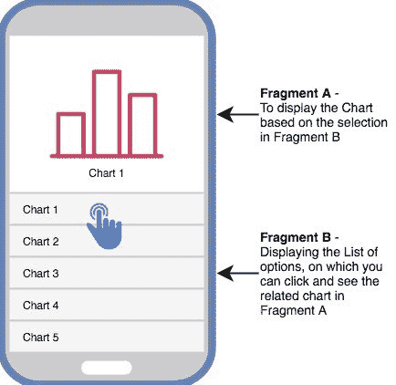
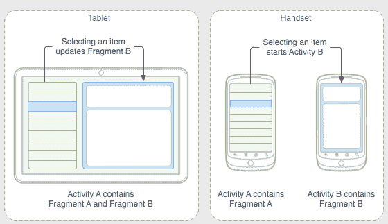
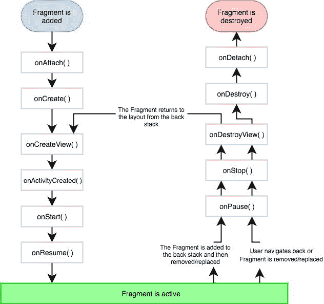

# 安卓系统中的片段

> 原文：<https://www.studytonight.com/android/fragments-in-android>

安卓中的**片段**是一个组件，可以在活动中使用，定义一个独立的模块化用户界面组件，并附加到活动中。它独立运行，但由于它与[活动](activity-in-android)相关联，当一个活动被破坏时，片段也会被破坏。

如果你懂生物，知道**宿主**和**寄生虫**的概念，那么在安卓系统中，`Activity`是宿主，而一个**片段**是寄生虫。

片段有自己的**生命周期事件**，不同于活动的生命周期事件。

一个活动可以有任意数量的片段，尽管建议在一个活动中不要使用太多的片段。

此外，一个片段是一个可重用的组件，因此，如果需要，单个片段可以包含在多个活动中。

一般来说，在安卓应用中，片段被用来创建多窗格用户界面。

一个片段对于 UI(用户界面)有它自己的[布局](introduction-to-layouts)，但是我们甚至可以定义一个没有任何布局的片段，来实现一个没有用户界面的行为，更像是一个后台服务。

因此，片段是安卓操作系统中一个非常有趣的组件，它可以在一个安卓应用中以多种方式使用。

* * *

### 为什么我们需要安卓中的片段？

如果我们已经有了[活动](activity-in-android)，一个片段就像是一个**子活动**，那么在安卓中再多一个组件又有什么用呢？

嗯，在片段引入之前(片段是在 Android 的蜂巢版即 API 版本 11 中添加的)，我们在给定的时间点只能在一个屏幕上有一个活动，没有办法划分屏幕，单独控制不同的部分。

随着移动设备屏幕尺寸的增加，在屏幕上同时显示更多的内容更有意义，因此片段非常有用，在安卓开发者社区中非常受欢迎。

安卓应用中片段的使用完全取决于应用所使用的设备的屏幕大小。如果屏幕尺寸大，那么我们可以很容易地在屏幕上显示 2 个或者更多的片段，但是如果显示尺寸较小，建议在单独的活动中使用片段。

因此，还建议保持片段的设计模块化和独立，以便它可以根据屏幕大小或任何其他因素在不同的屏幕/活动上使用。

* * *

#### 片段在安卓系统中的主要用途

下面是片段在安卓系统中的 3 种主要用法，片段就是针对这 3 种用法介绍的:

1.  **模块化**:如果一个活动有太多的功能组件，最好将其分成独立的片段，从而使代码更有组织性和更容易维护。
2.  **可重用性**:如果我们在一个片段中定义了一个特定的特性，那么这个特性或多或少会变成一个可重用的组件，可以很容易地被引入到任何活动中。
3.  **适应性**:如果我们把一个应用屏幕的 UI 组件拆分成片段，那么根据屏幕大小等改变它们的方向和位置就变得更容易了。

* * *

### 片段生命周期

片段生命周期从它附加到一个活动开始。下面我们以流程图的形式展示了片段的完整生命周期。

#### 片段的生命周期方法

This is called when the fragment becomes active or interactive.

| 方法名 | 描述 |
| 活动 | 当片段附加到活动时，它被调用一次。 |
| onCreate(捆绑) | 创建片段时，系统调用此方法。这是一个重要的方法，您应该在这个方法中实现片段的基本组件。 |
| onCreateView() | 当必须初始化片段的用户界面时，调用这个方法。当第一次创建片段时调用它，然后当片段从后栈返回布局时调用它。这个方法通常会返回一个`View`组件，但是如果片段没有 UI，那么可以返回一个`null`。 |
| onActivityCreated() | 创建宿主活动时会调用此方法。此时，我们甚至可以使用`findViewById()`方法访问片段的视图。 |
| onStart（） | 当片段在设备屏幕上变得可见时，调用此方法。 |
| onResume（） |  |
| onpause() | 当一个片段不再是交互式的，并且用户即将离开该片段时，就会调用这个函数。此时，如果需要，建议保存现有用户会话的任何数据。 |
| onStop() | 当片段不再可见时，调用此方法。 |
| onDestroyView() | 当片段要被销毁时，就调用这个函数。在这里，您可以在片段被销毁之前清理资源。 |
| onDestroy() | 这是对片段状态的最后清理。 |
| 底部() | 就在片段从宿主活动分离之前调用它。 |

在我们的下一个教程中，我们将学习如何在 android 中实现片段。

* * *

* * *