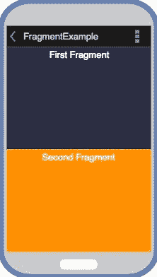

# 在安卓系统中处理碎片

> 原文：<https://www.studytonight.com/android/working-with-android-fragments>

既然我们已经理解了什么是碎片，现在是时候举一个实际的例子了。为了创建一个片段，我们必须定义一个片段类，它扩展了类`Fragment`并覆盖了创建片段所必需的方法。

```
import android.os.Bundle;
import android.support.v4.app.Fragment;
import android.view.LayoutInflater;
import android.view.ViewGroup;

public class ExampleFragment extends Fragment {
    @Override
    public View onCreateView(LayoutInflater inflater, ViewGroup container,
        Bundle savedInstanceState) 
    {
        // Inflate the layout for this fragment
        return inflater.inflate(R.layout.fragment_view, container, false);
    }
}
```

在上面的代码中，`fragment_view`布局是片段的布局，通常在一个单独的名为 **fragment_view.xml** 的 XML 文件中定义

要向任何活动添加片段，您可以遵循以下两种方法中的任何一种:

1.  Specify the fragment directly in the main layout XML file. Basic fragment code in XML looks like:

    ```
    <fragment
        android:name="com.studytonight.android.fragments.ExampleFragment"
        android:id="@+id/fragments"
        android:layout_width="match_parent"
        android:layout_height="match_parent" />
    ```

    其中属性`android:name`将保存片段类的完全限定名。

2.  或者，您可以使用`FrameLayout`在运行时将片段添加到您的活动中。我们将详细讨论这种方法，但首先，让我们学习如何在我们的 android 应用程序中实现一个基本片段。

* * *

### 片段的基本实现

在这个例子中，我们将看到如何向一个活动添加一个片段，通过直接在我们的应用程序的主布局 XML 文件中添加片段。在这个例子中，我们将创建 2 个[片段](fragments-in-android)，并将它们添加到我们的主活动中。

下面是我们的 **activity_main.xml** 文件或主布局 xml 文件的代码:

```
<RelativeLayout xmlns:android="http://schemas.android.com/apk/res/android"  
    android:layout_width="fill_parent"  
    android:layout_height="fill_parent" > 

    <fragment  
        android:id="@+id/fragmentOne"  
        android:name="com.studytonight.fragmentexample.FragmentOne"  
        android:layout_height="0dp"
        android:layout_width="match_parent"
        android:layout_weight="1" /> 

    <fragment  
        android:id="@+id/fragmentTwo"  
        android:name="com.studytonight.fragmentexample.FragmentTwo"  
        android:layout_height="0dp"
        android:layout_width="match_parent"
        android:layout_weight="1"
        android:layout_below="@id/fragmentOne" />

</RelativeLayout> 
```

第一个片段的布局将在 **fragment_one.xml** 文件中定义。

```
<?xml version="1.0" encoding="utf-8"?> 

<LinearLayout xmlns:android="http://schemas.android.com/apk/res/android"  
    android:layout_width="match_parent"  
    android:layout_height="match_parent"  
    android:orientation="vertical"  
    android:background="#2c2e43" >  

    <TextView  
        android:id="@+id/textViewOne"  
        android:layout_width="wrap_content"  
        android:layout_height="wrap_content" 
        android:textColor="#FFFFFF"
        android:gravity="center_horizontal"
        android:text="First Fragment" />

</LinearLayout> 
```

而对应的片段类`FragmentOne`将是:

```
package com.studytonight.fragmentexample;  

import android.app.Fragment;  
import android.os.Bundle;  
import android.view.LayoutInflater;  
import android.view.View;  
import android.view.ViewGroup;  

public class FragmentOne extends Fragment {  
    @Override  
    public View onCreateView(LayoutInflater inflater, ViewGroup container,  
            Bundle savedInstanceState) 
    {  
        // TODO Auto-generated method stub  
        return inflater.inflate(R.layout.fragment_one, container, false);  
    }  

}
```

同样，第二个片段的布局 XML 文件和类将是:

**fragment_two.xml**

```
<?xml version="1.0" encoding="utf-8"?> 

<LinearLayout xmlns:android="http://schemas.android.com/apk/res/android"  
    android:layout_width="match_parent"  
    android:layout_height="match_parent"  
    android:orientation="vertical"  
    android:background="#ff9100" >  

    <TextView  
        android:id="@+id/textViewTwo"  
        android:layout_width="wrap_content"  
        android:layout_height="wrap_content"
        android:textColor="#FFFFFF"
        android:gravity="center_horizontal"
        android:text="Second Fragment" />

</LinearLayout> 
```

**FragmentTwo.java**

```
package com.studytonight.fragmentexample;  

import android.app.Fragment;  
import android.os.Bundle;  
import android.view.LayoutInflater;  
import android.view.View;  
import android.view.ViewGroup;  

public class FragmentTwo extends Fragment {  
    @Override  
    public View onCreateView(LayoutInflater inflater, ViewGroup container,  
            Bundle savedInstanceState) 
    {  
        // TODO Auto-generated method stub  
        return inflater.inflate(R.layout.fragment_two, container, false);  
    }  

}
```

最后，主 actvity 类**MainActivity.java**的代码如下:

```
package com.studytonight.fragmentexample;

import android.os.Bundle;  
import android.app.Activity;  
import android.view.Menu;  
public class MainActivity extends Activity {  

    @Override  
    protected void onCreate(Bundle savedInstanceState) {  
        super.onCreate(savedInstanceState);  
        setContentView(R.layout.activity_main);  
    }  
}
```

一切就绪后，运行 android 应用程序查看输出。

* * *

#### 输出屏



* * *

### 运行时更新片段

我们也可以在运行时添加、移除或更新活动中的片段组件。为了在运行时添加一个片段，我们必须使用`FrameLayout` in out 主布局 XML 文件来定义我们想要添加片段的位置。

要在运行时添加/替换/删除片段，`FragmentManager`和`FragmentTransaction`可以优雅地执行添加、替换和删除[片段](fragments-in-android)的操作。

下面是我们如何将`FrameLayout`添加到布局 XML 文件中:

```
<RelativeLayout xmlns:android="http://schemas.android.com/apk/res/android"  
    android:layout_width="fill_parent"  
    android:layout_height="fill_parent" > 

    <FrameLayout  
        android:id="@+id/frameLayout"
        android:layout_width="match_parent"
        android:layout_height="match_parent" /> 

</RelativeLayout> 
```

这就是我们如何使用片段管理器和事务类:

```
// get fragment manager
FragmentManager fm = getFragmentManager();

// add a new fragment
FragmentTransaction ft = fm.beginTransaction();
ft.add(R.id.your_placehodler, new FragmentOne());
// commit the change
ft.commit();

// replace a fragment
FragmentTransaction ft = fm.beginTransaction();
ft.replace(R.id.your_placehodler, new FragmentTwo());
ft.commit();

// remove a fragment
Fragment fragment = fm.findFragmentById(R.id.fragmentTwo);
FragmentTransaction ft = fm.beginTransaction();
ft.remove(fragment);
ft.commit();
```

这是可以使用的，当点击一些按钮时，我们必须显示不同的信息，在这种情况下，我们可以在点击按钮时更新片段。

你一定在想，**为什么我们需要一个管理器和事务类来更新或添加一个片段？**嗯，由于片段是异步加载的，对活动的更改是在运行时进行的，因此为了处理这些因素，使用了`FragmentTransaction`类，它执行事务中的所有操作，这意味着，如果出现任何问题，它将把用户界面恢复到最后的稳定状态。

* * *

* * *