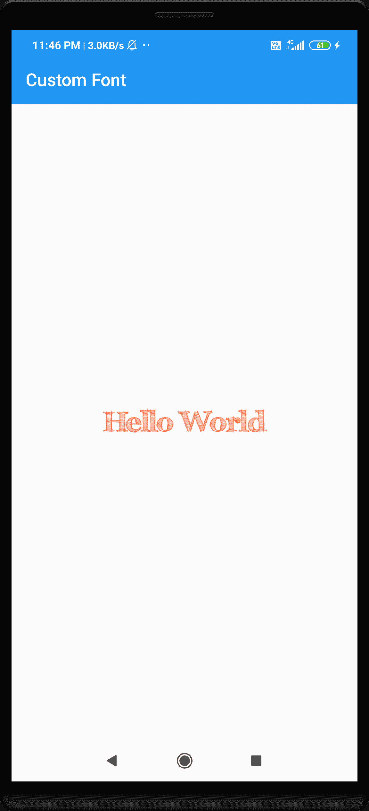

# 在安卓系统中使用自定义字体

> 原文：<https://www.studytonight.com/android/custom-font-in-android>

Android 在 android studio 中提供了各种字体样式，帮助开发者让自己的应用或游戏更有吸引力，但是如果你想给你的应用增加一些独特的字体，一种 Android Studio 默认没有的自定义字体，那你会怎么做呢？

要做到这一点，在 android studio 中，我们主要有 3 种方法，我们将使用如下所示的所有 3 种方法逐一添加自定义字体。所以在跳转到用于添加自定义字体的方法之前，首先我们必须下载任何自定义字体文件(我们将在我们的应用中使用)，这通常是一个**。ttf** 文件。对于本教程，我们将使用**FFF-图斯克** ( [立即下载](https://www.fontsquirrel.com/fonts/download/FFF-Tusj))字体文件，或者您可以下载任何**。你想要的 ttf 文件**。

**<u>注意:</u>** 在进行下面 3 种方法或技巧之前，首先我们要创建一个活动为空的安卓项目，包含所有的基本文件和资源。

## 添加自定义字体-第一种方法

您必须遵循一些基本步骤来将自定义字体添加到您的 android 项目中:

1.  首先，我们将创建一个新的**安卓资源目录**。为此，右键单击 **app - > res** ，选择 **New - >安卓资源目录**，创建**字体**的**资源类型**，然后单击**确定**。

2.  现在解压**FFF-图斯克** zip 文件，在**FFF-图斯克**文件夹中，你会找到**fff _ 图斯克. ttf** 文件。复制并粘贴 **app - > res - >字体**文件夹中的文件(您可以在项目中粘贴任意数量的字体文件)

3.  Open the **activity_main.xml** file and remove the default android generated code and create a [RelativeLayout](https://www.studytonight.com/android/relative-layout-in-android) and inside the relative layout add a simple [TextView](https://www.studytonight.com/android/android-textview) and create an **id** for the text view, which we will use in step 4.

    ```
    <TextView
        android:layout_marginLeft = "16dp"
        android:layout_marginRight = "16dp"
        android:textColor = "#FF5722"
        android:layout_centerInParent = "true"
        android:foregroundGravity = "center_horizontal"
        android:gravity = "center_horizontal"
        android:text = "Hello World"
        android:textSize = "32dp"
        android:id = "@+id/customFont"
        android:layout_width = "match_parent"
        android:layout_height = "wrap_content"/>
    ```

    **activity_main.xml** 文件的完整代码如下:

    ```
    <?xml version = "1.0" encoding =  "utf-8" ?>
    <RelativeLayout
        xmlns:android = "http://schemas.android.com/apk/res/android"
        xmlns:app = "http://schemas.android.com/apk/res-auto"
        xmlns:tools = "http://schemas.android.com/tools"
        android:layout_width = "match_parent"
        android:layout_height = "match_parent"
        tools:context = ".MainActivity">

        <TextView
            android:layout_marginLeft = "16dp"
            android:layout_marginRight = "16dp"
            android:textColor = "#FF5722"
            android:layout_centerInParent = "true"
            android:foregroundGravity = "center_horizontal"
            android:gravity = "center_horizontal"
            android:text = "Hello World"
            android:textSize = "32dp"
            android:id = "@+id/customFont"
            android:layout_width = "match_parent"
            android:layout_height = "wrap_content"/>

    </RelativeLayout>
    ```

4.  现在打开**MainActivity.java**文件，导入如下图所示的库:

    ```
    //import the basic library 
    import android.graphics.Typeface;
    import android.os.Bundle ;
    import android.widget.TextView;
    import androidx.core.content.res.ResourcesCompat;
    ```

    在`onCreate()` 方法中，创建**`TextView`**的实例，并创建一个`Typeface`对象，并将其设置为**`TextView`**，如下所示:

    ```
    //creating and initializing the TextView object 
    TextView customFontTextView = ( TextView ) findViewById( R.id.customFont);

    //creating typeface and getting the font from the font directory 
    Typeface typeface = ResourcesCompat.getFont( MainActivity.this, R.font.fff_tusj );

    //setting typeface to textview 
    customFontTextView.setTypeface( typeface );
    ```

    **MainActivity.java**文件的完整代码如下:

    ```
    package com.studytonight.project ;

    //import the basic library
    import android.graphics.Typeface;
    import android.os.Bundle ;
    import android.widget.TextView;
    import androidx.core.content.res.ResourcesCompat;

    import androidx.appcompat.app.AppCompatActivity ;

    public class MainActivity extends AppCompatActivity {

        @Override
        protected void onCreate( Bundle savedInstanceState ) {
            super.onCreate( savedInstanceState );
            setContentView( R.layout.activity_main );

            //creating and initializing the TextView object
            TextView customFontTextView = ( TextView ) findViewById( R.id.customFont);

            //creating typeface and getting the font from the font directory
            Typeface typeface = ResourcesCompat.getFont( MainActivity.this, R.font.fff_tusj );

            //setting typeface to textview
            customFontTextView.setTypeface( typeface );
        }

    }
    ```

    **<u>注:</u>** 所有 3 种技术的输出都是一样的，就像我们在做同样的事情，只是方式不同。

## 通过添加自定义字体类别:

要通过为自定义字体创建类来添加自定义字体，请执行以下步骤:

1.  首先我们创建一个新的**文件夹**为此，右键单击**应用**并选择**新建- >文件夹- >资产文件夹**并创建一个**资产**文件夹。

2.  现在复制过去 **app - >资产**文件夹中我们在**方法 1** 中提取的 **fff_tusj.ttf** (您可以在资产文件夹中的项目中粘贴任意多的文本文件)

3.  在本教程中，我们将通过右键单击**app->Java->com . study south . project->New->Java 类**为自定义字体创建一个新的 [Java 类](https://www.studytonight.com/java/object-and-classes.php)，并根据您的需要命名该类(我们正在为本教程创建 **MyCustomFont** 类)

4.  Now **extend** the **MyCustomFont** to **AppCompatTextView** and create **3 constructors** inside the **MyCustomFont** class as shown below:

    ```
    //constructor with 1 parameter
    public MyCustomFont( @NonNull Context context ) {
        super( context );
    }

    //constructor with 1 parameter
    public MyCustomFont( @NonNull Context context,  @Nullable AttributeSet attrs ) {
        super( context, attrs);
    }

    //constructor with 1 parameter
    public MyCustomFont( @NonNull Context context,  @Nullable AttributeSet attrs , int defStyleAttr ) {
        super( context, attrs , defStyleAttr );
    }
    ```

5.  现在在**我的自定义字体**里面我们创建一个方法**私有虚空`setTheTypeface(Context context)`** ，在这个方法里面我们创建并设置**字体**，如下图所示:

    ```
    private void setTheTypeface( Context context )
    {
        Typeface typeface = Typeface.createFromAsset(context.getAssets() , "fff_tusj.ttf" );
            this.setTypeface( typeface );
    }
    ```

    现在调用`setTheTypeface()` 方法里面的所有的构造函数如下图所示

    ```
     public MyCustomFont( @NonNull Context context ) {
            super( context );
            //calling setTheTypeface Function
            setTheTypeface( context );
        }

        public MyCustomFont( @NonNull Context context,  @Nullable AttributeSet attrs ) {
            super( context, attrs);
            //call the  setTheTypeface Function
            setTheTypeface( context );
        }

        public MyCustomFont( @NonNull Context context,  @Nullable AttributeSet attrs , int defStyleAttr ) {
            super( context, attrs , defStyleAttr );
            //calling the setTheTypeface Function
            setTheTypeface( context );
        }
    ```

    现在 **MyCustomFont** 类的工作已经结束，**MyCustomFont.java**的完整代码如下所示

    ```
    package com.studytonight.project;

    import android.content.Context;
    import android.graphics.Typeface;
    import android.util.AttributeSet;

    import androidx.annotation.NonNull;
    import androidx.annotation.Nullable;
    import androidx.appcompat.widget.AppCompatTextView;

    class MyCustomFont extends AppCompatTextView {

        //constructor with 1 parameter
        public MyCustomFont( @NonNull Context context ) {
            super( context );
            //calling setTheTypeface Function
            setTheTypeface( context );
        }

        //constructor with 2 parameter
        public MyCustomFont( @NonNull Context context,  @Nullable AttributeSet attrs ) {
            super( context, attrs);
            //call the  setTheTypeface Function
            setTheTypeface( context );
        }

        //constructor with 3 parameter
        public MyCustomFont( @NonNull Context context,  @Nullable AttributeSet attrs , int defStyleAttr ) {
            super( context, attrs , defStyleAttr );
            //calling the setTheTypeface Function
            setTheTypeface( context );
        }

        private void setTheTypeface( Context context )
        {
            Typeface typeface = Typeface.createFromAsset(context.getAssets() , "fff_tusj.ttf" );

            this.setTypeface( typeface );
        }
    } 
    ```

6.  现在转到 **activity_main.xml** 文件，删除默认布局，添加一个**相对布局**，在相对布局中添加**com . study south . project . mycustomfont**，如下所示:

    ```
     <com.studytonight.project.MyCustomFont
           android:layout_marginLeft = "16dp"
           android:layout_marginRight = "16dp"
           android:textColor = "#FF5722"
           android:layout_centerInParent = "true"
           android:foregroundGravity = "center_horizontal"
           android:gravity = "center_horizontal"
           android:text = "Hello World"
           android:textSize = "32dp"
           android:id = "@+id/customFont"
           android:layout_width = "match_parent"
           android:layout_height = "wrap_content"/>
    ```

    现在**方法 2** 完成， **activity_main.xml** 文件的完整代码如下所示

    ```
    <?xml version = "1.0" encoding =  "utf-8" ?>
    <RelativeLayout
        xmlns:android = "http://schemas.android.com/apk/res/android"
        xmlns:app = "http://schemas.android.com/apk/res-auto"
        xmlns:tools = "http://schemas.android.com/tools"
        android:layout_width = "match_parent"
        android:layout_height = "match_parent"
        tools:context = ".MainActivity">

       <com.studytonight.project.MyCustomFont
           android:layout_marginLeft = "16dp"
           android:layout_marginRight = "16dp"
           android:textColor = "#FF5722"
           android:layout_centerInParent = "true"
           android:foregroundGravity = "center_horizontal"
           android:gravity = "center_horizontal"
           android:text = "Hello World"
           android:textSize = "32dp"
           android:id = "@+id/customFont"
           android:layout_width = "match_parent"
           android:layout_height = "wrap_content"/>

    </RelativeLayout>
    ```

## 使用 fontFamily 属性-最简单的方法:

这是在我们的安卓应用中添加自定义字体的最简单方法，

1.  在这个技巧中，我们将遵循**方法 1** 的前 2 步，这意味着我们首先添加字体**。ttf 文件**里面的字体文件夹。

2.  Then open the **activity_main.xml** file and remove the default code and add the relative layout and inside it we add the simple **TextView** and add the **fontFamily** property to it as shown below:

    ```
    android:fontFamily="@font/fff_tusj"
    ```

    现在我们的**`TextView`**看起来像:

    ```
    <TextView
           android:fontFamily = "@font/fff_tusj"
           android:layout_marginLeft = "16dp"
           android:layout_marginRight = "16dp"
           android:textColor = "#FF5722"
           android:layout_centerInParent = "true"
           android:foregroundGravity = "center_horizontal"
           android:gravity = "center_horizontal"
           android:text = "Hello World"
           android:textSize = "32dp"
           android:layout_width = "match_parent"
           android:layout_height = "wrap_content"/>
    ```

    我们完成了，是的，就是这样， **activity_main.xml** 文件的完整代码如下所示:

    ```
    <?xml version = "1.0" encoding =  "utf-8" ?>
    <RelativeLayout
        xmlns:android = "http://schemas.android.com/apk/res/android"
        xmlns:app = "http://schemas.android.com/apk/res-auto"
        xmlns:tools = "http://schemas.android.com/tools"
        android:layout_width = "match_parent"
        android:layout_height = "match_parent"
        tools:context = ".MainActivity">

       <TextView
           android:fontFamily = "@font/fff_tusj"
           android:layout_marginLeft = "16dp"
           android:layout_marginRight = "16dp"
           android:textColor = "#FF5722"
           android:layout_centerInParent = "true"
           android:foregroundGravity = "center_horizontal"
           android:gravity = "center_horizontal"
           android:text = "Hello World"
           android:textSize = "32dp"
           android:layout_width = "match_parent"
           android:layout_height = "wrap_content"/>

    </RelativeLayout>
    ```

## 自定义字体的输出:

对于以上三种方法，应用的输出都是相同的:



有了这个，现在你可以在你的安卓应用中使用任何你喜欢的新字体。

* * *

* * *