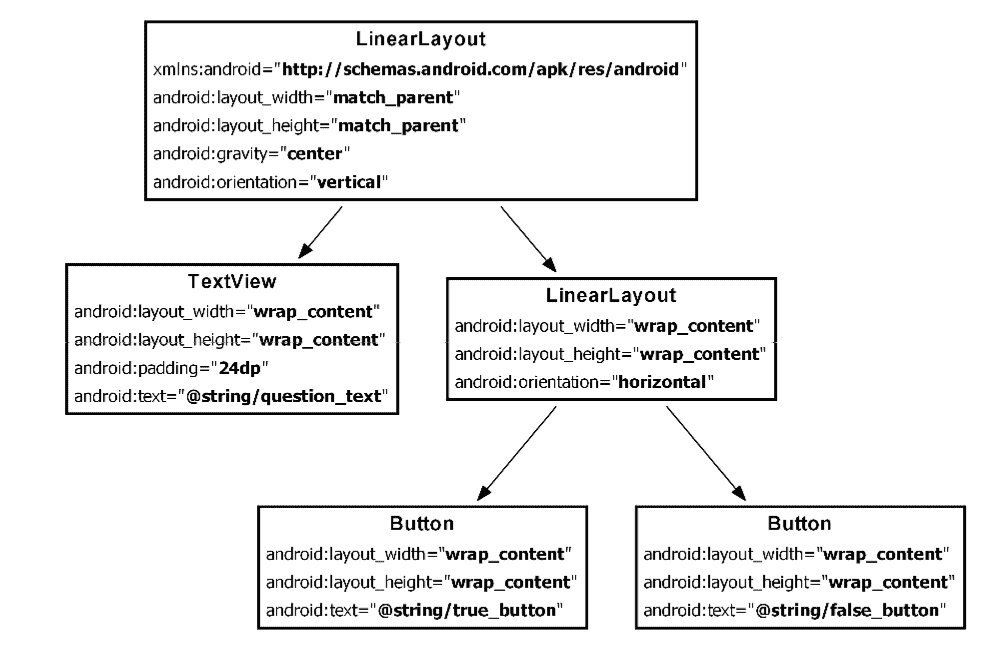
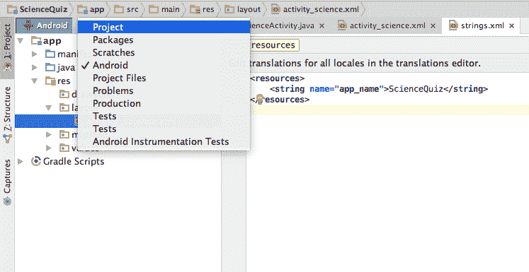

# 科学问答安卓应用程序-第 2 部分

> 原文：<https://www.studytonight.com/android/second-android-application-2>

正如我们所知，一个活动的默认布局由一个`RelativeLayout`和一个带有文本 Hello World 的`TextView`组成！，因此我们将不得不改变 ti，因为我们正在构建一个科学问答应用程序。对于我们的应用程序，我们将设置如下图所示的屏幕，为此，我们需要:

*   [`LinearLayout`](linear-layout-in-android) 一纵
*   一 [`TextView`](android-textview)
*   一[横`LinearLayout`T2】](linear-layout-in-android)
*   以及，两个 [`Buttons`](android-button-view)

从文件`activity_science.xml`中移除现有的 XML 代码，并在布局文件中写入以下代码。

```
<?xml version="1.0" encoding="utf-8"?>
<*LinearLayout* xmlns:android="http://schemas.android.com/apk/res/android"
    android:layout_width="match_parent"
    android:layout_height="match_parent"
    android:gravity="center"
    android:orientation="vertical" >
    <*TextView*
        android:layout_width="wrap_content"
        android:layout_height="wrap_content"
        android:padding="24dp"
        android:text="@string/question_text" />
    <*LinearLayout*
        android:layout_width="wrap_content"
        android:layout_height="wrap_content"
        android:orientation="horizontal" >
        <*Button*
            android:id="@+id/true_button"
            android:layout_width="wrap_content"
            android:layout_height="wrap_content"
            android:text="@string/true_button" />
        <*Button*
            android:id="@+id/false_button"
            android:layout_width="wrap_content"
            android:layout_height="wrap_content"
            android:text="@string/false_button" />
    </*LinearLayout*>
</*LinearLayout*>
```

你会注意到 3 个用红色标记的字符串，现在不要担心它们，我们稍后会回来。

在更改布局 xml 文件时，您会注意到预览也发生了变化。每个 XML 元素，即`LinearLayout`、`TextView`和`Button`代表一个小部件，它们的 XML 属性定义了如何配置小部件，就像在`TextView`中显示什么文本一样，由`android:text`属性配置。文本显示在`Button`小部件上也是如此。

* * *

## 小部件和属性的分层布局



让我们试着理解一下布局。从上面的 XML 中我们可以看到，`LinearLayout`是根元素，它的高度和宽度等于属性`android:layout_width="match_parent"`和`android:layout_height="match_parent"`定义的设备屏幕。它还将子元素的方向定义为垂直。

根`LinearLayout`的两个子部件是一个`TextView`和另一个`LinearLayout`。

孩子`LinearLayout`还有两个孩子，`Button`水平放置在`LinearLayout`内部，因为它被定义为孩子`LinearLayout`中的属性`android:orientation`。

我们还为两个`Button`小部件指定了`android:id`属性。完成后，我们可以参考和使用活动类中的按钮，我们将在[下一个教程](second-android-application-3)中看到如何做到这一点。

* * *

## 创建字符串资源

每个安卓项目都已经添加了一个`strings.xml`文件。在项目工具窗口中，在您的项目中，如果您选择了安卓风格结构，请找到**应用程序/res/values** ，如果您的项目工具窗口在项目视图中，请找到**应用程序/src/main/res/values** 。如果您不知道如何在安卓包结构和项目之间切换，请遵循下图。



在`strings.xml`文件中单独定义字符串值是一种标准做法。可以指定任何字符串值的格式如下:

```
<string name="STRING_NAME">STRING_VALUE</string>
```

一旦在`strings.xml`文件中声明了一个字符串，就可以使用`@string/STRING_NAME`直接在布局 xml 文件中使用它。现在，我们必须在我们的`strings.xml`文件中为**问题 _ 文本**、**真 _ 按钮**和**假 _ 按钮**创建三个字符串引用，如下所述:

```
<string name="question_text">
        *Graphite is used in making Pencils.*
    </string>
    <string name="true_button">*True*</string>
    <string name="false_button">*False*</string>
```

当您在`strings.xml`中创建这 3 个字符串时，您将看到您的`layout_science.xml`文件中的所有错误都将被解决。

如果我们愿意，我们也可以有自己独立的任意名称的字符串 xml 文件，但是它应该位于 **res/values/** 目录中。

* * *

* * *