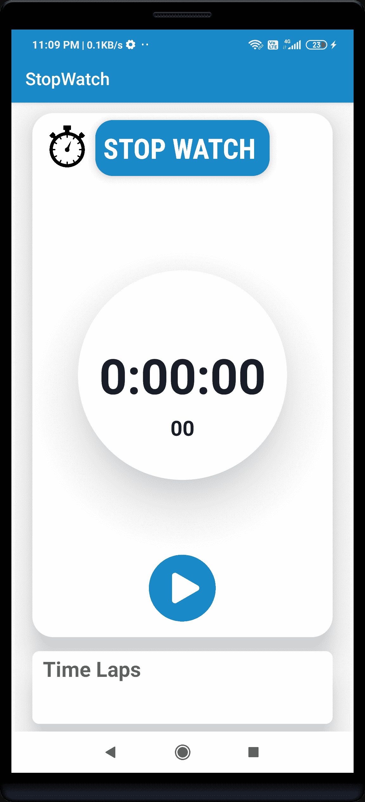
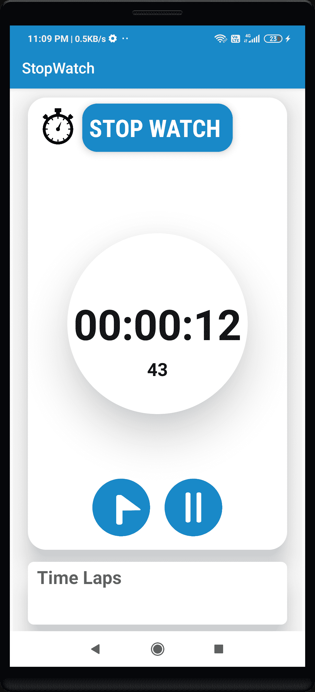
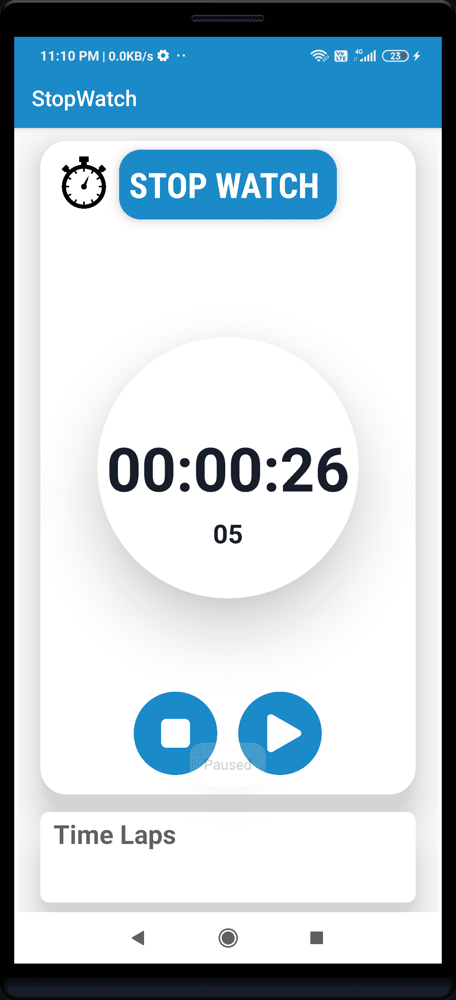
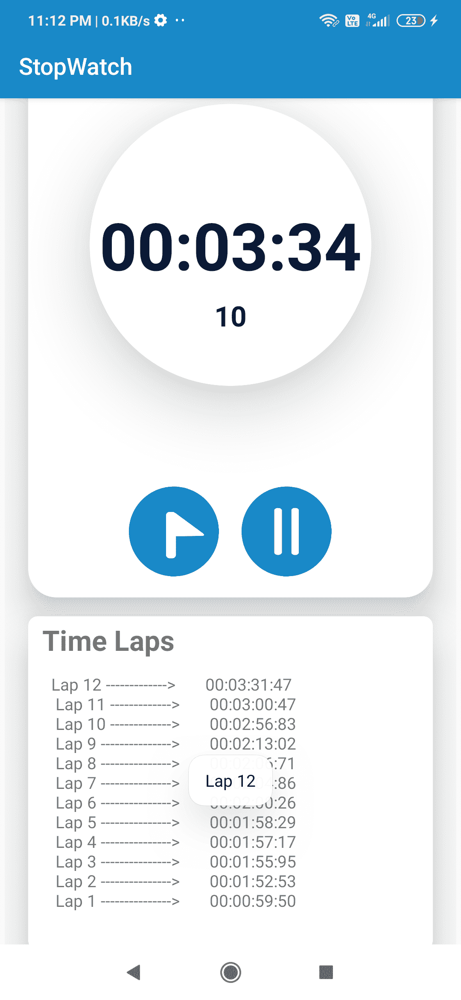

# 秒表安卓应用项目——第 3 部分

> 原文：<https://www.studytonight.com/android/stopwatch-android-app-project-part-3>

这是我们在AndroidStudio制作秒表安卓应用系列的最后一部分，也是这个项目中最重要的一部分。

如果您还没有完成前两部分，请在继续之前完成:

*   第一部分:[秒表安卓应用](https://www.studytonight.com/android/stopwatch-android-app-project-part-1)设置项目

*   第二部分:[为秒表安卓应用](https://www.studytonight.com/android/stopwatch-android-app-project-part-2)创建 UI

在这一部分，我们将为秒表的所有功能编写登录，以使应用根据我们的需要工作。因此，在进入编码部分之前，我们必须了解一些基本情况，如下所示:

1.  1 秒= 1000 毫秒

2.  1 分钟= 60 秒

3.  1 小时=60 分钟

## 秒表安卓应用——为逻辑编码

现在打开**MainActivity.java**文件，导入一些基础类，如下图:

```
//importing required classes
import android.os.Handler;
import android.view.View;
import android.widget.ImageView;
import android.widget.TextView;
import java.util.Locale;
```

接下来我们在 MainActivity 类中创建[Android](https://www.studytonight.com/android/android-textview)**[ImageView](https://www.studytonight.com/android/android-textview)**和[Android](https://www.studytonight.com/android/android-imageview)**[Textview](https://www.studytonight.com/android/android-imageview)**的对象如下所示:

```
//creating object of ImageView and Text View
ImageView playBtn, pauseBtn, stopBtn, timeLapseBtn;
TextView timeView;
TextView timeViewms;
TextView timeLapse;
```

接下来我们在**MainActivity.java**类中加入整数变量和布尔变量，如下所示:

```
// integers to store hours, minutes, seconds,  ms 
int hours, minutes, secs, ms;

// integer to store seconds
private int seconds = 0;

// boolean to check if the stopwatch is running or not
private boolean running;

// simple count variable to count number of laps
int lapCount=0;
```

现在在`onCreate` 方法里面我们初始化 **ImageView** 和 **TextView** 并添加`OnClickListener` 并显示一条[简单的安卓吐司消息](https://www.studytonight.com/android/toast-in-android)给用户根据输入如下所示:

```
// initializing the Image view objects
playBtn=(ImageView)findViewById(R.id.playBtn) ;
pauseBtn=(ImageView)findViewById(R.id.pauseBtn) ;
stopBtn=(ImageView)findViewById(R.id.stopBtn) ;

timeLapseBtn=(ImageView)findViewById(R.id.timeLapseBtn) ;

// initializing the text view objects
timeView = (TextView)findViewById(R.id.time_view) ;
timeViewms=(TextView)findViewById(R.id.time_view_ms) ;
timeLapse = (TextView)findViewById(R.id.timeLapse) ;

  // play button click listener
        playBtn.setOnClickListener(new View.OnClickListener() {
            @Override
            public void onClick(View view) {

                //showing simple toast message to user
                Toast.makeText(MainActivity.this, "Started", Toast.LENGTH_SHORT).show(); 

                // hide the play and stop button
                playBtn.setVisibility(View.GONE) ;
                stopBtn.setVisibility(View.GONE) ;

                // show the pause  and time lapse button
                pauseBtn.setVisibility(View.VISIBLE) ;
                timeLapseBtn.setVisibility(View.VISIBLE) ;

                // set running true
                running = true ;
            }
        }) ;
        // pause button click listener
        pauseBtn.setOnClickListener(new View.OnClickListener() {
            @Override
            public void onClick(View view) {

                //showing simple toast message to user
                Toast.makeText(MainActivity.this, "Paused", Toast.LENGTH_SHORT).show();

                // show the play  and stop  button
                playBtn.setVisibility(View.VISIBLE) ;
                stopBtn.setVisibility(View.VISIBLE) ;

                // hide the pause  and time lapse button
                timeLapseBtn.setVisibility(View.GONE) ;
                pauseBtn.setVisibility(View.GONE) ;

                running = false ;
            }
        }) ;

        // stop  button click listener
        stopBtn.setOnClickListener(new View.OnClickListener() {
            @Override
            public void onClick(View view) {

                //showing simple toast message to user
                Toast.makeText(MainActivity.this, "Stoped", Toast.LENGTH_SHORT).show();

                // set running to false
                running = false ;
                seconds = 0 ;
                lapCount=0 ;

                // setting the text view to zero
                timeView.setText("00:00:00") ;
                timeViewms.setText("00") ;
                timeLapse.setText("") ;

                // show the play  
                playBtn.setVisibility(View.VISIBLE) ;

                // hide the pause , stop and time lapse button
                pauseBtn.setVisibility(View.GONE) ;
                stopBtn.setVisibility(View.GONE) ;
                timeLapseBtn.setVisibility(View.GONE) ;
            }
        }) ;

        // lap button click listener
        timeLapseBtn.setOnClickListener(new View.OnClickListener() {
            @Override
            public void onClick(View view) {
                // calling timeLapse function
                timeLapseFun() ;
            }
        }) ;

// calling runtimer
runTimer() ;
```

现在在里面创建一个方法`private void runTimer`，当我们点击如下所示的开始按钮时调用该方法:

```
private void runTimer() {

	// creating handler
	final Handler handlertime = new Handler();

	// creating handler
	final Handler handlerMs = new Handler();

	handlertime.post(new Runnable() {@Override

		public void run() {
			hours = seconds / 3600;
			minutes = (seconds % 3600) / 60;
			secs = seconds % 60;

			// if running increment the seconds
			if (running) {
				String time = String.format(Locale.getDefault(), "%02d:%02d:%02d", hours, minutes, secs);

				timeView.setText(time);

				seconds++;
			}

			handlertime.postDelayed(this, 1000);
		}
	});

	handlerMs.post(new Runnable() {@Override
		public void run() {

			if (ms >= 99) {
				ms = 0;
			}

			// if running increment the ms
			if (running) {
				String msString = String.format(Locale.getDefault(), "%02d", ms);
				timeViewms.setText(msString);

				ms++;
			}
			handlerMs.postDelayed(this, 1);
		}
	});

}
```

我们在**MainActivity.java**内部又创建了一个方法来处理圈速，如下所示:

```
void timeLapseFun() {

	// increase lap count when function is called
	lapCount++;

	String laptext = String.format(Locale.getDefault(), "%02d:%02d:%02d", hours, minutes, secs);
	String msString = String.format(Locale.getDefault(), "%02d", ms);

	// adding ms to lap text
	laptext = laptext + ":" + msString;

	if (lapCount >= 10) {
		laptext = " Lap " + lapCount + " ------------->       " + laptext + " \n " + timeLapse.getText();
	} else {
		laptext = " Lap " + lapCount + " --------------->       " + laptext + " \n " + timeLapse.getText();

	}

	//showing simple toast message to user
	Toast.makeText(MainActivity.this, "Lap " + lapCount, Toast.LENGTH_SHORT).show();

	// showing the lap text
	timeLapse.setText(laptext);
}
```

**MainActivity.java**的完整代码如下:

```
package com.studytonight.project;

import android.os.Bundle;
import androidx.appcompat.app.AppCompatActivity;

// importing required classes
import android.os.Handler;
import android.view.View;
import android.widget.ImageView;
import android.widget.TextView;
import android.widget.Toast;

import java.util.Locale;

public class MainActivity extends AppCompatActivity {

	// integers to store hours , minutes , seconds ,  ms 
	int hours,
	minutes,
	secs,
	ms;

	// integer to store seconds
	private int seconds = 0;

	// boolean to check if stopwatch is running or not
	private boolean running;

	// simple count variable to count number of laps
	int lapCount = 0;

	// creating object of ImageView and Text View
	ImageView playBtn,
	pauseBtn,
	stopBtn,
	timeLapseBtn;
	TextView timeView;
	TextView timeViewms;
	TextView timeLapse;

	@Override
	protected void onCreate(Bundle savedInstanceState) {
		super.onCreate(savedInstanceState);
		setContentView(R.layout.activity_main);

		// initializing the Image view objects
		playBtn = (ImageView) findViewById(R.id.playBtn);
		pauseBtn = (ImageView) findViewById(R.id.pauseBtn);
		stopBtn = (ImageView) findViewById(R.id.stopBtn);

		timeLapseBtn = (ImageView) findViewById(R.id.timeLapseBtn);

		// initializing the text view objects
		timeView = (TextView) findViewById(R.id.time_view);
		timeViewms = (TextView) findViewById(R.id.time_view_ms);
		timeLapse = (TextView) findViewById(R.id.timeLapse);

		// play button click listener
		playBtn.setOnClickListener(new View.OnClickListener() {@Override
			public void onClick(View view) {

				//showing simple toast message to user
				Toast.makeText(MainActivity.this, "Started", Toast.LENGTH_SHORT).show();

				// hide the play and stop button
				playBtn.setVisibility(View.GONE);
				stopBtn.setVisibility(View.GONE);

				// show the pause  and time lapse button
				pauseBtn.setVisibility(View.VISIBLE);
				timeLapseBtn.setVisibility(View.VISIBLE);

				// set running true
				running = true;
			}
		});
		// pause button click listener
		pauseBtn.setOnClickListener(new View.OnClickListener() {@Override
			public void onClick(View view) {

				//showing simple toast message to user
				Toast.makeText(MainActivity.this, "Paused", Toast.LENGTH_SHORT).show();

				// show the play  and stop  button
				playBtn.setVisibility(View.VISIBLE);
				stopBtn.setVisibility(View.VISIBLE);

				// hide the pause  and time lapse button
				timeLapseBtn.setVisibility(View.GONE);
				pauseBtn.setVisibility(View.GONE);

				running = false;
			}
		});

		// stop  button click listener
		stopBtn.setOnClickListener(new View.OnClickListener() {@Override
			public void onClick(View view) {

				//showing simple toast message to user
				Toast.makeText(MainActivity.this, "Stoped", Toast.LENGTH_SHORT).show();

				// set running to false
				running = false;
				seconds = 0;
				lapCount = 0;

				// setting the text view to zero
				timeView.setText("00:00:00");
				timeViewms.setText("00");
				timeLapse.setText("");

				// show the play
				playBtn.setVisibility(View.VISIBLE);

				// hide the pause , stop and time lapse button
				pauseBtn.setVisibility(View.GONE);
				stopBtn.setVisibility(View.GONE);
				timeLapseBtn.setVisibility(View.GONE);

			}
		});

		// lap button click listener
		timeLapseBtn.setOnClickListener(new View.OnClickListener() {@Override
			public void onClick(View view) {
				// calling timeLapse function
				timeLapseFun();
			}
		});

		// calling runtimer
		runTimer();

	}

	private void runTimer() {

		// creating handler
		final Handler handlertime = new Handler();

		// creating handler
		final Handler handlerMs = new Handler();

		handlertime.post(new Runnable() {@Override

			public void run() {
				hours = seconds / 3600;
				minutes = (seconds % 3600) / 60;
				secs = seconds % 60;

				// if running increment the seconds
				if (running) {
					String time = String.format(Locale.getDefault(), "%02d:%02d:%02d", hours, minutes, secs);

					timeView.setText(time);

					seconds++;
				}

				handlertime.postDelayed(this, 1000);
			}
		});

		handlerMs.post(new Runnable() {@Override
			public void run() {

				if (ms >= 99) {
					ms = 0;
				}

				// if running increment the ms
				if (running) {
					String msString = String.format(Locale.getDefault(), "%02d", ms);
					timeViewms.setText(msString);

					ms++;
				}
				handlerMs.postDelayed(this, 1);
			}
		});

	}

	void timeLapseFun() {

		// increase lap count when function is called
		lapCount++;

		String laptext = String.format(Locale.getDefault(), "%02d:%02d:%02d", hours, minutes, secs);
		String msString = String.format(Locale.getDefault(), "%02d", ms);

		// adding ms to lap text
		laptext = laptext + ":" + msString;

		if (lapCount >= 10) {
			laptext = " Lap " + lapCount + " ------------->       " + laptext + " \n " + timeLapse.getText();
		} else {
			laptext = " Lap " + lapCount + " --------------->       " + laptext + " \n " + timeLapse.getText();

		}

		//showing simple toast message to user
		Toast.makeText(MainActivity.this, "Lap " + lapCount, Toast.LENGTH_SHORT).show();

		// showing the lap text
		timeLapse.setText(laptext);
	}
}
```

### 输出:

在下面的快照中，您可以看到**秒表**在安卓应用中的外观。

首次打开应用时:



当我们点击开始:



当我们**点击暂停**时:



当我们点击**圈**图标时(我们已经记录了 12 圈)



当我们点击**停止**图标时:


## 结论:

有了这个，我们成功地完成了秒表项目。如果这个项目帮助了你，那就在 Instagram - [@study .今夜](https://www.instagram.com/study.tonight/)找到我们，和我们分享你的项目快照。祝贺你完成了这个项目。

* * *

* * *