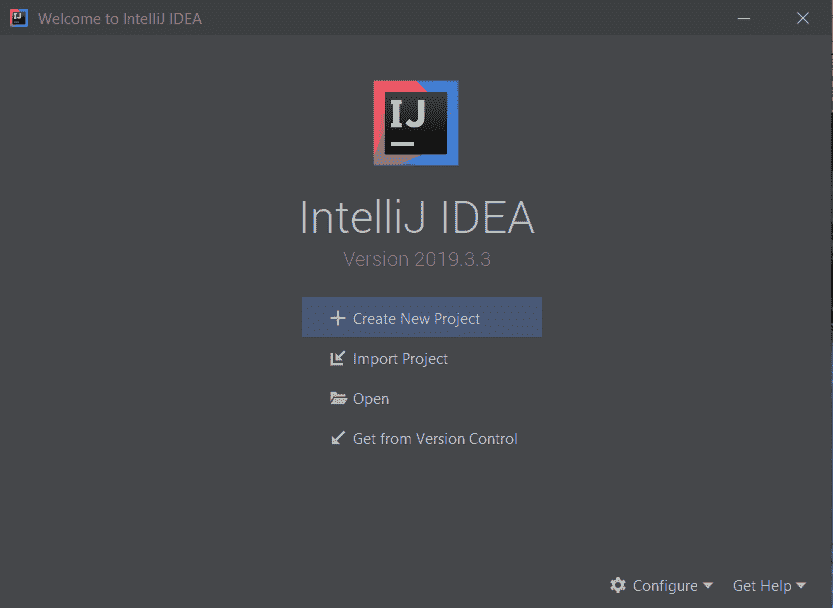
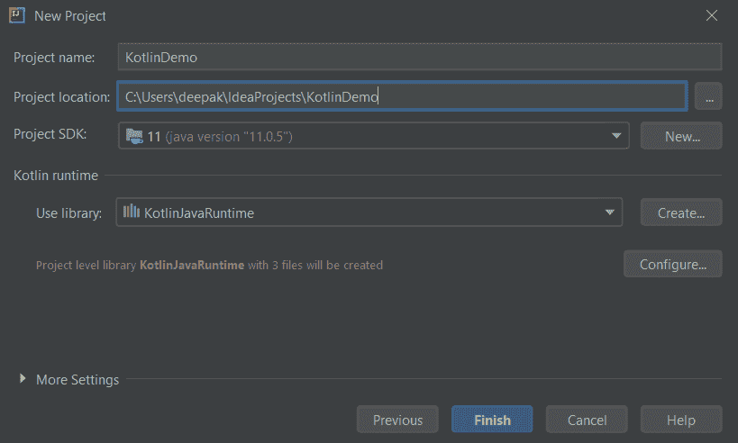
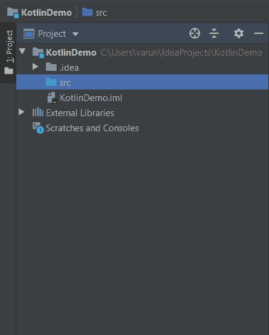
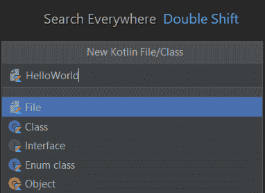
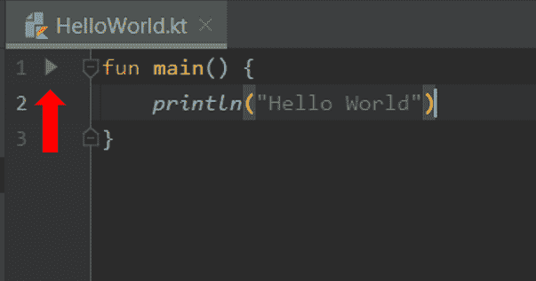
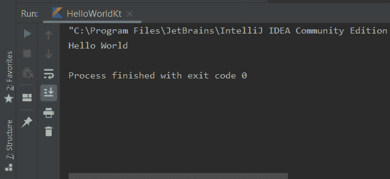

# 柯特林第一个使用 IntelliJ IDEA 的程序

> 原文：<https://www.studytonight.com/kotlin/first-program-in-kotlin-using-intellij-idea>

在上一个教程中，我们看到了如何在我们的系统中安装 IntelliJ idea。在本教程中，我们将看到如何在 IntelliJ IDEA IDE 中创建新项目，并在 Kotlin 中运行我们的第一个程序，该程序将在控制台上打印“ *Hello World* ”。

## 在 IntelliJ IDEA 中创建新项目

在 IntelliJ 中设置项目是运行任何 Kotlin 文件所必需的。按照以下步骤创建新项目:

*   转到开始，搜索 IntelliJ IDEA，然后打开它。如果您是第一次运行它，您可能会看到一些第一次设置，如导入设置，并选择一个黑暗或正常的主题。据此选择。

*   接下来，你会看到这个窗口:
    

*   点击“**新建项目**”。

*   从左侧面板选择 Kotlin，选择“ **JVM| IDEA** ”选项。点击下一步。
    T3】

*   输入项目的名称。您可以编辑项目位置并提供自定义位置。
    

*   在左侧可以看到这样的项目结构:
    

*   右键点击 **src** 文件夹，选择**新建>柯特林文件/类**，点击回车。你会看到:
    

*   输入文件名“ **HelloWorld** ，点击回车。

您已经成功创建了一个新的 Kotlin 项目，并在其中创建了一个 Kotlin 文件。现在我们将在其中创建我们的第一个 Kotlin 程序。

## 科特林的第一个节目

编写以下程序的是 **HelloWorld.kt** 文件:

```
fun main() {
    println("Hello World")
}
```

**说明:**

*   第 1 行:每个 Kotlin 程序都以`main()`函数开始。使用柯特林中的`fun`关键字创建函数。我们将在后面的章节中阅读更多关于函数的内容。

*   第 2 行:`println()`功能用于在控制台上打印字符串。

要运行该程序，点击`main()`功能旁边的绿色箭头，如下所示:



程序将被编译，输出将打印在控制台上:



## 摘要

在本文中，我们创建了一个科特林项目，并在科特林运行了我们的第一个程序。在下一个教程中，我们将看到如何通过命令行运行相同的程序。

* * *

* * *