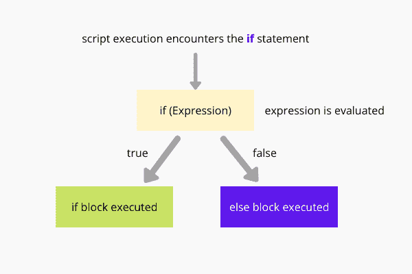

> 原文：<https://www.studytonight.com/kotlin/kotlin-if-else-expression>

[← Prev](/kotlin/kotlin-comments "Kotlin Comments")[Next →](/kotlin/kotlin-when-expression "Kotlin when Expression")

# 柯特林 if else 表达式

在本教程中，我们将学习如何使用 if-else 表达式控制 Kotlin 中的执行流。几乎所有现代编程语言都可以使用 if-else 语句来控制执行流程。

在大多数语言中，`if-else`块用于基于表达式选择条件。如果`if`表达式返回**真**，将执行`if`块。否则，将执行`else`块。例如，如果我们想使用**分数**知道一个**学生是否通过了**考试，我们可以编写以下代码:

```
fun main() {
    val marks = 70
    val result:String
    if(marks > 33){
        result = "Hurrah! You passed"
    }
    else{
        result ="Sorry! You failed"
    }
    println(result)
}
```

万岁！你通过了

在这里，因为学生的**分大于 33，所以通过了**考试。

但在科特林，如果-else 不是**陈述**，而是**表达**。这意味着 if-else 块可以返回一个语法略有变化的值。

让我们看看下面的代码:

```
fun main() {
    val marks = 70
    val result:String
    result = if(marks > 33) {
        "Hurrah! You passed"
    }
    else{
        "Sorry! You failed"
    }
    println(result)
}
```

这里，根据条件，该值将从 if-else 块返回，并将被分配给`result`变量。

<u>**注意:**</u> 在使用 if-else 作为表达式时，必须有一个带有`if` block 的`else` block。

Kotlin 中有各种类型的 if-else 表达式:

1.  简单的 if-else 表达式

2.  if-else 梯子

3.  嵌套 if 表达式

## 简单的 if-else 表达式

以下是如果不使用`else`块时`if`语句如何工作的图示:


让我们通过一个代码示例来看看简单的`if`表达式的作用:

```
fun main() {
    val light = "red"
    if(light == "red"){
       print("Stop")
    }
}
```

停止

如果我们在代码中指定了`if`和`else`，那么:



我们已经在上面看到了一个简单 if-else 表达式的例子。我们可以进一步简化这个表达式:

```
fun main() {
    val marks = 70
    val result:String
    result = if(marks > 33) "Hurrah! You passed" else "Sorry! You failed"
    println(result)
}
```

万岁！你通过了

如果在`if`和`else`块中有单行代码，我们可以**去掉大括号。**

## 如果不是这样的梯子

如果我们有多个条件需要检查，那么我们可以使用`if else`阶梯。让我们用一个例子来理解这一点。

假设我们想根据一个学生的分数给他/她打分；我们可以使用`if else`阶梯:

```
fun main() {
    val marks = 70
    val grade: String
    grade = if(marks >= 91)
        "A+"
    else if(marks >= 81)
        "A"
    else if(marks >= 71)
        "B+"
    else if(marks >= 61)
        "B"
    else if(marks >= 51)
        "C+"
    else if(marks >= 41)
        "C"
    else if(marks >= 33)
        "D"
    else
        "F"
    println("Your grade is: $grade")
}
```

你的成绩是:B

为了使上面的代码示例更具交互性，您可以[从用户](https://www.studytonight.com/kotlin/kotlin-input-and-output)处获取输入，然后将等级显示为输出。

## 嵌套 if-else 表达式

当我们在另一个`if`表达式中有一个`if`表达式时，它被称为嵌套的`if`表达式。让我们借助一个例子来理解这一点。

我们将编写一个程序来找出三个数字的最大值。

### 算法示例:

*   输入三个数字: *num1* 、 *num2* 和 *num3。*

*   如果 *num1* 大于 *num2:*

    *   如果 num1 大于 num3，则 num1 为最大值

    *   否则 *num3* 最大

*   否则如果 *num2* 大于 *num3* ，则 *num2* 最大

*   否则 *num3* 最大

这可以实现为:

```
import java.util.*

fun main() {
    val scanner = Scanner(System.`in`)

    // Taking three numbers as input
    println("Enter first number: ")
    val num1 = scanner.nextInt()

    println("Enter second number: ")
    val num2 = scanner.nextInt()

    println("Enter third number: ")
    val num3 = scanner.nextInt()

    val max = if(num1 > num2){
        if(num1 > num3)
            num1
        else
            num3
    }
    else if(num2 > num3)
        num2
    else num3

    println("Maximum number is: $max")
}
```

输入第一个号码:
10
输入第二个号码:
20
输入第三个号码:
11
最大号码为:20

上面程序的第一部分是从用户那里输入 3 个数字，然后我们比较这些数字，找出 3 个数字中的最大数字。为此，我们在另一个`if`条件中使用一个`if else`条件，这是嵌套的`if`表达式。

嵌套没有限制。一个`if`条件内可以有任意多个`if`条件，也可以做一个嵌套链。

## 摘要

在本教程中，我们讨论了柯特林中的`if`和`else`表达式。在下一个教程中，我们将讨论柯特林中的`when`表达。

* * *

* * *