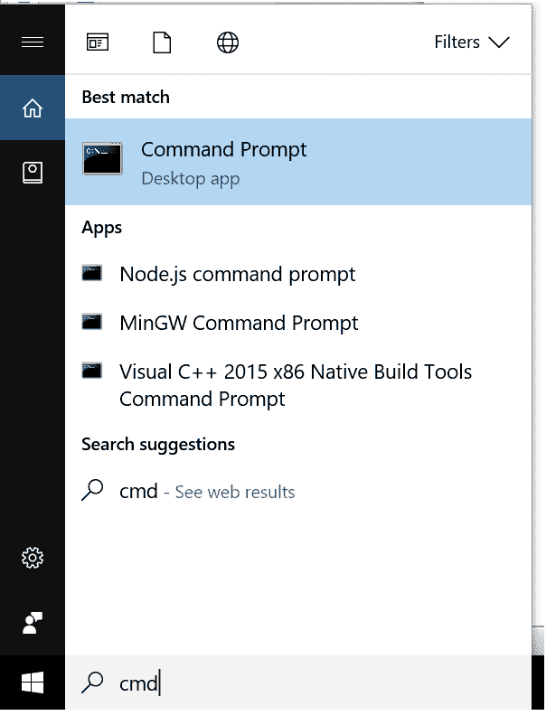
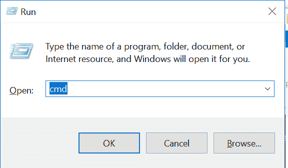
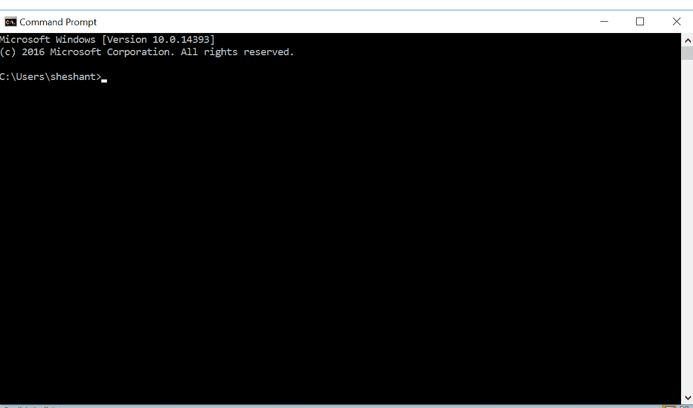
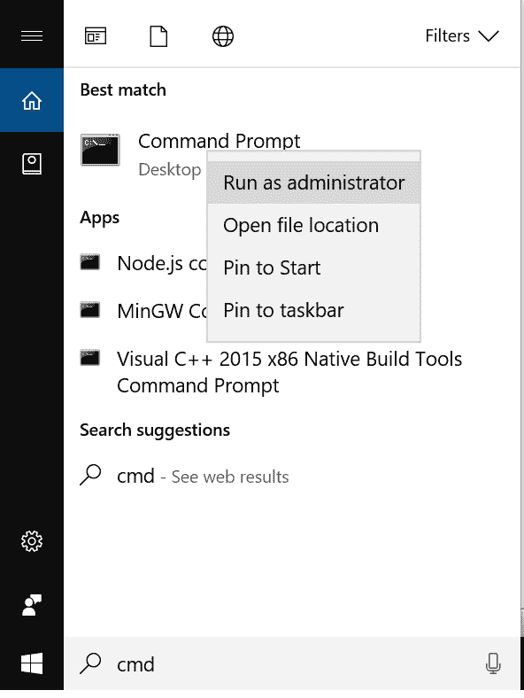
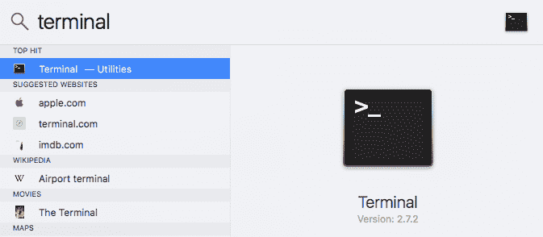
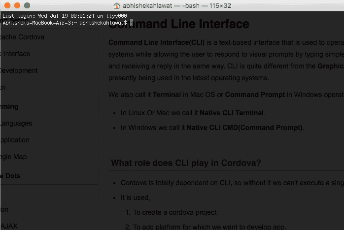

# Cordova：命令行界面

> 原文：<https://www.studytonight.com/apache-cordova/command-line-interface>

**命令行界面(CLI)** 是一个基于文本的界面，用于操作软件和操作系统，同时允许用户通过在界面中键入简单的命令并以相同的方式接收回复来响应视觉提示。命令行界面与目前在最新操作系统中使用的**GUI**有很大不同。

我们也称之为 Mac OS 中的**终端**或者 Windows 操作系统中的**命令提示符**。

*   在 Linux 或 Mac 中，我们称之为**本地命令行界面终端**。
*   在 Windows 中我们称之为**原生 CLI CMD(命令提示符)**。

* * *

## CLI 在Cordova扮演什么角色？

*   Cordova 完全依赖于 CLI，因此没有它，我们无法执行单个进程。
*   它被使用，
    1.  创建一个Cordova项目。
    2.  添加我们想要开发应用的平台。
    3.  添加插件。
    4.  去创造 APK。

对于这些列出的任务，我们必须传递命令行参数。

* * *

### 如何在 Windows 操作系统中打开 CMD？

1.  Search **cmd** in the Menu search bar by typing cmd or command prompt, then click on the Command Prompt App option in search results.

    

3.  We can also press `Ctrl + R` to open **RUN** dialog box, and type in **cmd** to open Command Prompt.

    

5.  It will open a black colored screen, this is the command prompt. Step 1 will open **cmd** in normal mode.

    

7.  To open command prompt in administrator mode, search **cmd** in searchbar and click right button of mouse and choose option **Run as administrator**.

    

以下是一些在日常工作中使用的有用命令:

*   `cls` →清除命令提示符屏幕
*   `cd [directory_path]` →转到任意目录
*   `cd ..` →从任何目录出来，到它的直接父目录。
*   `mkdir [directory_name]` →该命令用于创建任意目录。
*   `ipconfig` →获取您的 IP 地址信息和 DNS 相关信息。

* * *

### 在苹果操作系统中打开终端

1.  Press `Command + Space` to open **Spotlight Search**, and type **terminal** in the search field.

    

2.  And click on the **Terminal - Utilities** option to open the Terminal.

    

* * *

* * *