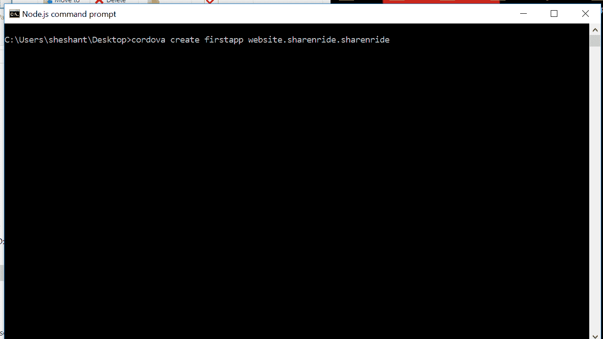
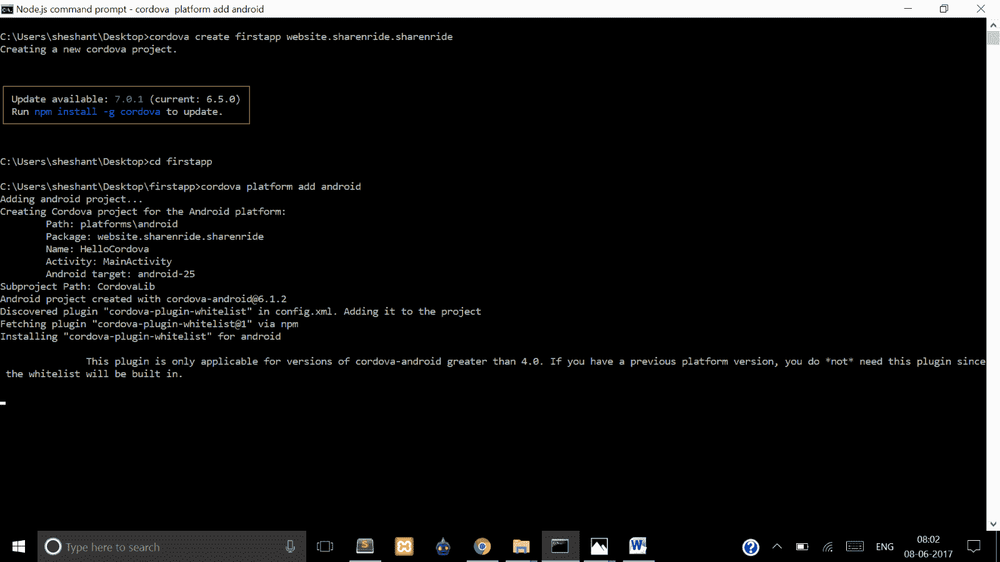
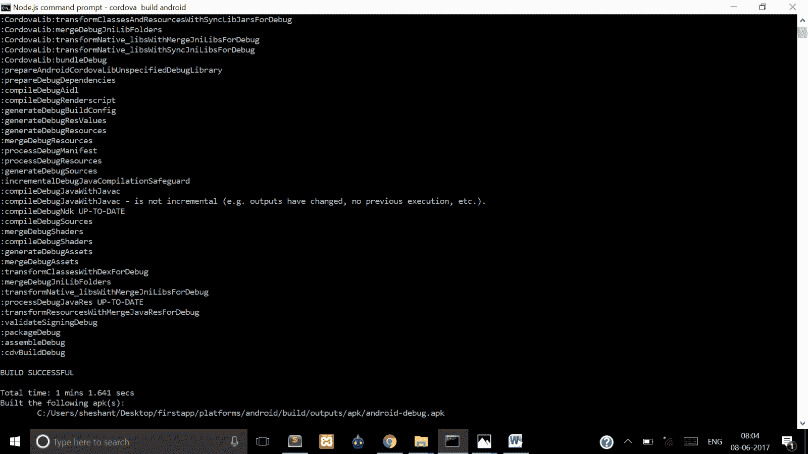
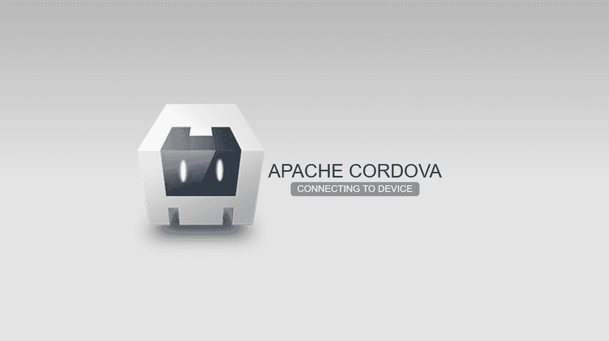
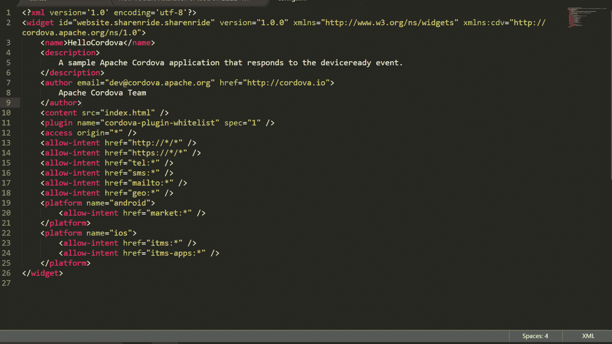

# 科尔多瓦:首个安卓应用

> 原文：<https://www.studytonight.com/apache-cordova/first-android-application>

现在我们准备使用 Apache Cordova 创建我们自己的第一个安卓应用程序。

1.  打开`cmd`。
2.  转到您想要创建第一个应用程序的位置。假设你想在**桌面**上创建你的第一个应用。所以在命令提示符下输入以下代码:`cd desktop`，如果你在这里**“C:user \ system _ name”**。命令`cd desktop`将带你到桌面位置。
3.  键入`cordova create [project_name] [package_name] [apk_name]`并按回车键。

    **项目名称** →这将是你的项目名称，就像 **myFirstApp** 一样。执行第三步后，将在桌面上创建一个具有指定名称的文件夹。你可以去那里看看。

    **package_name** →每个 App 都有一个唯一的应用 ID，称为 package name，如*com . stytomnight . App*、*com . my firstatpp . Android*、*any . any . any other things*等。

    **apk_name** →是 apk 的名称。

    

4.  键入`cd [project_name]`并按回车键，进入项目目录。
5.  现在我们将指定我们想要为其创建移动应用程序的平台的名称，例如，我们可以通知 cordova，我们想要通过使用命令`cordova platform add android`来创建 android 应用程序。它将增加安卓平台。您可以在项目文件夹内的**平台**文件夹中看到它。

    

6.  键入`cordova build android`。该命令将生成 apk。

    第一次<u>第五步</u>或者<u>第六步</u>需要时间，因为会下载梯度文件。

    你的 apk 的位置将是:**project _ name/platforms/Android/build/output/apk**。

    

你可以在模拟器上运行这个 **apk** 或者复制到你的安卓手机上安装。启动应用程序后，您将看到默认的 apache HTML 编码屏幕。



* * *

## 科尔多瓦:修改我们的应用程序

现在我们将在<u>第 4 步</u>之后把自己的文件添加到 app 文件夹中。

我们的 <u>HTML</u> 文件:*index.html*

```
<html>
    <head>
        <script type="text/javascript" src="index.js"></script>
        <link rel="stylesheet" type="text/css" href="name.css">			
    </head>
    <body onload="ask()">
        <div id='question'>Tell us your experience on Studytonight</div>
        <div id='answer'></div>
    </body>
</html>
```

我们的 <u>CSS</u> 文件: *style.css*

```
#question {
	margin-top:100px;
	text-align:center;
	color:red;
	border: blue solid 2px;
}

#question:hover {
	color:geen;
}

#answer {
	margin-top:30px;
	text-align:center;
	color:yellow;
	border: red solid 2px;
}
```

我们的 <u>Javascript</u> 文件: *index.js*

```
function ask(){			
    // This function will be called when page will be loaded.
    var k = prompt("Tell us your experience on Studytonight"); 
    if(k.length > 0) {			
        // Before inserting string into the div, it clear it first.
        document.getElementById('answer').innerHTML = "";
        // Now it will inject string into the div.
        document.getElementById('answer').innerHTML = k;
    } 
    else {	  	
        // If length of string is 0, then it will again ask you the same question.
	   ask();
    }
}
```

现在打开**项目 _ 名称**文件夹，转到 **www** 文件夹，删除所有预先存在的文件，放置所有三个文件(`index.html`、`index.js`和`style.css`)。然后再次遵循步骤 5 & 6。

* * *

### `config.xml`文件是干什么用的？

当你打开**项目名称**文件夹时，你会看到一个`config.xml`文件。那么我们来探究一下这个文件是干什么用的？在记事本、记事本++、Atom 或任何好的编辑器中打开这个 **config.xml** 文件。



**config.xml** 是我们项目的全局配置文件。每个项目都会有这个文件。它指定了平台、使用的插件、打开的第一页、权限等。

1.  它指定开发人员想要为哪个平台创建应用程序。
2.  必需的插件。
3.  在 *config.xml* 中，`content`标记用于指定要打开的第一页，

    ```
    <content src="index.html" /> 
    ```

    每当打开应用程序时，它都会被重定向到此页`index.html`。只要修改 *config.xml* 文件中的配置，您就可以编辑它，并将其更改为类似`firstpage.html`的任何内容。

更多信息，请点击链接:[https://cordova.apache.org/docs/en/latest/config_ref/](https://cordova.apache.org/docs/en/latest/config_ref/)

* * *

* * *