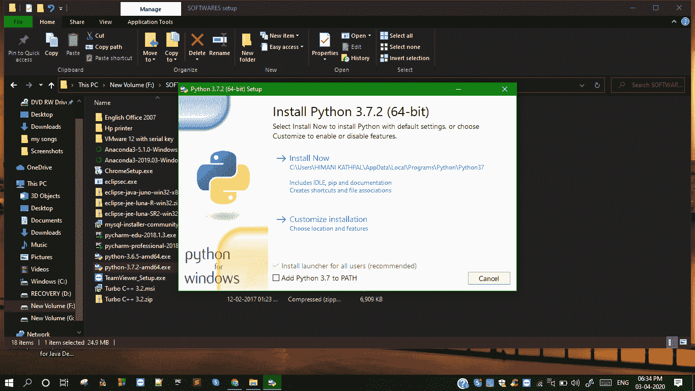
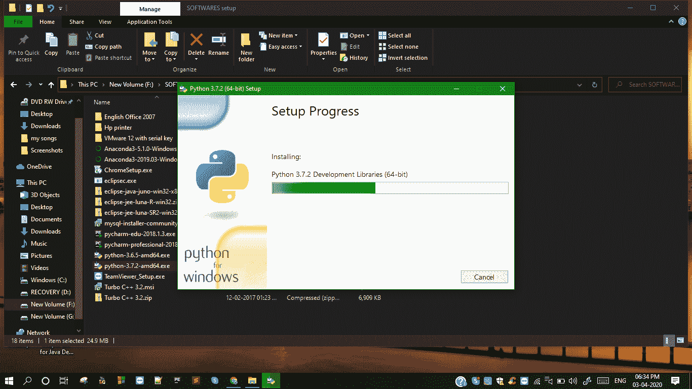

# 了解 Python 并设置 Python 开发环境

> 原文：<https://www.studytonight.com/python/getting-started-with-python>

欢迎光临！这是你学习 Python 编程语言的第一步。或者，你已经知道这种语言了吗，来这里只是为了修正你的概念？。你属于哪一类并不重要，因为我们将从基础开始教你 Python。

一个有经验的程序员可能有一个优势，那就是很快就能找到主题和课程，尽管我们建议您不要匆忙完成主题，因为 Python 虽然是一种普通的编程语言，但对程序员来说有一些好处，您不会想错过教程中的那些。

尽管有这么多麻烦，但没什么好担心的。你应该很高兴选择了最神奇最简单的教程来学习 Python。

* * *

## 为什么是 Python？

Python 被认为是最通用的编程语言之一。如果你有一点编程经验，那么你很快就会注意到区别。让我们来看看 Python 的特性。

### Python 的特性

1.  它有简单易用的语法。
2.  它几乎可以在任何平台上运行，包括视窗、Linux 的所有发行版(Linux 的所有版本)、苹果 OS X、Unix 等。
3.  您甚至可以将其他编程语言(如 [C](/c/overview-of-c.php) 、 [C++](/cpp/introduction-to-cpp.php) 等)与 python 结合起来，以实现两全其美。
4.  它的大型标准库支持使现实生活中的编程变得容易得多。
5.  除此之外，它是开源的，并且有大量的社区支持来积极地使用 Python 编程。
6.  它是面向对象的**(也叫 [OO 编程或 OOP](oops-in-python) )** ，这使得它更适用于现实世界的应用编程。
7.  此外，它不仅可以用来编写复杂的程序，还可以用来设计具有图形用户界面的应用。
8.  Python 是一门独立的语言，因为它是一个解释器，一行一行地执行 python 代码，这使得调试更加容易。但是 Python 编译是一个永无止境的讨论话题？嗯，技术上是这样的，从用户写的代码到**字节码**，然后字节码被送到解释器执行。这里有一个很好的 StackOverflow 讨论:[Python 是解释的，还是编译的，还是两者都有？](https://stackoverflow.com/questions/6889747/is-python-interpreted-or-compiled-or-both)
9.  Python 有许多实现，如**CPython**(python 的标准实现) **Jython** (目标是与 java 编程语言集成)等。

就其语法的简单性而言，让我们看一个示例代码。考虑一个程序，其中您希望用户从键盘输入一些东西，并且您希望将该值保存在变量中。对于 [C++](/cpp) ，一种流行的编程语言，以下是您将如何编写它:

```py
#include<iostream>
using namespace std;
int main(){
    int x;
    cin >> x;
    return 0;
}
```

对于另一种流行的编程语言 [Core Java](/java) ，它将是:

```py
import java.util.Scanner;
class Test{
    Scanner input = new Scanner(System.in);
    public static void main(String args[]){
        int x;
        x = input.nextInt();
    }
}
```

而在`Python`中，是*(*鼓声*)* :

```py
x = input()
```

别开玩笑了。仅此而已。没有文件导入，没有大括号，没有分号，只有一行。现在真的没有必要去理解这段代码。它只是想向你展示 Python 是如何让程序员松一口气的。

在上面的代码中可以注意到的另一件事是，在 C++和 Java 的情况下，用户只能键入任意的`integer`作为变量`x`的输入，因为我们已经通过指定代码`int x;`将值`x`声明为整数。就 python 而言，程序员在声明变量时不必显式指定数据类型，Python 的编译器会根据分配给变量的值类型自行指定。

* * *

### 关于课程的一些事情

准确地说，目前有两个版本的 Python 可以在他们的官方网站上获得，即 **Python 2.x** 和 **Python 3.x** 。在本课程中，我们将讨论 Python 3.x

此外，Python 3.x 和 Python 2.x 之间没有太大的区别，主要的变化是打印任何东西的方式。这只是 Python 2.x 中的`print`，在 Python 3.x 中，他们把它变成了`print()`，是的，增加了括号。

* * *

## Python 的应用

人们可以说，使用 Python 几乎可以做任何事情。

1.  **Web 应用** : Python 可以用来开发可伸缩、安全的 Web 应用。像 Django、Flask、金字塔等框架对于设计和开发基于网络的应用来说是惊人的。

3.  **计算机软件或桌面应用**:由于 python 也可以用来开发 GUI，因此是开发桌面应用的绝佳选择。`Tk`是一个开源的 widget 工具包，可以用 python 开发桌面应用。`Kivy`就是另一个这样的平台。

5.  **科学计算应用**:python 以其惊人的计算能力和简单的语法被用于科学计算应用。像`SciPy`和`NumPy`这样的 Python 库最适合科学计算。

7.  **AI 和 ML(人工智能和机器学习)** : Python 处于向人工智能和机器学习范式转变的前沿。

9.  **图像处理** : Python 以其图像处理能力而闻名，包括逐像素遍历和分析任何图像。有许多 python 库可用于图像处理，例如:枕头、scikit-image 等。

从你可能已经在使用的东西开始:像 **Instagram** 、 **Reddit** 、 **Mozilla** 这样的网站，都是使用 Python 开发的。有各种各样的网络框架，像`Django`(最流行的一个)和`Pyramid`，基于 Python，可以用来开发现代的网络应用。

* * *

## 安装 Python

在您的 Windows 系统中设置 Python 环境的步骤:

1.  前往[python.org/download](https://www.python.org/downloads/)
2.  根据您的电脑，下载最新版本的 32 位或 64 位 Python 3.x 。
3.  Open Installer and follow these steps:

    

    选中窗口中的选定选项后，单击下一步。

    

4.  遵循这些步骤后，安装将开始。
5.  您可以通过在 **cmd** 中键入`python -V`来检查安装是否成功。如果它返回您已经安装的 Python 版本，那么恭喜您一切就绪。

如果你有一台 **Macbook** ，MacOS 预装了 Python 2.7.x，但是你不能更新版本或者[在 Python 中添加模块](modules-and-functions) a >，因为这是操作系统所要求的。所以你应该[下载 Python 3，在 Macbook](https://www.studytonight.com/post/python-virtual-environment-setup-on-mac-osx-easiest-way) 中设置虚拟环境。

如果你使用 Ubuntu 操作系统，它会预装 Python。

* * *

* * *