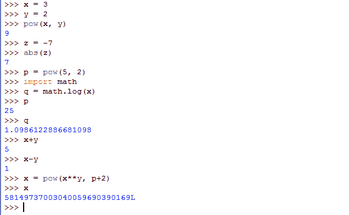

# Python 中的变量

> 原文：<https://www.studytonight.com/python/variables-in-python>

本课讨论变量。那些已经知道一些编程的人必须熟悉变量的概念及其重要性。变量是我们放在空盒子(内存位置)上的铭牌，我们可以在其中存储任何值(数据)，一旦我们使用完一个变量，铭牌就会从盒子(内存位置)上移除(超出范围)，然后盒子就会有一个新的铭牌。另外，在 python 中，一个盒子可以有多个铭牌。

在 python 中，一切都是一个对象，**变量**只是用来标识这些对象的名称。

例如:

```py
x = 10
```

在上面的代码中，`x`是对象`10`的变量或标签或名称。

如果我们有以下代码:

```py
x = 10
y = 10
```

那么对于对象`10`我们有两个标签(引用)`x`和`y`。

因此，我们可以说变量提供了一种用描述性名称标记数据的方式，因此读者和我们自己可以更清楚地理解我们的程序。将变量视为保存信息的容器的铭牌是有帮助的。他们唯一的目的是标记存储在内存中的数据。这些数据可以在整个程序中使用。

让我们看一些例子。一个变量应该有一个*名字*。有一些规则可以给变量命名。

*   变量名只能由字母、数字和下划线组成。
*   变量名称中的第一个字符不能是数字。因此`i-am-variable`、`variable!`、`1variable`、`#variable`都是无效变量名。而`i_am_variable`、`variable`、`variable1`、`_variable`都是有效名称。

* * *

## 在变量中存储值

是时候看看如何在变量中存储一个值了。考虑一个名为`x`的变量，我们希望这个变量存储一个数值或者一个数字，比如`11`。然后，要做到这一点，只需转到 IDLE 并键入:

```py
>>> x = 11
```

并按下**进入**键。这样我们的变量就被创建了，命名为`x`，并在其中存储了一个默认值`11`，使用等于`=`运算符。请记住，**等于**运算符始终用于为任何变量指定特定值。变量的名称将始终位于*左侧*，其值将位于*右侧*。让我们创建另一个变量，比如`y`并为其赋值`25`。

```py
>>> y = 25
```

现在在当前的 IDLE 会话中，python 正在处理两个变量`x`和`y`，它们分别有值`11`和`25`。如果您想检查 IDLE 中任何变量的值，只需在新行中键入该变量的名称，然后按回车键。存储在其中的值将以新的一行打印在IDLE屏幕上。

```py
>>> x
11
>>> y
25
```

现在试着看看下面的代码，你认为这会做什么？

```py
>>> x = y
```

正如你在 LHS(左手边)看到的，我们在 RHS(右手边)有`x`和`y`，因此正如我们之前解释的，右边的值将被分配给左边的变量。由于`y`中存储了一个值`25`，该语句会将`x`中的值从`11`修改为`25`。因此，如果你再问`x`的值，现在就是`25`了。在这种情况下，我们只是重写了`x`变量中的值。

```py
>>> x
25
```


一旦你完成了上面的例子，让我们这次在命名变量时更有创造性。让我们创建一个变量，并指定您的名字作为它的值。所以这里我们有一个名为`name`的盒子，它可以存储任何单词。这个过程与我们上面所做的非常相似，只是有一点小小的改变。仔细看，

```py
>>> name = "Sudytonight"
```

如您所见，我们在*双引号*中引用了我们网站的名称。这是因为我们不想让 python 编译器混淆。既然**study nothing**是一个词(或者更准确地说，是编程世界中的`string`)，我们就必须用引号将它括起来。通过这样做，我们告诉 python 这是一个词。但是，如果我们在没有引号的情况下写下*今晚学习*会发生什么？像这样，

```py
>>> name = Studytonight
```

由于没有引号，python 会将`Studytonight`视为另一个变量，并试图找到存储在其中的值，以便进一步将其分配给变量`name`。但是由于我们从未声明过任何名为`Studytonight`的变量，python 将无法为其找到任何值，最终，它将抛出一个**错误**，称名为`Studytonight`的变量未定义。

也可以同时使用*单引号*和*双引号*来表示一个单词(或`string`)。

```py
>>> name = "Studytonight.com"
>>> name = 'Studytonight'
```

[现场示例→](/code/python/using-variables.php)

两者都很好。


现在，您也可以尝试使用带有**数学函数**的变量，就像我们在[上一个教程](numbers-and-math-functions)中学习的那样。尝试使用变量作为函数的参数。例如，

```py
>>> x = 3
>>> y = 2
>>> pow(x, y)
9
>>> z = -7
>>> abs(z)
7
```

接下来，可以尝试将任意数学函数的**答案**保存在一个变量中。比如，

```py
>>> p = pow(5, 2)
>>> import math
>>> q = math.log(x) 
```

尝试对这些变量使用**数学运算符**。比如，

```py
>>> x+y
5
>>> x-y
1
```

尝试在一个**数学表达式**中使用这些变量，包括一些**数学函数**和**运算符**，所有这些加在一起，就像，

```py
>>> x = pow(x**y, p+2)
```

在上面的代码中，python 将首先计算 RHS(右手边)上的表达式，并将使用变量`x`的旧值，即`3`，一旦表达式被求解，答案将存储在变量`x`中，该变量将成为其新值。



* * *

* * *