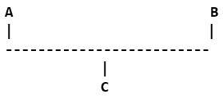

# Python 中的继承类型

> 原文：<https://www.studytonight.com/python/types-of-inheritance>

在上一个教程中，我们学习了[继承](inheritance-in-python)以及子类如何继承父类以利用其属性和功能。

如果一个类想要继承多个类呢？或者有没有可能继承一个已经继承了其他类的类？为了回答这些问题，让我们看看不同类型的继承。

在 Python 中，有两种类型的继承:

1.  多重继承
2.  多级继承

* * *

## Python -多重继承

多重继承意味着您将多个类的属性继承到一个类中。如果你有两个类，比如`A`和`B`，你想创建一个继承`A`和`B`属性的新类，那么:

```py
class A:
    # variable of class A
    # functions of class A

class B:
    # variable of class A
    # functions of class A

class C(A, B):
    # class C inheriting property of both class A and B
    # add more properties to class C
```

所以就像一个孩子继承了母亲和父亲的特征一样，在 python 中，我们可以在一个子类中继承多个类。



如您所见，我们没有在子类的括号中提到一个类名，而是提到了两个类名，用逗号`,`隔开。为了消除你的疑虑，是的，你可以继承任意多的类。因此，语法实际上应该是:

```py
class A(A1, A2, A3, ...):
    # class A inheriting the properties of A1, A2, A3, etc.
  	# You can add properties to A class too
```

* * *

### Python -多级继承

在多级继承中，我们在多个不同的级别继承类。我们有三个班`A`、`B`、`C`，其中`A`为超级班，`B`为其子(子)班，`C`为`B`的子班。


这里有一个简单的例子，它只是为了向您解释这在代码中的样子:

```py
class A:
    # properties of class A

class B(A):
    # class B inheriting property of class A
    # more properties of class B

class C(B):
    # class C inheriting property of class B
    # thus, class C also inherits properties of class A
    # more properties of class C
```

* * *

### 使用`issubclass()`方法

在 python 中，有一个函数可以帮助我们验证一个特定的类是否是另一个类的子类，这个内置函数就是`issubclass(paramOne, paramTwo)`，其中`paramOne`和`paramTwo`可以是类名，也可以是类的对象名。

```py
class Parent:
  	var1 = 1
  	def func1(self):
  	    # do something

class Child(Parent):
  	var2 = 2
  	def func2(self):
  	    # do something else
```

为了检查`Child`类是否是`Parent`类的子类。

```py
>>> issubclass(Child, Parent)
```

真实的

或者使用类的对象，

```py
Parent p = Parent()
Child c = Child()
```

几乎是一样的，

```py
>>> issubclass(c, p)
```

真实的

* * *

* * *