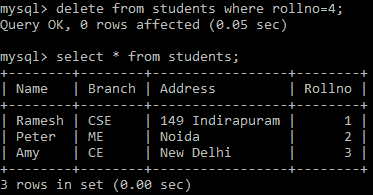

# Python MySQL -删除表数据

> 原文：<https://www.studytonight.com/python/python-mysql-delete-data-from-table>

在本教程中，我们将学习如何在 Python 中**删除 MySQL 表数据**，在这里我们将使用 [`DELETE` SQL 查询](/dbms/dml-delete-command.php)和 [`WHERE`子句](/dbms/where-clause.php)。

`DELETE` SQL 查询是**用来从 MySQL 表中删除任何记录**。

### Python MySQL `DELETE`:语法

其语法如下:

```py
DELETE FROM table_name WHERE condition
```

**注意:**在上面的语法中，`WHERE`子句用于指定条件，以锁定要删除的特定记录。如果不指定条件，那么表中的所有记录都将被删除。

## Python MySQL `DELETE`表数据:示例

我们来看一个删除**学生**表中的记录的例子(来自 [Python MySQL 创建表](/python/python-mysql-create-table)教程)，其**rollino**为 **4** 。代码如下:

```py
import mysql.connector as mysql

db = mysql.connect(
    host = "localhost",
    user = "yoursername",
    passwd = "yourpassword",
    database = "studytonight"
)

cursor = db.cursor()
## defining the Query
query = "DELETE FROM students WHERE Rollno = 4"

## executing the query
cursor.execute(query)

## final step to tell the database that we have changed the table data
db.commit()
```

如果上面的代码运行没有错误，那么这意味着带有 **rollno = 4** 的行被成功删除。

要检查它是否存在于表中，您可以使用下面给出的代码:

```py
import mysql.connector as mysql

db = mysql.connect(
    host = "localhost",
    user = "yourusername",
    passwd = "yourpassword",
    database = "studytonight"
)

cursor = db.cursor()
## defining the Query
query = "SELECT * FROM students"

## getting records from the table
cursor.execute(query)

## fetching all records from the 'cursor' object
records = cursor.fetchall()

## Showing the data
for record in records:
    print(record)
```

上述代码的输出如下所示:

(' RaMEsh '，' CSE '，' 149 individuals '，1) ('Peter '，' me '，' night '，' 2) ('Amy '，' CE '，'新德里'，' 3)

以下是实际输出的快照:



从上面的输出中我们可以看到 **rollno=4** 的行被成功删除。

* * *

* * *