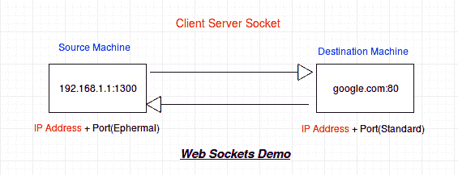

# 套接字基础

> 原文：<https://www.studytonight.com/network-programming-in-python/basics-of-sockets>

到目前为止，您一定已经获得了关于网络和 python 的基本概念。如果您错过了最后几个教程，我们建议您在开始使用套接字之前仔细阅读它们。现在真正的乐趣开始于我们开始把这些东西混合在一起。那么，让我们从套接字开始，看看它们是什么，以及我们为什么使用它们。

为了理解什么是套接字，让我们从互联网连接开始。互联网连接基本上连接了互联网上的两个点，用于数据共享和其他东西。来自计算机 **C1** 的一个进程可以通过互联网连接与来自计算机 **C2** 的一个进程进行通信。它具有以下属性:

*   **可靠**:表示在连接两台电脑的线缆安全之前，数据会安全传输。
*   **点对点**:两点之间建立连接。
*   **全双工:**这意味着信息传输可以通过两种方式进行，即从客户端到服务器以及服务器同时(同时)到客户端。

**插座**是双向点对点通信通道的端点。给定一个互联网连接，比如客户端(浏览器)和服务器(比如 study now . com)之间的连接，我们将有两个套接字。一个`Client Socket`和一个`Server Socket`。

套接字作用于两个部分: **IP 地址** + **端口号**



含糊地说，当你点击将你带到“今夜研究”网站的链接时，你的浏览器做了如下事情:

```py
#a socket object is created for communication
clientsocket = socket.socket(socket.AF_INET, socket.SOCK_STREAM)

# now connect to the web server on port 80
# - the normal http port
clientsocket.connect(("www.studytonight.com", 80))
```

这发生在客户端。当客户端尝试与服务器连接时，操作系统会为连接分配一个随机端口。这个随机端口被称为**应急端口**。在上图中，`1300`是源(客户端)机器上的一个快速端口。客户端套接字是短暂的，即一旦数据交换结束，它就会关闭。现在服务器上发生的事情与客户端有点不同。让我们看看:

```py
serversocket = socket.socket(socket.AF_INET, socket.SOCK_STREAM)

#bind the socket to a public host and a well-known port
serversocket.bind((socket.gethostname(), 80))

#become a server socket and listen for connections
serversocket.listen(5)
```

目前只关注`Connect`和`Bind`方法。

**Connect** 是客户端套接字用来启动与服务器的连接。该请求通过服务器套接字的**绑定**方法来实现。如果你对代码有问题，不要担心。每一点都将通过例子单独解释。

在结束之前，让我们看看客户机和服务器套接字之间的一些区别:

*   与客户端套接字不同，服务器套接字不是短暂的。例如:您可能需要 youtube.com 处理一个请求，但是 youtube.com 必须 24*7 处理来自全球用户的任何请求。
*   与客户端套接字使用快速端口进行连接不同，服务器套接字需要一个标准的或定义良好的端口进行连接，如:端口 80 用于正常的 HTTP 连接，端口 23 用于远程登录等。

* * *

* * *