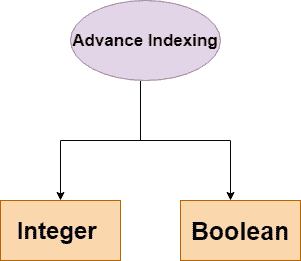

# Python 数字高级索引

> 原文：<https://www.studytonight.com/numpy/python-numpy-advance-indexing>

在本教程中，我们将介绍 Python NumPy 库中数组元素的高级索引。

NumPy 数组中的切片仅用于呈现视图，而高级索引总是返回数据的**副本**。

如果您希望从一个数组的不同行中选择随机数，并且您想要选择的项目没有顺序，那么我们可以使用高级索引概念。您将在下面的代码示例中看到，我们将使用高级索引从一个数组的不同行和列中挑选随机元素。

## 高级索引的类型

以下是高级索引的类型:



现在我们将逐一介绍上述类型的高级索引。

## 1.整数索引

借助整数索引机制，您可以基于 N 维索引选择任意**项。此外，每个整数数组用于表示该维度中的索引数量。**

当索引由和目标数组的维数一样多的整数数组组成时，它就变得太简单了。

### 例 1:

在下面给出的例子中，将从数组对象的每一行中选择指定列的一个元素**。因此**行索引将包含所有行号**，而**列索引将指定要选择的元素**。的代码片段如下:**

```py
import numpy as np 

x = np.array([[11, 28], [23, 84], [95, 56]]) 
print ("The array used for Integer Indexing")
print(x)

y = x[[0,1,2], [0,0,1]] 
print("The Output is:")
print(y) 
```

用于整数索引的数组
【【11 28】
【23 84】
【95 56】】
输出为:
【11 23 56】

在上面的代码中，在执行高级索引并创建新的数组`y`时，对于数组`x`，首先我们指定要拾取的所有行的**行号**，然后我们**指定要拾取的该行的实际元素**的索引。

因此代码`x[[0,1,2], [0,0,1]]`意味着要选取的行是**第 0 行、第 1 行和第 2 行**(由[0，1，2]表示)，然后从第 0 行选取[0]索引元素，从第 1 行选取[0]索引元素，从第 2 行选取[1]索引元素(由[0，0，1]表示)。

### 例 2:

在下面给出的例子中，我们将尝试选择 ndarray 的角元素。的代码片段如下:

```py
import numpy as np 
x = np.array([[10, 81, 2], [3, 43, 35], [63, 72, 8], [92, 10, 11]]) 

# [10, 81, 2]
# [ 3, 43, 35]
# [62, 72, 8]
# [92, 10, 11]
# so corener elements are 10, 2, 92 and 11

print ('The array is:') 
print (x)

# picking the 1st and last row
rows = np.array([[0], [3]])
# picking 0 index and 2nd index element from each row
cols = np.array([[0, 2], [0, 2]])
y = x[rows, cols] 

print ('The corner elements of the array are:') 
print (y)
```

数组为:
【【10 81 2】
【3 43 35】
【63 72 8】
【92 10 11】】
数组的角元素为:
【【10 2】
【92 11】】

<u>**注意:**</u> 您可以使用一个切片(`:`)或省略号(`…`)将高级和基本索引与一个索引数组结合起来。

### 例 3:

在下面的例子中，我们将对行使用**切片，对列使用**高级索引。结果与切片用于两者时相同。但是如您所知，高级索引会创建 ndarray 的新副本，并且可能具有不同的内存布局，因此我们在一起使用它们时应该小心。让我们看看下面给出的代码片段:

```py
import numpy as np 

x = np.array([[11, 1, 12], [31, 4, 15], [6, 37, 8], [91, 10, 11]]) 

print("The array is:")
print(x)
# Using basic slicing
z = x[1:4, 1:3] 

print('After slicing the array becomes:')
print(z)

# using advanced indexing for column 
y = x[1:4, [1,2]] 

print('After Slicing using advance index for column:')
print(y)
```

数组为:
【【11 1 12】
【31 4 15】
【6 37 8】
【91 10 11】】
切片后数组变为:
【【4 15】
【37 8】
【10 11】】
切片后使用列的推进索引:
【【4 15】
【37 8】
【10 11】】

## 2.布尔索引

布尔索引是一种高级索引，当我们希望使用比较运算符或其他运算符根据某种条件从数组中挑选元素时，可以使用它。

### 例 1:

在下面给出的代码示例中，布尔索引的结果是返回大于 11 的**项:**

```py
import numpy as np 

x = np.array([[11, 51, 2],[23, 24, 5], [16, 47, 8] ,[91, 10, 11]]) 

print("The array is:")
print(x)

# Now we will print the items greater than 11
print("The items greater than 11 are:")
print(x[x>11])
```

阵为:
【【11 51 2】
【23 24 5】
【16 47 8】
【91 10 11】】
大于 6 的项为:
【51 23 24 16 47 91】

就像我们在上面的代码示例中所做的那样，我们也可以使用不同的运算符来查找小于、等于或大于给定数字的元素。

### 示例 2:删除“不是数字”值

要省略**非数字(NaN)** ，可以使用`~` ( **补码运算符**)。其代码片段如下所示:

```py
import numpy as np 

a = np.array([np.nan, 1, 12, np.nan, 3, 41, 54]) 

print("After omitting NaN the output array is :")
print (a[~np.isnan(a)])
```

省略 NaN 后，输出数组为:
【1】。12.3.41.54.]

### 示例 3:删除非复数

通过下面给出的代码示例，您将了解如何从数组中**过滤出非复杂元素**:

```py
import numpy as np 

a = np.array([1, 2+6j, 5, 3.5+5j]) 

print("After Filtering the non-complex numbers :")
print (a[np.iscomplex(a)])
```

过滤非复数后:
【2。+6.j 3.5+5.j]

## 摘要

在本教程中，我们已经介绍了 Numpy 库中不同类型的数组元素的高级索引。我们已经介绍了 Numpy 中不同类型的高级索引用例的几个例子。

* * *

* * *