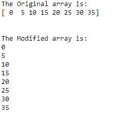
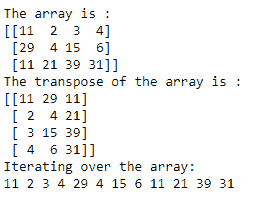
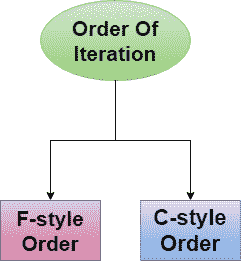
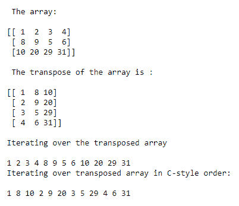
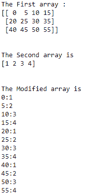

# 访问数组元素的次数(迭代)

> 原文：<https://www.studytonight.com/numpy/numpy-accessing-array-elements-iteration>

在本教程中，我们将学习如何遍历任何给定的数组，以逐个访问 NumPy 库中数组(数组迭代)中的所有可用元素。

`numpy.nditer`是 Numpy 库提供的迭代器对象。

*   `numpy.nditer`是一个高效的**多维迭代器对象**，用于**迭代 Numpy 库中的数组**。

*   在这个迭代器对象的帮助下，使用 [Python 迭代器接口](https://www.studytonight.com/python/python-iterable-and-iterator)访问给定数组的每个元素。

## 例 1

让我们看一个例子，我们将使用`arange()`方法创建一个**数组**，然后使用`numpy.nditer`对其进行迭代:

```
import numpy as np

a = np.arange(0,40,5)

print ("The Original array is:")
print (a)
print ('\n')

# showing elements of array one by one
print ("The Modified array is:")
for x in np.nditer(a):
    print(x)
```

上述代码的输出将是:



<u>**注意:**</u> 这里需要注意的是，迭代的顺序不像**那样遵循任何特殊的行-主或列-顺序**，但是迭代的顺序总是被选择为与给定数组的内存布局相匹配。你可以通过**迭代数组的转置**来检查它。

## 示例 2:迭代数组的转置

让我们举一个例子，我们将取一个数组，然后我们将看到给定矩阵的转置，我们将使用`nditer`迭代。其代码如下:

```
import numpy as np  

a = np.array([[11,2,3,4],[29,4,15,6],[11,21,39,31]])  
print("The array is :")  
print(a)  

print("The transpose of the array is :")  
at = a.T 

print(at)  
print("Iterating over the array:")   
for x in np.nditer(at):  
    print(x, end=' ') 
```

上述代码的输出将是:



## Numpy 中的迭代顺序

在 Numpy 中，基本上我们有两种方法可以将元素存储到数组中，如下所示:



现在我们将讨论 numpy 迭代器如何处理特定顺序(F 型或 C 型)的例子。

### 示例 3:迭代 F 型和 c 型顺序数组

下面我们有一个例子，我们将以 F 风格和 C 风格进行迭代。的代码片段如下:

```
import numpy as np  

a = np.array([[1,2,3,4],[8,9,5,6],[10,20,29,31]])  
print("\nPrinting the array:\n")  
print(a)  
print("\nPrinting the transpose of the array:\n")  
at = a.T  
print(at)  
print("\nIterating over the transposed array\n")  

for x in np.nditer(at):  
    print(x, end= ' ')  
print("\nSorting the transposed array in C-style:\n")  
c = at.copy(order = 'C')  
print(c)  

print("\nIterating over the C-style array:\n")  
for x in np.nditer(c):  
    print(x, end=' ')  

d = at.copy(order = 'F')  
print("\n")
print(d) 

print("\nIterating over the F-style array:\n")  
for x in np.nditer(d):  
    print(x, end=' ') 
```

打印数组:

【【1 2 3 4】
【8 9 5 6】
【10 20 29 31】】

打印数组转置:

【【1 8 10】
【2 9 20】
【3 5 29】
【4 6 31】】

迭代转置数组

1 2 3 4 8 9 5 6 10 20 29 31
按 C 风格对转置数组进行排序:

【【1 8 10】
【2 9 20】
【3 5 29】
【4 6 31】】

迭代 C 风格数组:

1 8 10 2 9 20 3 5 22
【3 5 29】
【4 6 31】】

迭代 F 型数组:

1 2 3 8 9 5 6 10 20 29 31

### 需要注意的要点:

需要注意的是，在定义`Iterator`对象本身时，可以提到顺序“ **C** 或“ **F** ”。

让我们来看一个例子，其中我们将在定义迭代器对象时提到顺序:

```
import numpy as np  

a = np.array([[1,2,3,4],[8,9,5,6],[10,20,29,31]])    
print("\n The array:\n")  
print(a)  
print("\n The transpose of the array is :\n")  
at = a.T  
print(at)  
print("\nIterating over the transposed array\n")  
for x in np.nditer(at):  
    print(x, end= ' ')  

print("\nIterating over transposed array in C-style order:\n")  
for x in np.nditer(at, order = 'C'):  
    print(x,end=' ') 
```

上述代码的输出将是:



## 数字阵列广播迭代

如果两个数组是**可展宽的**，那么一个组合的`nditer`对象能够同时迭代它们。假设一个数组`x`有维度 **3x4** ，还有另一个维度 **1x4** 的数组`y`，那么我们使用广播迭代器(数组`b`广播到`a`大小)。

其代码示例如下:

```
import numpy as np 

a = np.arange(0,60,5) 
a = a.reshape(3,4) 

print ('The First array :') 
print (a)
print ('\n')

print ('The Second array is') 
b = np.array([1, 2, 3, 4], dtype = int) 
print (b)  
print ('\n' )

print ('The Modified array is') 
for x,y in np.nditer([a,b]): 
    print ("%d:%d" %(x,y))
```



## 修改数组的值

`nditer`对象的另一个可选参数称为`op_flags`。该参数的默认值为只读，但也可以设置为**读写**或**只写**模式。借助这个迭代器，您可以很容易地修改数组中所有或部分元素的值。

让我们看看同样的例子:

```
import numpy as np

a = np.arange(0,50,6)
a = a.reshape(3,3)
print ('The Original array is:')
print (a)
print ('\n')
for x in np.nditer(a, op_flags = ['readwrite']):
    # modifying the value of array elements
    x[...] = 2+x
print ('The Modified array is:')
print (a)
```

原阵为:
【【0 6 12】
【18 24 30】
【36 42 48】】

变阵为:
【【2 8 14】
【20 26 32】
【38 44 50】】

## 摘要

在本教程中，我们已经介绍了 Numpy 中用于数组迭代的`nditer`对象。之后，我们通过一个例子介绍了迭代的顺序在迭代中的作用。然后学习了广播迭代及其示例。最后，我们介绍了如何在迭代时修改数组的值。

* * *

* * *