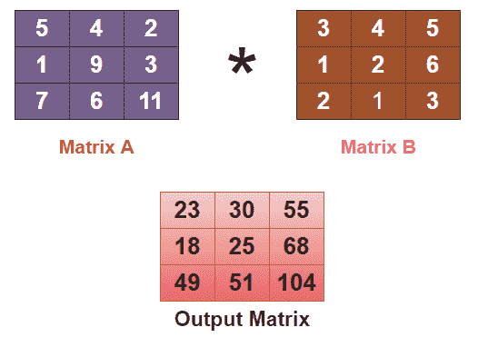
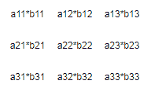
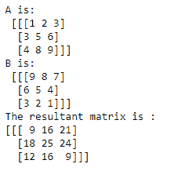
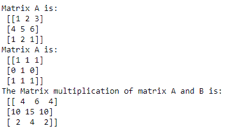
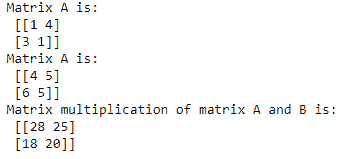
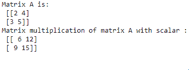

# NumPy矩阵乘法

> 原文：<https://www.studytonight.com/numpy/numpy-matrix-multiplication>

在本教程中，我们将介绍 NumPy 库中两个矩阵的**乘法的概念。另外，由于 NumPy 库主要用于操作和数组处理，所以这是一个非常重要的概念。**

在 NumPy 中，矩阵 的**乘法基本上是一种运算，我们将**两个矩阵作为输入**和**将第一个矩阵的行乘以第二个矩阵**的列，产生一个单个矩阵作为输出。但是有一点很重要，我们要保证，那就是第一个矩阵**的**行数应该是**等于第二个矩阵**的列数。**

Numpy 中矩阵相乘的过程俗称**矢量化**。矢量化过程的主要目标是减少循环使用[](https://www.studytonight.com/python/looping-in-python)**来执行此类操作。当程序中跳过`for`循环的使用时，将减少代码的整体执行时间。**

 **让我们向您展示矩阵乘法的图像，然后我们将继续讨论矩阵乘法的不同方法:



## 矩阵乘法的不同方法

NumPy 中主要有三种不同的矩阵乘法方法，如下所示:

*   **使用** `multiply()` **函数**
    该函数将返回两个给定数组的元素乘法。

*   **使用** `matmul()` **函数**
    该函数将返回两个输入数组的矩阵乘积。

*   **使用** `dot()` **函数**
    该函数将返回两个给定数组的标量或点积。

现在我们将一个接一个地详细理解上面给出的每一种方法。

## 1.使用`multiply()`功能

当我们要做两个数组的乘法运算时，使用`numpy.multiply()`函数。该方法将返回`arr1`和`arr2`的乘积，乘法按元素进行。

如果，矩阵 A 为:


并且，矩阵 B 是:


然后， **A*B** 将这样计算:



### `numpy.multiply()`的语法:

使用该函数所需的语法如下:

```py
numpy.multiply(arr1, arr2, /, out, *, where, casting, order, dtype=None, subok=True[, signature, extobj], ufunc ‘multiply’)
```

让我们讨论上面给出的参数:

*   **arr1**
    该参数用于指示第一个输入数组。

*   **arr2**
    该参数用于指示第二个 nput 数组。

*   **数据类型**
    该参数用于指示返回数组的类型。

*   **出**
    该参数主要指定结果存储的位置。

    *   如果提供了这个参数，那么它必须有一个可以存储乘法结果的形状。

    *   如果未提供此参数或**无**，在这种情况下，将返回新分配的数组。

*   **其中**
    在该参数中，**真**值表示计算该位置的`ufunc`，如果是**假**值，则将该值单独留在输出中。

*   ****kwargs**
    该参数允许向函数传递键值对。

### 基本示例:

下面我们有一个代码片段，涵盖了用于 NumPy 中矩阵乘法的`multiply()`函数:

```py
import numpy as np  

a = np.array([[11,2,23],[14,75,6],[17,8,9]], ndmin=3) 
print("A is:\n",a)

b = np.array([[9,8,7],[6,5,4],[3,2,1]], ndmin=3)    
print("B is:\n",b)

out = np.multiply(a,b)  
print("The resultant matrix is :")
print(out)
```

上述代码的输出将是:



## 2.使用`matmul()`功能

NumPy 库中的`matmul()`函数用于返回两个给定数组的矩阵乘积。

如果，矩阵 A 为:


并且，矩阵 B 是:


然后， **A*B** 使用`matmul()`函数会这样计算:


### `matmul()`的语法:

使用该函数所需的语法如下:

```py
np.matmul(array a, array b)
```

值得注意的是，当它返回**二维数组**的标准乘积时，如果任一给定数组的维数为 **> 2** ，则它被视为位于最后两个索引中的矩阵的**堆栈，并被相应地广播。另一方面，如果任一参数是 **1-D 数组**，则通过在其维度上附加 **1** 将其提升为矩阵，该矩阵在乘法后被移除。**

### 例 1:

在下面的例子中，我们使用了`matmul()`函数进行矩阵乘法:

```py
import numpy as np

A = np.array([[1,2,3], [4,5,6],[1,2,1]])
B = np.array([[1,1,1], [0,1,0], [1,1,1]])

print("Matrix A is:\n",A)
print("Matrix A is:\n",B)

C = np.matmul(A,B)
print("The Matrix multiplication of matrix A and B is:\n",C) 
```

上述代码的输出将是:

### 

### 例 2:

让我们举另一个例子，其中被相乘的两个阵列(矩阵)具有不同的维度:

```py
import numpy.matlib 
import numpy as np 

a = [[1,4],[2,1]] 
print("A is",a)
b = [1,2]
print("B is",b)
print("AxB is")
print(np.matmul(a,b))
print("BxA is ")
print (np.matmul(b,a))
```

A 为[[1，4]，[2，1]]
B 为[1，2]
AxB 为
【9 4】
BxA 为
【5 6】

## 3.使用`dot()`功能

在 NumPy 库中使用`dot()`函数的任意两个给定矩阵的点积基本上就是它们的矩阵积。唯一的主要区别是在**点积**中，我们也可以有标量值。因此两个矩阵的点积也被称为**标量积**。

### `numpy.dot()`的语法:

使用该函数所需的语法如下:

```py
numpy.dot(a, b, out=None)
```

如果，矩阵 **A** 为:


而矩阵 **B** 是，


A 和 B 的**点积计算如下:**

```py
A.B = a11*b11 + a12*b12 + a13*b13
```

现在让我们举几个代码示例来看看这是如何实现的。

### 例 1:

通过下面给出的例子，我们将说明两个一维矩阵的点积:

```py
import numpy as np

A = np.array([7,9,8])
B = np.array([2,5,6])
print("Matrix A is:\n", A)
print("Matrix A is:\n", B)

C = np.dot(A,B)
print("Dot product of matrix A and B is:\n", C)
```

矩阵 A 为:
【7 9 8】
矩阵 A 为:
【2 5 6】
矩阵 A 与 B 的点积为:
107

### 例 2:

在下面给出的例子中，我们将说明两个二维矩阵的点积:

```py
import numpy as np

A = np.array([[1,4],[3,1]])
B = np.array([[4,5],[6,5]])
print("Matrix A is:\n", A)
print("Matrix A is:\n", B)

C = np.dot(A, B)
print("Matrix multiplication of matrix A and B is:\n", C)
```



### 例 3:

在下面给出的例子中，我们将说明一个**标量值和一个二维矩阵**的点积:

```py
A = np.array([[2,4],[3,5]])
print("Matrix A is:\n", A)
C = np.dot(3, A)
print("Matrix multiplication of matrix A with scalar :\n", C)
```



## 摘要

在本教程中，我们介绍了矩阵乘法的不同方法。我们介绍了`multiply()`函数、`matmul()`函数和`dot()`函数的语法，以及这些函数的多个代码示例。

* * *

* * ***