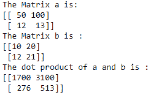

# NumPy 点()函数

> 原文：<https://www.studytonight.com/numpy/numpy-dot-function>

在本教程中，我们将介绍 Numpy 库的`dot()`功能。

`dot()`函数主要用于计算两个向量的**点积。**

*   这个函数可以处理 2D 阵列，但它会将它们视为矩阵，然后执行矩阵乘法。

*   在这种情况下，如果一个数组`a`是一个 **N-D 数组**，而数组`b` 是一个 **M-D 数组**(其中，`M >= 2`)那么它就是`a`最后一个轴和`b`倒数第二个轴的和积:

```py
dot(a, b)[i,j,k,m] = sum(a[i,j,:] * b[k,:,m])
```

### `numpy.dot()`的语法:

使用该函数所需的语法如下:

```py
numpy.dot(a, b, out=None)
```

**参数:**

让我们讨论一下这个函数的参数:

*   **a**
    这是第一个参数。如果“a”是复数，那么它的复共轭用于点积的计算。

*   **b**
    这是第二个参数。如果“b”是复数，那么它的复共轭用于点积的计算。

*   **退出**
    这表示输出参数。这个输出必须具有如果不使用将返回的确切类型。否则它必须是连续的，并且它的`dtype`必须是将被返回给`dot(a, b)`的`dtype`。

**返回值:**

`dot()`功能将返回 **a** 和 **b** 的点积。如果 **a** 和 **b** 都是标量，或者如果两者都是一维数组，则返回标量值，否则返回数组。如果给出 **out** ，则返回。

<u>**注:**</u> 如果`a`的最后一个维度与`b`的倒数第二个维度大小不同，则`ValueError`升高。

## 例 1:

代码片段如下，我们将在其中使用`dot()`函数:

```py
import numpy as np

#Let us take scalars first 
a = np.dot(8, 4) 
print("The dot Product of above given scalar values : ")
print(a) 

# Now we will take 1-D arrays 
vect_a = 4 + 3j
vect_b = 8 + 5j

dot_product = np.dot(vect_a, vect_b) 
print("The Dot Product of two 1-D arrays is : ")
print(dot_product) 
```

上述给定标量值的点积:
32
两个一维数组的点积为:
(17+44j)

### 两个 1D 阵列点积计算的说明:

vec _ a = 4+3j
vec _ b = 8+5j

现在计算点积:
= 4(8+5j)+3j(8–5j)
= 32+20j+24j–15
= 17+44j

## 例 2:

现在让我们创建两个 numpy 数组，然后使用`dot()`函数为它们找到点积:

```py
import numpy as np

a = np.array([[50,100],[12,13]])  
print("The Matrix a is:")
print (a)

b = np.array([[10,20],[12,21]])  
print("The Matrix b is :")
print(b)

dot = np.dot(a,b)  
print("The dot product of a and b is :")
print(dot)
```



## 摘要

在本教程中，我们介绍了 Numpy 库的`dot()`功能。我们介绍了如何使用它的语法和这个函数返回的值，以及一些代码示例。

* * *

* * *