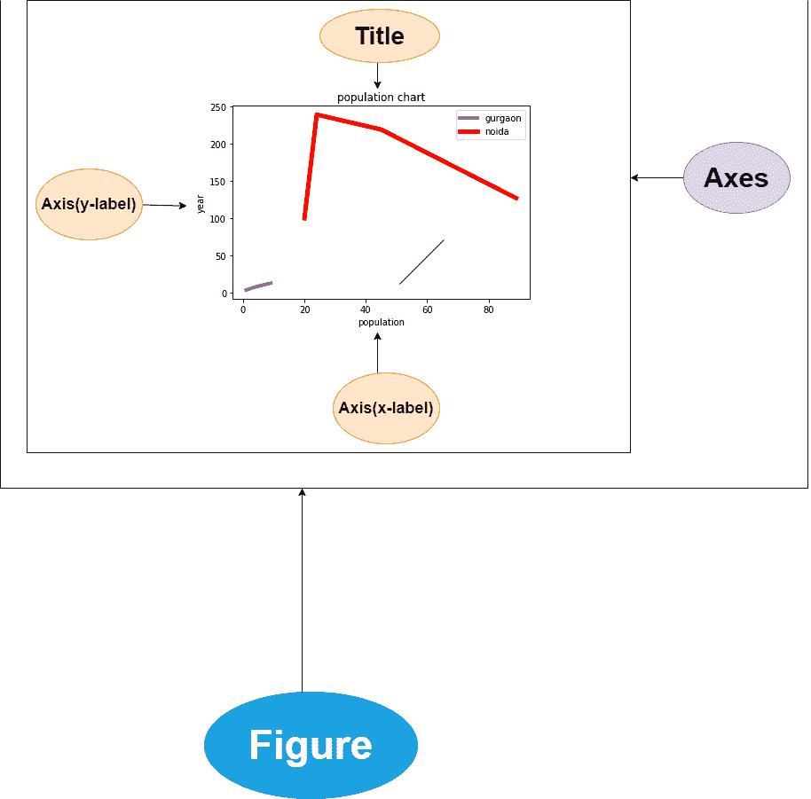
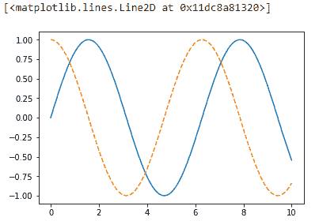

# Matplotlib 中的一般概念

> 原文：<https://www.studytonight.com/matplotlib/general-concepts-in-matplotlib>

在本教程中，我们将介绍 Matplotlib 中的一些**一般概念**和**的一些提示**供您记忆，借助**哪个可视化变得容易**。

我们知道 **Matplotlib** 是一个**强大的库**，用于以图的形式可视化数据。您将在我们的教程中看到，在这个库的帮助下，您可以创建许多类型的图，如**线、条形图、直方图、轮廓图、散点图、提琴图等等。用于**创建阵列的 2D 图**。**

这里有一些一般的概念，你必须先了解，然后再继续进一步的主题。使用 matplotlib 创建的**图形有许多部分，这里我们将讨论这些部分，它们是:**

首先，我们用了“图”字；让我们了解一下什么是 Matplotlib 中的人物？

### 1.图:

图是创建不同绘图的**画布**。Matplotlib 图形是包含一个或多个轴/绘图的画布。

### 2.轴:

一个 **Matplotlib 图**中的轴是用来**生成图极限**的，基本上就像一个**数线**。三维图可以有一个 X 轴、Y 轴和 Z 轴。

### 3.轴:

Axes 一般**被认为是一个图**。在 **3D** 的情况下，有**三轴对象**但是一个图形中有**多轴**。

### 4.艺术家

在图上能看到的一切都是艺术家。大多数艺术家都被绑上了**斧头**。这些像是**文本对象**、**集合对象**和 **Line2D 对象**等等。



在借助 matplotlib 创建可视化之前；让我们讨论一些与 Matplotlib 库相关的事情:

## 1.导入 Matplotlib 库

在我们的代码中导入 Matplotlib 时，我们将使用一些标准的简写:

```py
import matplotlib as mpl
import matplotlib.pyplot as plt
```

The `plt` interface mentioned above is used often in our further tutorials.

## 2.设置样式

因此，我们将使用`plt.style`指令为我们的人物选择合适的**美学风格**。

现在，让我们设置**经典风格**，确保我们创建的情节使用经典的 Matplotlib 风格:

```py
plt.style.use('classic')
```

## 3.显示图

地块的显示方式取决于您如何使用 Matplotlib 库。

您可以使用 Matplotlib 创建三个适用的上下文:脚本中的**、T2 IPython 笔记本中的**或 T4 IPython Shell 中的。

### 根据脚本绘图:

如果你在脚本中使用 **matplotlib** ，那么`plt.show()`函数就是你的好朋友。此功能**启动一个事件循环**，然后查看**所有当前活动的图形对象**，并打开一个或多个**交互窗口**，显示您的**图形或图形**。

<u>**注**</u> :在每个 Python 会话中`plt.show()`命令只能使用一次**，并且最常出现在**脚本的末尾**。**

您不能使用多个`show()`命令，因为如果您愿意，它将会导致不可预测的依赖后端的行为。因此应该尽量避免**。**

 **让我们以一个名为`myplt.py`的文件为例，其中的代码如下:

```py
import matplotlib.pyplot as plt
import numpy as np

x = np.linspace(0, 10, 100)
plt.plot(x, np.sin(x))
plt.plot(x, np.cos(x))
plt.show()
```

在命令行提示符下运行上述脚本，使用以下命令:`$ python myplot.py`将打开一个窗口，显示您的图形。

### 从 IPython 外壳绘图

如果您**指定 Matplotlib 模式**，IPython 可以很好地与 Matplotlib 配合使用。如果您想启用此模式，可以在启动 ipython 后立即使用`%matplotlib`魔法命令:

```py
%matplotlib
```

当您运行上述命令时，它会给出:

使用 matplotlib 后端:Qt5Agg

在上述命令之后，编写以下代码:

```py
import matplotlib.pyplot as plt
```

现在任何`plt`剧情命令**都会打开一个人物窗口**，然后你可以进一步使用可以运行的**命令来更新剧情**。

某些更改(如修改已经绘制的线的属性)不会自动绘制；如果你想强制更新，那么使用`plt.draw()`。不需要在 Matplotlib 模式下使用`plt.show()`。

### 从 IPython 笔记本中绘图

现在 IPython Notebook 基本上是一个基于**浏览器的交互式数据分析**工具，用于将**叙事**、**代码**、**图形**、 **HTML 元素**等更多的东西组合成一个单一的可执行文档。

如果你想在 IPython 笔记本中交互式绘图，那么使用`%matplotlib`命令，它将以类似于 IPython 外壳的方式工作。在 IPython 笔记本中，您还可以选择直接在笔记本中嵌入图形，有两种可能的选择:

1.  笔记本中的命令`%matplotlib`会将**引向嵌入在笔记本中的交互剧情**。

2.  命令`%matplotlib inline`将有助于在笔记本中嵌入你的剧情的**静态图像**

首先，运行下面给出的命令:

```py
%matplotlib inline
```

运行此命令后(每个内核/会话只需执行一次)，笔记本中创建绘图的任何单元格都将嵌入生成图形的 PNG 图像。

```py
import numpy as np
import matplotlib.pyplot as plt

x = np.linspace(0, 10, 100)
fig = plt.figure()
plt.plot(x, np.sin(x), '-')
plt.plot(x, np.cos(x), '--')
```



## 总结:

因此，在本教程中，我们试图涵盖 Matplotlib 模块的基础知识，使用 Matplotlib 生成的绘图组件以及如何使用 Matplotlib，涵盖了 3 种不同的方法。

* * *

* * ***