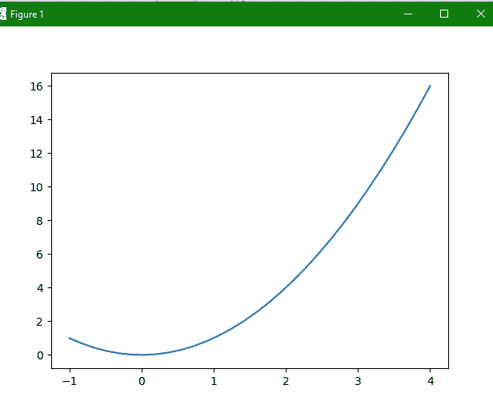

> 哎哎哎:# t0]https://www . studytonight . com/matplotlib/matplotlib-pyab 模块


# matplotlib pylab 模块

在本教程中，我们将介绍 Matplotlib 中的 **Pylab** 模块。

该模块主要帮助**将来自 **pyplot** 和 **NumPy** 的函数和类**引入**全局命名空间**，这对于 Matlab 用户来说变得更加容易。

*   该模块为面向对象的**Matplotlib**绘图库提供程序接口。

*   该模块安装在 Matplotlib 旁边；同样地， **matplotlib.pyplot** 是 matplotlib 包中的一个模块。

*   这是一个非常方便的模块，因为该模块**有助于在单个名称空间中批量导入** `matplotlib.pyplot`(用于绘图)和 **NumPy** (用于数学和处理数组)**。**

 **<u>**注:**</u>【Pylab】**与 Python 中的各种内置函数冲突**，因此被废弃，使用不多。

## 导入 Pylab 模块的语法

导入 **pylab** 模块的基本语法如下:

```py
from pylab import *
```

让我们介绍使用 **pylab** 模块的基本绘图:

## pylab 模块使用示例:

为了绘制一条曲线，在这个代码示例中，我们将使用`plot()`函数。你只需要一对长度相同的数组。让我们看看相同的代码:

```py
from numpy import *
from pylab import *

x = linspace(-1, 4, 30)
y = x**2
plot(x, y)
show() 
```

现在让我们看看由此产生的输出:



如果需要绘制符号而不是线条，那么需要在`plot()`方法中提供一个额外的字符串参数。

可能的符号和颜色如下:

*   符号:-，-。, : , .、、o、^、v、< , >、s、+、x、d、d、1、2、3、4、h、h、p、|、_

*   颜色:b、g、r、c、m、y、k、w

让我们举一个活生生的例子:

## 使用 pylab 覆盖图

这些图也可以重叠。为此您需要使用多个`plot`命令。`clf()`功能用于**清除剧情**。

让我们看一个叠加图的实例:

* * *

* * ***