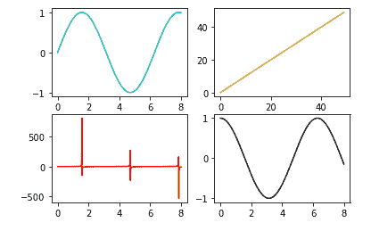

# Matplotlib 子图()函数

> 原文：<https://www.studytonight.com/matplotlib/matplotlib-subplots-function>

在本教程中，我们将介绍 Matplotlib 库中基于**状态的界面** Pyplot 中的`subplots()`函数。

Matplotlib 中的`subplots()`函数充当**实用程序包装器**。该功能有助于创建支线剧情的**通用布局，并且在一次调用中还包括**包围图形对象**。**

*   **这个功能的主要目的是创建一个带有一组支线剧情的人物**。

*   matplotlib 支持的各种支线剧情有 **2x1 垂直**、 **2x1 水平**或 **2x2 网格**。

## Matplotlib `subplots()`函数

使用该功能的基本**语法**如下:

```py
matplotlib.pyplot.subplots(nrows, ncols, sharex, sharey, squeeze, subplot_kw, gridspec_kw, **fig_kw)
```

### Matplotlib `subplots()`功能参数

让我们讨论一下这个函数使用的参数:

*   **非政府组织，ncls**

    参数**显示**表示**行数**，参数**显示**表示**表示子图网格的列数**。

*   **sharex，sharey**

    为了控制 x 轴(共享)或 y 轴(共享)之间的**属性共享，使用这些参数。**

*   **挤压**

    该可选参数通常**包含布尔值**，默认值为真。

*   **支线剧情 _kw**

    此参数用于指示带有关键字的 dict，这些关键字被传递给用于创建每个子批次的 add _ sub 批次调用。

*   **电网规格 _kw**

    此参数用于指示带有传递给 GridSpec 构造器的关键字的 dict，该构造器用于创建放置子情节的网格。

### Matplotlib `subplots()`函数返回值

这些函数返回的值如下:

*   **图:**此方法用于**返回图布局。**

*   **斧:**此法主要用于**回斧**。它可以是轴对象或轴对象的数组。

让我们借助几个例子来理解这个方法:

## 例 1:

通过下面给出的代码片段，我们将创建一个具有 2 行 2 列子场景的**图形。**

```py
import matplotlib.pyplot as plt
import numpy as np

fig, ax = plt.subplots(2, 2)
x = np.linspace(0, 8, 1000)

ax[0, 0].plot(x, np.sin(x), 'c') #row=0, col=0
ax[1, 0].plot(x, np.tan(x), 'r') #row=1, col=0
ax[0, 1].plot(range(50), 'y') #row=0, col=1
ax[1, 1].plot(x, np.cos(x), 'k') #row=1, col=1
fig.show()
```

上述代码的输出如下:



让我们用一个真实的例子来更详细地理解这个函数。

## 示例 2

让我们理解下面给出的实时示例的代码，其中我们已经**绘制了两个子图**。

## 总结:

如果要在一个图中创建多个子图来显示一个数据的不同方面，那么应该使用`subplots()`功能。

* * *

* * *