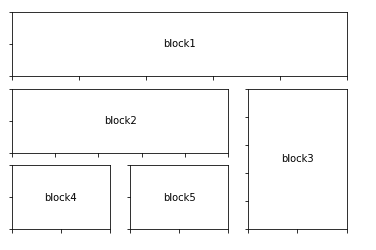

# Matplotlib subplot2grid()函数

> 原文：<https://www.studytonight.com/matplotlib/matplotlib-subplot2grid-function>

在本教程中，我们将介绍基于状态的界面中的`subplot2grid()`函数，即 **Matplotlib 库**中的 Pyplot

该功能用于在网格内的特定指定位置创建轴对象时提供**额外的灵活性。**

*   对于轴对象跨越多行或多列的**，我们将使用这种方法。**

*   `subplot2grid()`功能也被称为**子图形布局管理器**。

*   简而言之，我们将使用该功能在同一图形内创建**多个图表。**

## Matplotlib `subplot2grid()`函数

`subplot2grid()`功能或`matplotlib.pyplot.subplot2grid`功能可以很容易地用于在同一个图形内创建多个图表，下面是其**语法**:

```
matplotlib.pyplot.subplot2grid(shape, location, rowspan, colspan)
```

### Matplotlib `subplot2grid()`参数:

让我们讨论一下这个函数使用的参数:

*   **形状**

    形状参数用于指示图形内部要绘制的网格的**形状。这是**对这个方法的强制性论证**。**

    通常**作为两个数字的列表或元组**传递，主要负责网格的布局，**第一个数字**表示**的行数**，而**第二个数字**表示**的列数。**

*   **位置**

    该参数也是该功能取的**强制参数**。这种方法类似于**形状参数**，通常也作为两个数字的**列表或元组**传递。用于指定放置子图的**行号和列号。需要注意的一点是**指数总是从 0** 开始。**

    所以 **(0，0)** 是网格的**第一行**和**第一列**的单元格。

*   **行跨度**

    使用位置(loc)参数设置**网格布局**和**起始索引**后，如果需要，还可以**扩展选择以使用此参数占据更多行**。这是一个可选参数**，默认值为 1**。

*   **colspan**

    该参数与**行跨度参数**相似，用于排序**扩展选择以占用更多列**。这也是一个可选参数**，默认值为 1**。

## 示例:

让我们绘制一个[图形对象](https://www.studytonight.com/matplotlib/matplotlib-figure-class)的 **3x3** 网格，该网格由不同大小的轴对象以行和列跨度填充。其代码片段如下所示:

```
import matplotlib.pyplot as plt

def annotate_axes(fig):
    for i, ax in enumerate(fig.axes):
        ax.text(0.5, 0.5, "block%d" % (i+1), va="center", ha="center")
        ax.tick_params(labelbottom=False, labelleft=False)

fig = plt.figure()
ax1 = plt.subplot2grid((3, 3), (0, 0), colspan=3)
ax2 = plt.subplot2grid((3, 3), (1, 0), colspan=2)
ax3 = plt.subplot2grid((3, 3), (1, 2), rowspan=2)
ax4 = plt.subplot2grid((3, 3), (2, 0))
ax5 = plt.subplot2grid((3, 3), (2, 1))

annotate_axes(fig)

plt.show()
```

上述代码片段的输出如下:



## 总结:

所以现在你知道如何使用 Matplotlib `subplot2grid()`函数在一个图形中制作多个轴对象，这个函数很容易使用，正如我们在上面的代码示例中看到的。

* * *

* * *