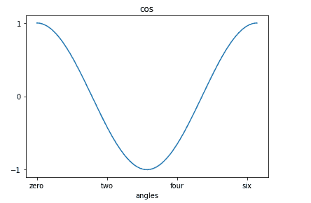

# 在 Matplotlib 中设置刻度和刻度标签

> 原文：<https://www.studytonight.com/matplotlib/setting-ticks-and-tick-labels-in-matplotlib>

在本教程中，我们将学习如何在轴上设置刻度和指定自定义刻度标签，以使 matplotlib 图形更易读和直观。

在 Matplotlib 库中，**记号**是用于表示轴上数据点的标记。

*   需要注意的是，在 matplotlib 库中**轴上间隔点的任务是自动完成的。**

*   matplotlib 中的**默认勾选**定位器和格式化器也很好，对于大多数用例来说已经足够了。

*   这个任务可以借助两个函数明确完成:`set_xticks()`和`set_yticks()`

*   这两个函数都以一个**列表对象**作为参数。列表**中的元素表示位置**，将在这些刻度位置上显示的值是使用`set_xticklables()`和`set_yticklabels()`功能设置的。

**例如:**

```
ax.set_xticks([2,4,6,8,12])
```

上面的代码将用记号标记给定位置的数据点。

然后到**设置刻度线对应的标签**，我们分别使用`set_xticklabels()`和`set_yticklabels()`功能。

```
ax.set_xlabels(['two', 'four', 'six', 'eight', 'twelve'])
```

现在在上面命令的帮助下，它将在 x 轴上的标记下方显示文本标签。

## 自定义刻度和刻度标签

现在让我们看一个在 Matplotlib 库中设置刻度和刻度标签的例子:

```
import matplotlib.pyplot as plt
import numpy as np
import math

x = np.arange(0, math.pi*2, 0.04)
fig = plt.figure()
ax = fig.add_axes([0.1, 0.1, 0.8, 0.8]) 
y = np.cos(x)
ax.plot(x, y)

# this will label the x axis
ax.set_xlabel('angles')
# setting title of plot
ax.set_title('cos')
# set the tick marks for x axis
ax.set_xticks([0,2,4,6])
# provide name to the x axis tick marks
ax.set_xticklabels(['zero','two','four','six'])
ax.set_yticks([-1,0,1])

plt.show()
```

以下是输出:



在上面的代码中，你一定注意到了函数`set_xlabel()`，这个函数用来为 X 轴指定一个标签，在我们的例子中我们显示的是 X 轴上的角度，因此得名**角度**。

然后，我们明确指定了刻度线，并为刻度线提供了标签。

这是一种完全定制图形的好技术。

* * *

* * *