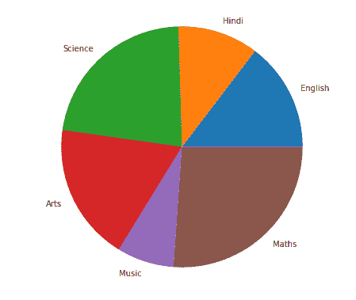
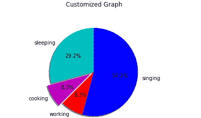

# Matplotlib 饼图——`pie()`函数

> 原文：<https://www.studytonight.com/matplotlib/matplotlib-pie-chart-pie-function>

在本教程中，我们将介绍什么是饼图？以及如何使用 python matplotlib 库创建饼图来表示您的数据。

### 什么是饼图？

饼图基本上是一种特殊的图表，用于在饼图切片的帮助下显示数据的相对大小。因此，它是一个完整的圆来表示 100%的空间，并创建饼图切片来表示数据集。

*   用于显示**的是**一个圆形统计图**，只有一系列数据**。

*   饼图的**完整区域等于**给定数据的总百分比**。**

*   在饼图中，饼图切片的**区域**用于表示数据部分的**百分比**。

*   馅饼的切片通常被称为**楔形**。

*   楔形的面积主要表示该部分相对于整个数据的**百分比，可以通过**楔形的弧长**来计算。**

### 饼图的用途:

下面给出了几个用途:

1.  业务演示(如销售、调查结果和运营)

2.  提供快速摘要

## Matplotlib `pie()`函数

matplotlib 的 **pyplot** 模块中的`pie()`函数用于创建一个饼图，表示数组中的数据。

如果图形和轴是正方形的，或者轴的纵横比相等，则可以创建最佳的饼图。

`pie()`函数所需的**语法**如下所示:

```py
matplotlib.pyplot.pie(data, explode, labels, colors, autopct, shadow)
```

### `pie()`功能参数:

让我们讨论一下这个函数的参数:

**1。数据**

该参数用于表示由要绘制的数据值组成的**数组，每个切片的分数面积由**数据/和(数据)**表示。如果**和(数据)< 1** ，那么数据值直接返回分数区域，这样**生成的饼图将有一个大小= 1-和(数据)**的空楔形。**

**2。标签**

该参数**表示字符串序列的列表**，用于设置每个楔形的标签

3 .尸检

该参数为字符串形式，用于**用数值**标记楔形体

**4。颜色**

该参数用于**为楔形体**提供颜色。

**5。阴影**

这个参数是**用来创建楔形的阴影。**

现在，是时候重温一下这个概念，创建一些饼图了。让我们从一些例子开始。

## 简单饼图示例:

在下面给出的例子中，我们将在 matplotlib 中创建一个简单的饼图:

```py
import matplotlib.pyplot as plt
import numpy as np 

subjects = ['English', 'Hindi', 'Science', 'Arts', 'Music', 'Maths'] 

data = [23, 17, 35, 29, 12, 41] 
fig = plt.figure(figsize =(10, 7)) 
plt.pie(data, labels = subjects) 

plt.show() 
```

上述代码片段的输出如下所示:



现在是时候创建一些定制的饼图了。以下是自定义图的一些方面:

*   `startangle`参数用于在饼图的 x 轴上按逆时针方向将绘图旋转**指定的度数。**

*   `shadow`参数接受**一个布尔值**，如果是**真**，那么**的阴影会出现在馅饼的边缘下方**。

*   **自定义饼图的楔形区**使用`wedgeprop`以 Python 字典为参数，名称值对用于表示楔形区属性，如**线宽**、**边缘颜色**等。

*   通过设置`frame=True`坐标轴，在饼图周围绘制框架。

*   `autopct`参数主要控制**如何在**上显示百分比。

## 自定义饼图示例:

让我们在 matplotlib 中创建一个自定义饼图:

```py
import matplotlib.pyplot as plt

slices = [7,2,2,13]
activities = ['sleeping','cooking','working','singing']
cols = ['c','m','r','b']

plt.pie(slices,
        labels=activities,
        colors=cols,
        startangle=90,
        shadow= True,
        explode=(0,0.1,0,0),
        autopct='%1.1f%%')

plt.title('Customized Graph\n')
plt.show()
```

其输出如下所示:



## 嵌套饼图示例:

现在让我们创建一个嵌套饼图(也称为圆环图)，下面给出了它的实例:

* * *

* * *