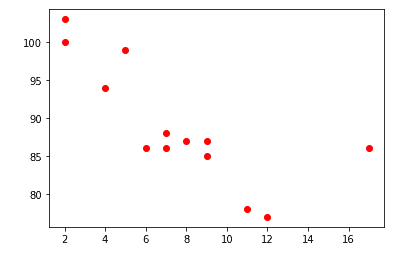
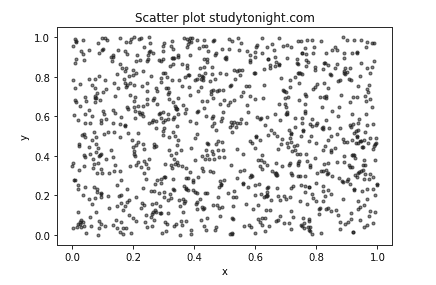

# Matplotlib 散点图——`scatter()`函数

> 原文：<https://www.studytonight.com/matplotlib/matplotlib-scatter-plot-scatter-function>

在本教程中，我们将介绍什么是散点图？以及如何使用 Matplotlib 库创建散点图来显示数据。

**散点图**是一种用于**将数据显示为点的集合**的图。

*   这个图主要是用**来观察两个变量**之间的关系。

*   **散点图****使用点**来表示两个变量之间的**关系。**

*   这些图主要用于在横轴和纵轴上绘制**数据点，以显示**一个变量受另一个**的影响有多大。**

*   在 **2 维**中用于**比较两个变量**，而在 **3 维**中用于进行三个变量的比较。

## Matplotlib `scatter()`函数

Python matplotlib 库中 pyplot 模块中的方法`scatter()`主要用于绘制散点图。

使用该方法的**语法**如下所示:

```py
matplotlib.pyplot.scatter(x_axis_data, y_axis_data, s, c, marker, cmap, vmin, vmax,alpha,linewidths, edgecolors)
```

**功能参数:**

让我们讨论一下`scatter()`方法的参数:

*   **x_axis_data**

    该参数表示**一个包含 x 轴数据的数组**。

*   **y_axis_data**

    该参数表示**一个包含 y 轴数据的数组**。

*   **s**T2】

    该参数表示**标记大小**(可以是标量或大小等于 x 或 y 的数组)。为可选参数，默认值为`None`。

*   **c**

    该参数表示序列的**颜色，是**可选的**参数，默认值等于`None`。**

*   **标记**

    该参数用于**指示标记样式。**该参数的默认值为`None`，也是**可选的**参数。

*   cmap

    该可选参数表示 cmap 名称，默认值等于`None`。

*   **线宽**

    该参数表示**标记边框**的宽度，默认值为`None`。

*   **边缘颜色**

    该参数用于**指示标记边框颜色**，并且其默认值为`None`。

*   alpha

    该选项指示混合值，介于 0(透明)和 1(不透明)之间。

让我们深入一些例子，创建一些散点图。

## 简单散点图示例:

下面我们有一个代码片段来创建一个简单的散点图。让我们看一下代码片段:

```py
import matplotlib.pyplot as plt 

x =[5, 7, 8, 7, 2, 17, 2, 9, 4, 11, 12, 9, 6] 
y =[99, 86, 87, 88, 100, 86, 103, 87, 94, 78, 77, 85, 86] 
plt.scatter(x, y, c ="red") 
plt.show() 
```

当您在机器上运行上述代码时，您将看到如下所示的输出:



## 大数据集散点图:

让我们用不同的随机数创建另一个散点图，代码片段如下:

```py
import numpy as np
import matplotlib.pyplot as plt

# Creating the data
N = 1000
x = np.random.rand(N)
y = np.random.rand(N)
colors = (0,0,0)
area = np.pi*3

plt.scatter(x, y, s=area, c=colors, alpha=0.5)
plt.title('Scatter plot studytonight.com')
plt.xlabel('x')
plt.ylabel('y')
plt.show()
```

其输出如下:


这里需要注意的是，数据可以分为几组。借助下面给出的代码片段，让我们了解如何使用该组创建散点图:

## 自定义散点图示例:

现在，我们将介绍 matplotlib 中高度和权重组的散点图代码片段:

* * *

* * *