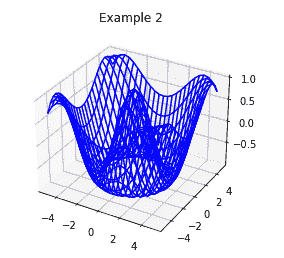

# Matplotlib 三维线框绘图-Plot _ 线框()函数

> 原文：<https://www.studytonight.com/matplotlib/matplotlib-3d-wireframe-plot-plot_wireframe-function>

在本教程中，我们将介绍 matplotlib 库中的**三维线框绘图**。我们已经在 Matplotlib 库中介绍了[三维绘图基础知识，以及三维线图、散点图和](https://www.studytonight.com/matplotlib/matplotlib-3d-plotting-line-and-scatter-plot)[三维等高线图](https://www.studytonight.com/matplotlib/matplotlib-3d-contour-plot-contour3d-function)。

对于使用三维线框的数据可视化，我们需要来自`matplotlib`、`mpl_toolkits`和`numpy`库的一些模块。

线框绘图基本上是取一个值的网格，并将其投影到指定的三维表面上，这有助于使生成的三维形式非常容易可视化。

要创建三维线框图形，将使用`plot_wireframe()`功能。

现在是时候介绍一些三维线框绘图的例子了。

## 三维线框绘图基本示例:

下面我们有一个例子，我们将创建一个三维线框图:

```
from mpl_toolkits.mplot3d import axes3d 
from matplotlib import pyplot 

fig = pyplot.figure() 
wf = fig.add_subplot(111, projection='3d') 
x, y, z = axes3d.get_test_data(0.07) 
wf.plot_wireframe(x,y,z, rstride=2, cstride=2, color='maroon') 

wf.set_title('3D wireframe plot') 
pyplot.show() 
```

下面是上面代码的输出:


## 三维线框绘图示例 2:

下面是另一个例子，其代码片段如下:

```
from mpl_toolkits import mplot3d 
import numpy 

a = numpy.linspace(-5, 5, 25) 
b = numpy.linspace(-5, 5, 25) 
x, y = numpy.meshgrid(a, b) 
z = numpy.cos(numpy.sqrt(x**2 + y**2)) 

fig = pyplot.figure() 
wf = pyplot.axes(projection ='3d') 
wf.plot_wireframe(x, y, z, color ='blue') 

wf.set_title('Example 2') 
pyplot.show() 
```

下面是上面代码的输出:



* * *

* * *