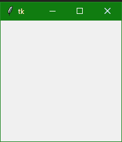

# Tkinter 模块介绍

> 原文：<https://www.studytonight.com/tkinter/introduction-to-python-tkinter-module>

在本教程中，我们将介绍 Tkinter、它的先决条件、GUI 编程的不同方法、如何安装 Tkinter 以及它的工作原理。

**Tkinter** 是一个 python 中的**标准库**，用于为桌面应用程序创建**图形用户界面(GUI)** 。借助 **Tkinter** 开发**桌面应用**并不是一件难事。

我们将使用的**主图形用户界面工具包**是`Tk`，这是 Python 的默认图形用户界面库。我们将从其名为**Tkit**(Tk 接口的缩写)的 Python 接口访问`Tk`。

### Tkinter 的先决条件

在学习 **Tkinter** 之前，你要有**Python 的基础知识**。您可以使用我们的[完整 Python 教程](https://www.studytonight.com/python/)学习 Python。

## Python 中的图形用户界面编程

用 Python 开发基于图形用户界面的程序有很多方法。下面给出了这些不同的方法:

1.  tkinter:

    在 Python 中， **Tkinter** 是一个标准的 **GUI** (图形用户界面)包。Tkinter 是 **Python 的默认 GUI 模块**，也是 Python 中 **GUI 编程**最常用的方式。注意 **Tkinter** 是一组**包装器**，将`Tk`小部件实现为 Python 类。

2.  **wxppython:**

    这基本上是一个开源的、跨平台的 **GUI 工具包，用 C++** 编写。也是 Tkinter 的**替代品。**

3.  **曲面:T1**

    JPython 是一个面向 Java 的 Python 平台，它为本地机器提供了对 **Java 类库**的 Python 脚本无缝访问。

我们将介绍用 Tkinter 进行图形用户界面编程。

## 什么是 Tkinter？

Python 中的 Tkinter 有助于以最少的麻烦创建图形用户界面应用程序。在各种图形用户界面框架中，Tkinter 是唯一内置于 **Python 标准库**的框架。

*   有利于 Tkinter 的一个重要特性是它是**跨平台**，所以同样的代码可以轻松在 **Windows** 、 **macOS** 和 **Linux** 上运行。

*   Tkinter 是**轻量级模块**。

*   使用起来很简单**。**

 **## 什么是 Tcl、Tk 和 Tkinter？

让我们通过更多地讨论 Tkinter 模块的起源来尝试了解它。

*   如上所述，Tkinter 是 **Python 的默认 GUI 库**，它只不过是 **Tk 工具包**之上的一个包装器模块。

*   Tkinter 基于 Tk 工具包，最初是为**工具命令语言** (Tcl)设计的。由于 Tk 非常受欢迎，因此它被移植到了各种各样的其他脚本语言中，包括 **Perl (Perl/Tk)** 、 **Ruby (Ruby/Tk)** 和**Python(Tkit)**。

*   **GUI 开发可移植性**和 Tk 的**灵活性使其成为设计和**实现各种商业级 GUI 应用的合适工具。****

*   Python **配合 Tkinter** 为我们提供了一种**更快更高效的方式**来构建有用的应用程序，如果你必须借助原生 OS 系统库直接用 C/C++编程，这将花费很多时间。

*   一旦我们启动并运行了 Tkinter，我们将使用称为**小部件**的基本构建块来创建各种桌面应用程序。

## 安装 Tkinter

有可能，Tkinter 可能已经和 Python 一起安装在您的系统上了。但并不总是如此。所以让我们首先检查它是否可用。

如果系统上没有安装 Python-[先安装 Python 3.8](https://www.studytonight.com/python/getting-started-with-python) ，然后检查 Tkinter。

您可以通过尝试**导入 Tkinter 模块**来确定您的 Python 解释器是否可以使用 Tkinter-如果可以使用 Tkinter，则不会出现错误，如以下代码所示:

```py
import tkinter
```

没有爆炸，所以我们知道我们有 **Tkinter 可用**。如果您看到任何错误，如找不到模块等，那么您的 **Python 解释器没有在启用 Tkit 的情况下编译**，模块**导入失败**，您可能需要重新编译您的 **Python 解释器才能访问 Tkit**。

## 将`Tk`添加到您的应用程序中

使用 Python 中的 Tkinter 设置 GUI 应用程序的基本步骤如下:

1.  首先**导入 Tkinter 模块**。

2.  第二步是**创建一个顶层窗口对象**，它包含了你的整个 GUI 应用程序。

3.  然后在第三步中，您需要**设置您所有的图形用户界面组件**及其功能。

4.  然后需要**将这些 GUI 组件**连接到底层应用程序代码。

5.  然后只需使用`mainloop()`进入主事件循环

以上步骤现在听起来可能有些胡言乱语。但是只要把它们都读完，我们将在继续学习本教程时解释所有内容。

## 第一个 Tkinter 示例

如前所述，在图形用户界面编程中，所有主要小部件都只构建在顶层窗口对象上。

顶层窗口对象由`Tkinter`中的`Tk`类创建。

让我们创建一个顶级窗口:

```py
import tkinter as tk 
win = tk.Tk() 

###you can add widgets here

win.mainloop()
```



### 以上使用的方法:

使用**图形用户界面**创建 **Python 应用程序**时，使用了两种主要方法。你必须记住它们，这些在下面给出:

1. **Tk(screenName=None，baseName=None，class name =‘tk '，use uk = 1)**

该方法主要用于**创建主窗口**。您也可以根据需要更改窗口的**名称，只需将**类名**更改为所需的名称即可。**

用于创建应用程序主窗口的代码是，我们也在上面的示例中使用了它:

```py
win = tkinter.Tk()    ## where win indicates name of the main window object
```

**2。`mainloop()`功能**

此方法用于启动应用程序。`mainloop()`功能是一个**无限循环**用来运行应用，它会等待**一个事件发生**和**处理事件**只要窗口没有关闭。

## 总结:

至此我们已经完成了对 Tkinter 的介绍，我们已经安装了 Tkinter 模块，甚至知道了什么是 Tkinter 中的 Windows 和 Widgets。我们还创建了我们的第一个 Tkinter GUI 应用程序并运行它。在下一个教程中，我们将了解更多关于 Tkinter 小部件的信息。

* * *

* * ***