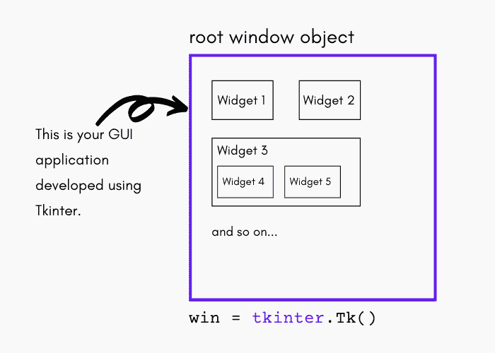
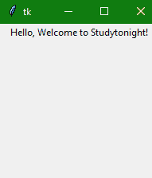

# Tkinter 窗口、小部件和框架

> 原文：<https://www.studytonight.com/tkinter/tkinter-windows-widgets-and-frames>

在本教程中，我们将介绍 Tkinter 模块的基础知识，解释什么是 Tkinter **窗口、小部件和框架**，它们是 Tkinter 中图形用户界面应用的**构建模块**。

## Tkinter 窗口和小部件介绍

让我们深入一点，了解一些关于 Tkinter 模块及其工作原理的基础知识。



*   GUI 编程中的**顶级窗口对象**包含所有的**小窗口对象**，它们将成为**完整 GUI** 的一部分。

*   **小窗口对象**可以是**文字标签**、**按钮**、**列表框**等。，这些单独的小图形用户界面组件被称为**小部件**。

*   因此，拥有一个顶级窗口对象将充当一个容器，您可以在其中放置所有小部件。在 Python 中，您通常会使用以下代码这样做:`win = tkinter.Tk()`

*   通过调用`tkinter.Tk()`返回的对象通常被称为**根窗口**。

*   **顶级窗口**主要是**单机作为你的应用**的一部分，还有**你的 GUI 可以有多个顶级窗口**，但是其中只有一个应该是你的**根窗口。**

*   首先，你需要完整地设计你所有的小部件，然后**添加真正的功能。**

*   **小部件可以是独立的**也可以是**容器**。如果一个小部件包含其他小部件，它被认为是那些小部件的**父部件。**

*   类似地，如果一个小部件包含在另一个小部件中，它被称为父部件的子部件**，****父部件是下一个直接的**封闭容器小部件。

*   **小部件也有一些关联的行为**，比如当按下按钮时**，或者**文本被填充到文本字段**中，所以我们有事件附加到这些动作上。**

*   小部件的行为生成事件，而 **GUI 对事件**的响应被称为**回调** -因为**他们“调用”一个函数只是为了处理发生的事件**。

## Tkinter 事件驱动处理

在 Tkinter 中，我们将窗口和小部件组合在一起，形成一个 GUI 应用。但是图形用户界面应用只是应用的前端。当最终用户使用这些小部件时，您可能希望执行一些代码逻辑。

每当对任何小部件执行操作时，都会生成一个事件，我们可以处理该事件来执行任何操作。

*   事件(小部件的行为)可以包括**按下按钮**、**移动鼠标**、**点击回车键或回车键**、**获得或失去“焦点”**等。

*   从**开始到任何图形用户界面应用**结束的整个事件系统是驱动它的因素，因此也被称为事件驱动处理。

*   让我们举一个**简单的鼠标移动**的例子:假设鼠标的**指针正好位于您的图形用户界面应用顶部的某个地方**。如果您将鼠标移动到应用的另一部分，则必须有某种东西使鼠标的移动被屏幕上的光标复制(在您的图形用户界面应用的顶部)。这些是**“光标移动”**事件，系统**必须处理这些事件来描述**您的光标在窗口中移动。在你将**停止移动鼠标**的时候，不再需要处理更多的事件，所以一切**只是再次停留在屏幕上**。

以下是一些基本定义，通过这些定义，您将能够理解 Tkinter 中的窗口、小部件和框架的概念。

## Tkinter Windows

“窗口”一词在不同的上下文中有不同的含义，但一般来说**“窗口”**是指用户显示屏上的某个矩形区域，您可以通过它进行交互。

然后在 Tkinter 中出现了顶层窗口的概念。

## 顶层窗口

顶层窗口是**在屏幕**上独立存在的窗口。您可以使用桌面管理器的标准框架和控件来装饰顶层窗口。它通常可以在桌面上移动**，如果你想的话也可以调整它的大小**。

然后是小部件的概念。让我们试着去理解它。

## tkinter widgets

术语“小部件”是一个通用术语，指的是在图形用户界面中组成应用的**构建块。**

让我们列出核心小部件及其类别:

*   **容器**

    在这个类别下，小部件是框架、标签框架、顶层和窗格窗口。

*   **按钮**

    在按钮类别下，有按钮、单选按钮、复选按钮(复选框)和菜单按钮。

*   **文本小部件**

    在文本小部件的类别下，有标签、消息和文本。

*   **输入小部件**

    在这个类别下，小部件是缩放、滚动条、列表框、滑块、旋转框、条目(单行)、选项菜单、文本(多行)和画布(矢量和像素图形)。

现在让我们继续看 Tkinter 中的框架。

## Tkinter 帧

框架基本上是一个矩形区域，可以包含其他小部件。在 Tkinter 中，有一个[框架小部件](https://www.studytonight.com/tkinter/python-tkinter-frame-widget)，它是复杂布局的基本组织单位。它是一个小部件，没有自己的特殊样式或图形用户界面组件。它只是用来在复杂的图形用户界面布局的情况下容纳其他 Tkit 小部件。

<u>**注意:**</u> 这里需要注意的是，无论什么时候创建任何小部件，都会创建一个父子关系。举个例子，如果你在一个框架内放置一个按钮，这个框架小部件被称为按钮小部件的父部件。

## Tkinter 基本示例

让我们举一个例子，我们将用一个简单的[文本小部件](http://www.studytonight.com/tkinter/python-tkinter-label-widget)创建一个 Tkinter 应用:

```py
from tkinter import *
win = Tk() # Create the root (base) window 
win.geometry("200x200")
w = Label(win, text="Hello, Welcome to Studytonight!") # Create a label with words
w.pack() # Put the label into the window

win.mainloop()# Start the event loop
```



上面的代码将创建一个带有标签小部件的窗口，输出将如上所示。我们已经创建了一个 Tkinter 窗口，然后向其中添加了一个基本的标签小部件。

## 总结:

在本教程中，我们学习了使用 Tkinter 的图形用户界面应用的基本构建块，它们是窗口、小部件和框架，用于开发不同的图形用户界面应用。在下一个教程中，我们将学习如何创建一个 Tkinter 窗口，这是任何应用的起点，因为在一个 Tkinter 窗口中，我们添加了所有的小部件。

* * *

* * *