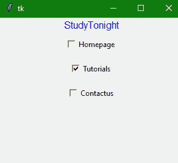

# Tkinter `Checkbutton`小部件

> 原文：<https://www.studytonight.com/tkinter/python-tkinter-checkbutton-widget>

在本教程中，我们将介绍 Python 中的 Tkinter Checkbutton 小部件，它用于在使用 Tkinter 开发桌面应用时在 GUI 上创建复选框。

如果你想在一个表单中显示多个选项，用户可以勾选选择任意选项，我们可以使用 Tkinter **Checkbutton 小部件**。它允许您通过单击每个选项对应的按钮，一次选择多个**选项**或一个**单个**选项。

例如，在表单中，您可以看到填写性别的选项，它有“男性”、“女性”、“其他”等选项。，您可以在任何选项上打勾，这是一个复选框。我们使用 HTML 中的 **`<input>`标签**，来创建复选框

它可以包含**文本或图像**。根据您的要求，有许多选项可用于配置**检查按钮部件**。

## Tkinter 检查按钮小部件

**检查按钮小部件**的语法如下:

```py
w = CheckButton(master, option=value)
```

在上面的语法中，`master`参数表示**父窗口**。您可以使用许多**选项**来配置您的检查按钮小部件，这些**选项**被写成**逗号分隔的键值对**。

### Tkinter 检查按钮小部件选项

以下是与**检查按钮**部件一起使用的各种**选项**:

| **选项名称** | **描述** |
| --- | --- |
| `activebackground` | 该选项表示检查按钮在光标下时**检查按钮的背景颜色。** |
| `bd` | 该选项指示拐角周围边框的**大小。默认大小为 2 像素。** |
| `bg` | 该选项用于**表示检查按钮**的背景颜色。 |
| `bitmap` | 该选项主要用于**在按钮上显示图像**。 |
| `command` | **命令选项用于设置功能调用**，该功能调用安排在**检查按钮状态改变**时进行。 |
| `activeforeground` | 该选项主要**代表当勾选按钮在**光标**下时按钮的前景色**。 |
| `fg` | 该选项代表检查按钮的**文本颜色。** |
| `font` | 此选项指示 checkbutton 的字体。 |
| `height` | 该选项指示按钮的高度。这个高度在**文本行**的情况下表示**文本行数**，在**图像的情况下表示**像素数**。默认值为 1** 。 |
| 图像 | 该选项指示代表检查按钮的**图像。** |
| `cursor` | 该选项有助于在光标位于检查按钮上时将**鼠标指针更改为光标名称**。 |
| `disableforeground` | 该选项是用于指示**禁用检查按钮**文本的颜色。 |
| `higlightcolor` | 当焦点在检查按钮上时，此选项指示高亮颜色 |
| `justify` | 该选项用于指示多条文本行的表示方式**。对于左对齐，它设置为左对齐，对于右对齐，它设置为右对齐，对于中心对齐，它设置为中心对齐。** |
| `padx` | 该选项指示检查按钮在**水平方向**上的填充。 |
| `pady` | 该选项指示检查按钮在**垂直方向**上的填充。 |
| `underline` | 该选项用于**给检查按钮**的文本加下划线。 |
| `width` | 此选项指定 checkbutton 的宽度。对于文本按钮，它以若干字母的形式存在；对于图像按钮，它表示像素。 |
| `Wraplength` | 在这种情况下，如果该选项被设置为整数，则**文本将被分解为片段数**。 |
| `variable` | 该选项主要用于表示**用来跟踪检查按钮**状态的关联变量 |
| `offvalue` | 如果按钮关闭，检查按钮的**关联控制变量**默认设置为 0。您也可以将**未选中变量的状态更改为另一个**。 |
| `onvalue` | 检查按钮的**关联控制变量设置为 1(开)。通过将 onvalue 设置为该值，将为 on 状态提供任何替代值。** |
| `text` | 该选项用于**指示检查按钮**旁边的标签。对于多行，请使用“\n”。 |
| `state` | 该选项**主要用于表示检查按钮**的状态。**其默认值=正常**。可以将其更改为禁用，以使 checkbutton 无响应。当 checkbutton 处于焦点下时，此按钮的值为 ACTIVE |
| `selectcolor` | 该选项**表示设置时检查按钮**的颜色。其默认值为**红色**。 |
| `selectimage` | 该选项**设置后显示检查按钮**上的图像。 |

### Tkinter 检查按钮小部件方法:

以下是 checkbutton 小部件使用的方法:

| **方法名称** | **描述** |
| --- | --- |
| `invoke()` | checkbutton 小部件中的这个方法用于**调用与 checkbutton 关联的方法**。 |
| `select()` | checkbutton 小部件中的这个方法被称为**来打开**check button。 |
| `deselect()` | checkbutton 小部件中的这个方法叫做**关闭**check button。 |
| `toggle()` | checkbutton 小部件中的这种方法是**用来在不同的 check button 之间切换。** |
| `flash()` | checkbutton 小部件中的这种方法用于在活动颜色和正常颜色之间闪烁**。** |

## Tkinter 检查按钮小部件示例

下面我们有一个这个小部件的基本例子来获得对这个方法的基本理解:

```py
from tkinter import *

root = Tk() 
root.geometry("300x300") 

w = Label(root, text ='StudyTonight', fg="Blue",font = "100") 
w.pack() 

Checkbutton1 = IntVar() 
Checkbutton2 = IntVar() 
Checkbutton3 = IntVar() 

Button1 = Checkbutton(root, text = "Homepage", 
					variable = Checkbutton1, 
					onvalue = 1, 
					offvalue = 0, 
					height = 2, 
					width = 10) 

Button2 = Checkbutton(root, text = "Tutorials", 
					variable = Checkbutton2, 
					onvalue = 1, 
					offvalue = 0, 
					height = 2, 
					width = 10) 

Button3 = Checkbutton(root, text = "Contactus", 
					variable = Checkbutton3, 
					onvalue = 1, 
					offvalue = 0, 
					height = 2, 
					width = 10) 

Button1.pack() 
Button2.pack() 
Button3.pack() 

mainloop() 
```



正如您在上面的代码中看到的，创建了三个`IntVar()`变量，然后我们创建了三个**检查按钮**，具有不同的文本，如**主页**、**教程**和**联系人**。

因此，我们在这里使用一些选项创建了检查按钮，如`text`、`variable`、`onvalue`、`offvalue`、`height`和`width`。您可以尝试使用更多选项。

## 摘要

因此，在本教程中，我们学习了如何使用 Tkinter checkbutton 小部件在 GUI 应用中创建复选框。

* * *

* * *