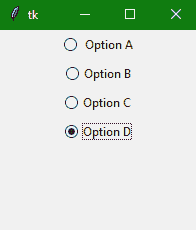
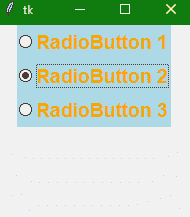

> 哎哎哎:# t0]https://www . studytonight . com/tkinter/python-tkinter radio button widget


# Python Tkinter Radiobutton Widget

在本教程中，我们将介绍 Python 中的 Tkinter **Radiobutton 小部件**，当我们想要在应用程序的 GUI 中添加一个单选按钮时会用到它。

Tkinter **单选按钮小部件**用于实现多项选择**选项**，这些选项主要是在用户输入表单中创建的。

*   该小部件为用户提供**多个选项**，**允许用户从给定选项**中仅选择一个选项。因此，它也被称为在 Python 应用程序中实现**一对多选择**。

*   还有，**不同的方法**也可以和 radiobutton 关联。

*   您也可以在单选按钮上**显示多行文本和图像**。

*   每个单选按钮为特定的**变量**显示一个**单值**。

*   您还可以**跟踪用户对单选按钮**的选择，因为**与单个变量**相关联

## Tkinter Radiobutton Widget

单选按钮小部件的语法如下:

```
W = Radiobutton(master, options) 
```

在上面的语法中，`master`参数表示**父窗口**。您可以使用许多`options`来更改单选按钮的**外观，这些选项被写成**逗号分隔的键值**对。**

### Tkinter Radiobutton Widget 选项:

以下是与 Tkinter 单选按钮小部件一起使用的**选项**:

| **选项名称** | **描述** |
| --- | --- |
| `anchor` | 该选项用于**表示文本**在小部件中的确切位置，在**小部件包含比文本**要求更多的空间的情况下。该选项的默认值为“中心”。 |
| `bg` | 该选项代表**小部件**的背景颜色。 |
| `activebackground` | 该选项**代表微件**聚焦时的背景颜色。 |
| `activeforeground` | 该选项**代表微件**聚焦时的字体颜色。 |
| `borderwidth` | 该选项用于**表示边框的大小**。 |
| `bitmap` | 如果您想要**在小部件**上显示图形，那么您可以**将该小部件设置为任何图形或图像对象。** |
| `command` | 该选项是**用来设置程序**，当单选按钮的状态改变时，每次**必须调用该程序。** |
| `cursor` | 该选项将鼠标指针转换为指定的光标类型**，并可设置为**箭头、点等。 |
| `font` | 该选项用于**表示小部件**文本的字体类型。 |
| `fg` | 该选项用于**表示小部件**文本的前景色。 |
| `height` | 该选项表示小部件的**垂直尺寸** |
| `width` | 该选项表示小部件的**水平尺寸，用字符数表示。** |
| `padx` | 该**选项代表小部件**的水平填充。 |
| `pady` | **该选项表示小部件的垂直填充** |
| `highlightcolor` | 该选项用于**表示小部件处于焦点下时焦点高亮**的颜色 |
| `highlightbackground` | 当**部件不在焦点**下时，该选项用于**表示焦点高亮**的颜色。 |
| `image` | 如果您希望**在小部件**上显示图像，那么该选项将**设置为图像而不是文本** |
| `justify` | 该选项用于**表示多行文字**的对齐。默认值为**中心**。其他值为**左，右**。 |
| `relief` | 该选项用于**表示边框的类型。**默认值为**平。** |
| `selectcolor` | 该**选项表示选择**时单选按钮的颜色 |
| `selectimage` | 该**选项表示当选择**时要在单选按钮上显示的图像 |
| `state` | 该选项用于**表示单选按钮**的状态。收音机按钮的默认状态是**正常**。您也可以将状态设置为**禁用**，以使收音机按钮无响应。 |
| `text` | 该**选项指示要在单选按钮**上显示的文本。 |
| `textvariable` | 该选项用于**控制小部件**所代表的文本。`textvariable`可以设置为需要在小部件上显示的文本。 |
| `underline` | 该选项可以**设置为现有的数字，以便**指定字符串的第 n 个字母**将带有下划线。**默认值为-1，表示无下划线 |
| `variable` | 该选项也称为**控制变量**，用于**跟踪用户的选择。因此，该变量在所有单选按钮**之间共享。 |
| `value` | 当用户打开时，每个单选按钮的该选项被分配给**控制变量**。 |
| `wraplength` | 该**选项用于将文本**换行到所需的行数，只需将**选项设置为所需的行数，使得每行仅包含该数量的字符**。 |

### Tkinter 单选按钮小部件方法:

以下是 Tkinter Radiobutton 小部件使用的各种方法:

| **方法名称** | **描述** |
| `deselect()` | 此方法用于取消选择或关闭单选按钮 |
| `select()` | 此方法用于选择单选按钮 |
| `invoke()` | 此方法通常用于在单选按钮的状态发生变化时调用函数。 |
| `flash()` | 这种方法通常用于在单选按钮的正常颜色和活动颜色之间闪烁多次。 |

## Tkinter 单选按钮小部件示例

下面我们有一个单选按钮小部件的基本示例。让我们看看 Radiobutton 小部件的代码片段:

```
#firstly ImportTkinter module 
from tkinter import * 
from tkinter.ttk import *

# Creating parent Tkinter window 
win = Tk() 
win.geometry("200x200") 

# let us create a Tkinter string variable 
# that is able to store any string value 
v = StringVar(win, "1") 

# here is a Dictionary to create multiple buttons 
options = {" Option A" : "1", 
		"Option B" : "2", 
		"Option C" : "3", 
		"Option D" : "4" 
		} 

# We will use a Loop just to create multiple 
# Radiobuttons instaed of creating each button separately
for (txt, val) in options.items(): 
	Radiobutton(win, text=txt, variable=v, value=val).pack(side = TOP, ipady = 4) 

mainloop() 
```

上面的代码将给出以下输出:



<u>**注意:**</u> 如果你自己尝试上面的代码片段，那么你会看到在输出中你一次只能选择一个按钮。

## 另一个例子

下面是这个小部件的另一个例子，我们将使用 style 类向 radiobutton 添加样式:

```
from tkinter import * 
from tkinter.ttk import *

win= Tk() 
win.geometry('200x200') 
v = StringVar(win, "1") 

# we will add Style class to add style to Radiobutton  
style = Style(win) 
style.configure("TRadiobutton", background = "light blue", 
				foreground = "orange", font = ("arial", 14, "bold")) 

# Dictionary to create multiple buttons 
values = {"RadioButton 1" : "1", 
		"RadioButton 2" : "2", 
		"RadioButton 3" : "3" 
		} 

for (text, value) in values.items(): 
	Radiobutton(win, text = text, variable = v, 
				value = value).pack(side = TOP, ipady = 3) 
mainloop() 
```



上面的代码将改变字体样式以及背景和前景色。在上图中`TRadiobutton`用在样式类中，它自动将样式应用于所有可用的单选按钮。

## 总结:

在本教程中，我们了解了 Radiobutton 小部件，它用于创建多个选项，从中可以选择一个选项。这主要在我们创建用户表单时使用，比如注册表单。

* * *

* * *