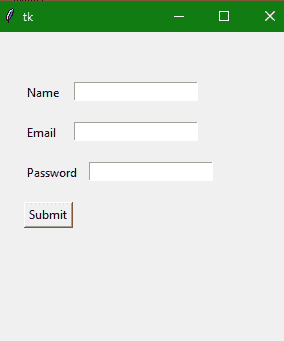

# Tkinter 输入小部件

> 原文：<https://www.studytonight.com/tkinter/python-tkinter-entry-widget>

在本教程中，我们将介绍 Python 中 Tkinter 的**输入小部件**及其各种选项，并且借助**的几个例子，**我们将详细了解这个概念。

如果你需要从用户那里得到一点点文本，比如名字、电子邮件地址或联系号码，那么使用**条目**小部件。

*   Entry 小部件主要用于显示一个**小文本框**，用户可以在其中输入一些文本。

*   有许多选项可用于更改**输入小部件的样式。**

*   需要注意的是**输入小部件**仅用于从用户处获取**单行文本**，因为在**多行文本**的情况下，将使用**文本小部件**。

*   这个小部件主要用于**接受用户的文本字符串**。

## Tkinter 条目小部件

**条目小部件**的语法如下:

```py
w = Entry(master, option=value)
```

在上面的语法中，主参数表示**父窗口。**您可以使用许多选项来更改**条目小部件** **的样式，这些选项以逗号分隔。**

### Tkinter 条目小部件选项:

条目小部件使用的各种选项如下:

| **选项名称** | **描述** |
| --- | --- |
| `bg` | 该选项用于小部件的**背景颜色**。 |
| `bd` | 该选项用于边框的**宽度，单位为像素。其默认值为 **2 像素。**** |
| `cursor` | 该选项有助于将鼠标指针更改为光标类型**，并将其设置为箭头、点等。** |
| `exportselection` | 需要注意的是**默认情况下**，写在**输入框内的文本会自动复制到剪贴板**。如果不想复制文本，则将**导出选择的值设置为 0。** |
| `fg` | 该选项用于指示文本的**颜色。** |
| `font` | 该选项用于表示文本的**字体类型** |
| `highlightbackground` | 该**选项用于表示当微件没有输入焦点时**遍历高亮区域**中显示的颜色**。 |
| `highlightcolor` | 该选项用于表示当小部件有输入焦点时，围绕小部件绘制的**遍历高亮矩形**所使用的颜色。 |
| `justify` | 如果文本包含多行，该**选项用于指定文本在**情况下的组织方式**。** |
| `relief` | 该选项用于**指示边框的类型。**该选项的默认值为`FLAT`。它有更多类似`GROOVE, RAISED,RIGID`的价值观。 |
| `selectbackground` | 该选项用于指示所选文本的**背景颜色。** |
| `selectforeground` | 用于设置所选任务的**字体。** |
| `selectborderwidth` | 该选项指示围绕所选任务显示的边框**宽度** |
| `width` | 该**选项指示要显示的图像**的宽度或**文本的宽度**。 |
| `textvariable` | **在这个选项的帮助下，你将**能够从你的输入小部件中检索当前文本，你需要将这个选项设置为`StringVar`类的一个实例。 |
| `show` | 该**选项用于显示其他类型的输入文本**，而不是字符串。例如，我们使用星号 (*)键入**密码。** |
| `xscrollcommand` | 如果你想让用户输入更多的文本而不是小部件的实际宽度**，你可以将输入小部件链接到水平滚动条**。 |
| `insertbackground` | 该选项主要表示在插入光标覆盖的区域内**颜色作为背景**。因此这个颜色将会覆盖小部件的正常背景，T2。 |

### Tkinter 输入小部件方法:

输入小部件使用的各种方法如下:

| **方法名称** | **描述** |
| --- | --- |
| `delete(first, last=None)` | 此方法用于删除小部件内部的**指定字符**。 |
| `get()` | 此方法用于将**条目小部件的当前文本作为字符串**获取。 |
| `icursor(index)` | 该方法用于将插入光标设置在指定索引处的**字符之前。** |
| `index(index)` | 该方法用于**将光标**放置在指定索引处书写的字符的**左侧。** |
| `select_clear()` | 该方法是**在**已经做了一些选择**的情况下，用来清除选择**。 |
| `select_present()` | 如果存在某个选择的**，则该方法将返回`true`，否则将返回`false`。** |
| `insert(index, s)` | 该方法主要用于在指定索引处的**字符前插入指定的字符串** |
| `select_adjust(index)` | 该方法主要包括选择出现在**指定索引**处的**字符** |
| `select_form(index)` | 该方法主要将**锚点索引位置**设置为索引指定的**字符。** |
| `select_range(start, end)` | 该方法用于选择字符**存在于指定范围**之间 |
| `select_to(index)` | 该方法主要选择从**开始到指定索引**的所有字符 |
| `xview(index)` | 此方法用于将条目小部件链接到**水平滚动条** |
| `xview_scroll(number, what)` | 该方法主要用于使输入小部件**水平滚动** |

## Tkinter 条目小部件示例

下面我们有一个 Tkinter Entry 小部件的基本例子。让我们看看代码片段:

```py
from tkinter import * 

win = Tk()  

win.geometry("400x250")  

name = Label(win, text = "Name").place(x = 30,y = 50)  

email = Label(win, text = "Email").place(x = 30, y = 90)  

password = Label(win, text = "Password").place(x = 30, y = 130)  

submitbtn = Button(win, text = "Submit",activebackground = "red", activeforeground = "blue")
              .place(x = 30, y = 170)  

entry1 = Entry(win).place(x = 80, y = 50)  

entry2 = Entry(win).place(x = 80, y = 90)  

entry3 = Entry(win).place(x = 95, y = 130)  

win.mainloop()
```



在上面的代码示例中，我们完成了以下工作:

1.  创建文本标签来命名文本输入字段。对于所有 3 个文本输入字段(输入小部件)，我们已经创建了三个标签。

2.  我们已经使用`place()` [几何管理器](https://www.studytonight.com/tkinter/python-tkinter-geometry-manager)将标签放置在应用窗口上。

3.  然后我们创建了一个按钮，即提交按钮。并使用`place()`几何管理器将其定位在应用图形用户界面上。

4.  最后，我们有三个**条目**小部件，它们将创建三个文本输入字段。并使用`place()`几何管理器将其定位在应用图形用户界面上。

## 摘要

在本教程中，我们学习了如何在创建 GUI 应用时使用 Tkinter Entry 小部件来创建文本输入字段。

* * *

* * *