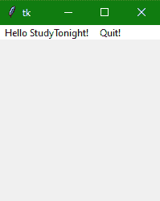

# Tkinter 菜单小部件

在本教程中，我们将介绍 Python 中的 Tkinter **菜单小部件**，它用于创建带有选项供用户选择的菜单。

Tkinter **菜单小部件**用于在 Python 应用程序中**创建不同类型的菜单**。

*   可以使用 Tkinter Menu 小部件创建以下类型的菜单:**弹出**、**下拉**、**和顶层**。

*   顶层菜单是那些显示在根窗口或任何其他顶层窗口的标题栏下的**菜单。例如，所有网站都在浏览器的网址栏下方有一个顶部导航菜单。**

*   菜单通常用于提供便捷的选项访问，如**打开任何文件**、**退出任何任务**、**以及在应用程序中操作数据**。

## Tkinter Menu Widget

菜单小部件的语法如下:

```py
W = Menu(master, options) 
```

在上面的语法中，`master`参数表示**父窗口**。可以用很多`options`来改变菜单的**外观，这些选项写成**逗号分隔的键值对**。**

### Tkinter Menu Widget 选项:

以下是菜单小部件使用的各种选项:

| **选项名称** | **描述** |
| --- | --- |
| `activebackground` | 该选项用于在微件处于焦点下时，指示微件的**背景色**。 |
| `activeforeground` | 该选项指示小部件有焦点时小部件文本的**字体颜色。** |
| `activeborderwidth` | 该选项用于指示小部件在鼠标下方时(活动时)边框的**宽度。该选项的默认值为 **1 像素**。** |
| `bd` | 该选项用于指示小部件的**边框宽度** |
| `bg` | 该选项指示小部件的**背景颜色。** |
| `cursor` | 当鼠标悬停在菜单上时，该选项指示光标**。** |
| `disabledforeground` | 当**小部件被禁用**时，该选项指示小部件的**文本颜色** |
| `font` | 该选项用于指示小部件文本的**字体类型** |
| `fg` | 该选项指定微件的**前景色**。 |
| `relief` | 该选项用于指定**边框类型**。其默认值为**升起**。 |
| `image` | 该选项用于**在菜单**上显示图像 |
| `postcommand` | 该选项可以设置为鼠标悬停在菜单上时调用的任何功能**。** |
| `tearoff` | 默认情况下，**菜单中的选项从位置 1** 开始。但是如果我们设置`tearoff=1`，那么**的选择将从第 0 个位置**开始。 |
| `selectcolor` | 该选项表示选择时用于**显示检查按钮或单选按钮的颜色。** |
| `title` | 如果您想更改窗口的标题，该选项被设置为**窗口的标题。** |

### Tkinter 菜单小部件方法:

以下是 Tkinter Menu 小部件使用的各种方法:

| 方法名称 | 描述 |
| `add_command()` | 此方法用于**向菜单添加菜单项**。 |
| `add_radiobutton()` | 此方法用于将[单选按钮](https://www.studytonight.com/tkinter/python-tkinter-radiobutton-widget)添加到菜单中。 |
| `add_checkbutton()` | 该方法主要用于**将[检查按钮](https://www.studytonight.com/tkinter/python-tkinter-checkbutton-widget)添加到菜单**中。 |
| `add_cascade()` | 该方法用于**通过将给定菜单与父菜单相关联来创建父菜单的分层菜单**。 |
| `add_seperator()` | 此方法用于**在菜单项中添加分隔线**。 |
| `add(type, options)` | 该方法用于**将特定菜单**项添加到菜单中。 |
| `delete(startindex, endindex)` | 此方法用于**删除指定范围内存在的菜单项**。 |
| `entryconfig(index, options)` | 此方法用于配置由给定索引标识的菜单项。 |
| `index(item)` | 此方法用于获取指定菜单项的索引。 |
| `insert_seperator(index)` | 此方法用于**在指定索引**处插入分隔符。 |
| `invoke(index)` | 此方法用于调用在指定索引处给定选项的关联操作。 |
| `type(index)` | 此方法用于获取索引指定的选择类型。 |

正如您在上面看到的，我们有很多方法与菜单小部件相关联，可用于根据您的要求配置菜单。

## Tkinter 菜单小部件示例

下面我们有一个使用这个小部件的基本例子:

```py
from tkinter import *

root = Tk()

def hello():
    print("hello!")

menubar = Menu(root)
menubar.add_command(label="Hello StudyTonight!", command=hello)
menubar.add_command(label="Quit!", command=root.quit)

root.config(menu=menubar)

root.mainloop()
```

### 

运行上述代码后，您将看到上面的输出。每当你点击**你好StudyTonight！**菜单项然后它会打印一个**你好！**在你的控制台上。一边点击**一边退出！**菜单项，应用程序将关闭。

## 总结:

在本教程中，我们学习了如何为我们的 Tkinter 应用程序创建菜单，以及如何向其中添加菜单项，并在用户选择任何菜单项时执行一些操作。

* * *

* * *